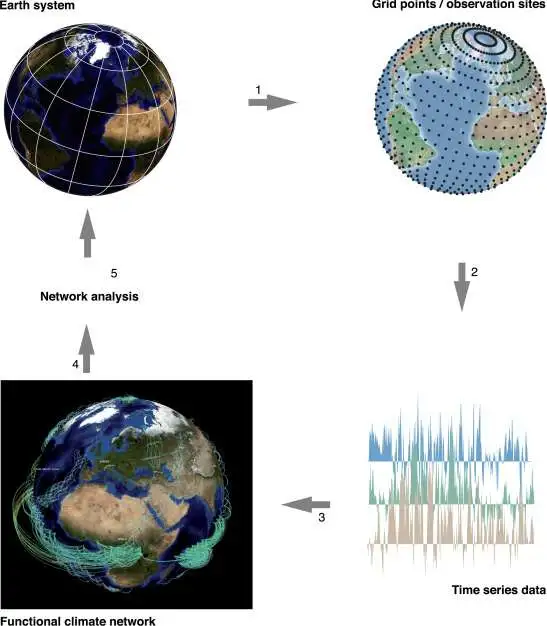
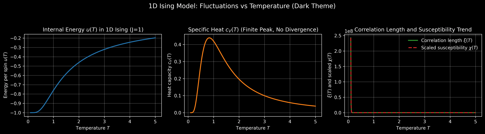
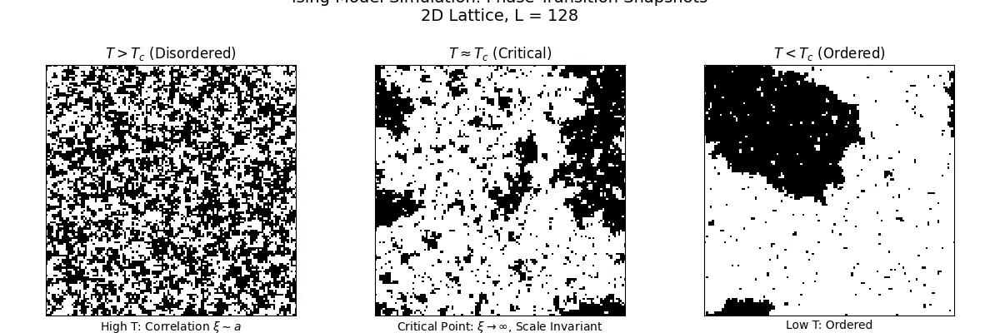
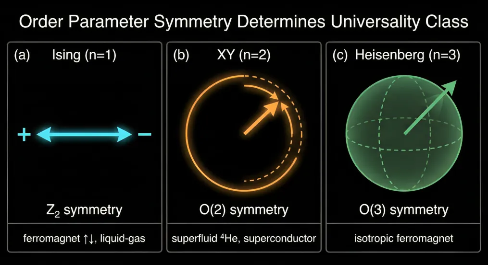

# Renormalization Group

[中文README](README_CN.md) | [English Notes](https://zhihangliu.cn/Renormalization-Group/en/) | [中文笔记合集](https://zhihangliu.cn/Renormalization-Group/)

This repository contains self-study notes on **Renormalization Group (RG)** theory, covering critical phenomena, phase transitions, scaling laws, and universality classes. Notes are organized as articles with accompanying [Python code](https://github.com/Liu-Zhihang/Renormalization-Group/tree/main/code) for deeper understanding.

## Course Overview

The renormalization group is one of the most profound ideas in theoretical physics. It answers a core question: **Why do systems with vastly different microscopic details exhibit the same macroscopic behavior near critical points?**

Through "coarse-graining"—progressively eliminating short-range degrees of freedom while retaining long-range effective interactions—RG reveals how different microscopic systems "flow" to the same fixed point under scale transformations, thereby sharing identical critical exponents. This **universality** is one of nature's most profound simplification principles.

This tutorial series starts from statistical mechanics foundations, progressively builds the quantitative language of critical phenomena, and ultimately delves into field-theoretic renormalization group and modern frontier applications.

## Completed Notes

### Part 1: Motivation, Statistical Physics, and Critical Phenomena

- [1. What Is the Renormalization Group](docs/en/1.%20What%20Is%20the%20Renormalization%20Group.md)
- [2. Why Do We Need the Renormalization Group](docs/en/2.%20Why%20Do%20We%20Need%20the%20Renormalization%20Group.md)
- [3. Statistical Mechanics Review: Partition Function, Free Energy, and Fluctuations](docs/en/3.%20Statistical%20Mechanics%20Review%20-%20Partition%20Function%2C%20Free%20Energy%2C%20and%20Fluctuations.md)
- [4. Phase Transitions and Critical Exponents: Scaling Laws and Universality Classes (Part I)](docs/en/4.%20Phase%20Transitions%20and%20Critical%20Exponents%20-%20Scaling%20Laws%20and%20Universality%20Classes%20%28Part%20I%29.md)
- [5. Phase Transitions and Critical Exponents: Scaling Laws and Universality Classes (Part II)](docs/en/5.%20Phase%20Transitions%20and%20Critical%20Exponents%20-%20Scaling%20Laws%20and%20Universality%20Classes%20%28Part%20II%29.md)

## Planned Topics

**Part 1: Motivation, Statistical Physics, and Critical Phenomena** (In Progress)

- Landau Theory and Ginzburg Criterion—Success and Failure of Mean Field
- The World of the Ising Model—From 1D Exact Solution to 2D Critical Point
- Block Spins and Coarse-Graining—Kadanoff's Intuitive RG Picture

**Part 2: Real-Space RG and Numerical Methods**

- Real-Space RG Recursion Relations—Relevant Dimensions and Phase Diagrams
- Finite-Size Scaling and Data Collapse
- Monte Carlo Simulation of the Ising Model—From Metropolis to Cluster Algorithms
- Monte Carlo RG—Constructing RG Transformations from Numerical Data
- Ginzburg-Landau Functional and Continuum Field Description
- From Lattice Ising to φ⁴ Field Theory

**Part 3: Field-Theoretic RG and Quantum Field Theory**

- Path Integrals and Gaussian Fields—From Harmonic Oscillator to Free Scalar Field
- φ⁴ Theory and Feynman Diagrams—Where Do Divergences Come From?
- Renormalization Techniques—Regularization, Counterterms, and Physical Parameters
- Callan-Symanzik Equation and β Function
- Wilson's Perspective on RG—"Integrating Out High-Momentum Modes"
- ε Expansion and Wilson-Fisher Fixed Point
- RG in Quantum Field Theory—QED, QCD, and Asymptotic Freedom
- Non-Perturbative RG—Functional RG and Large-N Techniques

**Part 4: Tensor Networks, DMRG, Complex Networks, and Non-Equilibrium RG**

- Density Matrix Renormalization Group (DMRG) and Matrix Product States (MPS)
- Tensor Networks and Multiscale Entanglement Renormalization (MERA, TNR)
- RG on Networks and Graphs—From Laplacian RG to Network RG
- RG in Non-Equilibrium Systems and Active Matter
- Quantum Gravity, Asymptotic Safety, and Holographic RG

**Part 5: RG × Machine Learning & Interdisciplinary Frontiers**

- RG, Information Theory, and Parameter Compression—From Fisher Information to "Emergent Theory"
- Deep Learning and Variational RG—RBM, Neural RG, and Mutual Information RG
- Learning RG with Deep Learning—FRG+NN, Neural Tensor Network, etc.
- New Directions of RG in Complex Systems and Interdisciplinary Applications
- Cutting-Edge Paper Reviews (Throughout the Tutorial)

## Usage

Each Python file corresponds to a specific topic covered in the notes. The code serves as practical implementation of theoretical concepts, developed as part of self-study notes.

Code Output Demonstrations:

**[Lecture 2: Why Do We Need the Renormalization Group](docs/en/2.%20Why%20Do%20We%20Need%20the%20Renormalization%20Group.md)**

| 2D Ising Model Critical Phenomena |
|:---:|
|  |

*2D Ising model configurations at different temperatures: high-temperature disordered state, fractal clusters near critical point, low-temperature ordered state*

**[Lecture 3: Statistical Mechanics Review—Partition Function, Free Energy, and Fluctuations](docs/en/3.%20Statistical%20Mechanics%20Review%20-%20Partition%20Function%2C%20Free%20Energy%2C%20and%20Fluctuations.md)**

| Free Energy Landscape | Fluctuation-Dissipation Relation |
|:---:|:---:|
|  |  |

*Left: Free energy landscape at different temperatures showing symmetry breaking at phase transition; Right: Numerical verification of fluctuation-dissipation theorem*

**[Lecture 5: Phase Transitions and Critical Exponents—Scaling Laws and Universality Classes (Part II)](docs/en/5.%20Phase%20Transitions%20and%20Critical%20Exponents%20-%20Scaling%20Laws%20and%20Universality%20Classes%20%28Part%20II%29.md)**

| 3D Percolation Phase Transition Animation |
|:---:|
|  |

*3D Site Percolation: As occupation probability p increases, clusters evolve from isolated small dots to a macroscopic network spanning the system*

| Finite-Size Scaling Analysis | Data Collapse Verifying Universality |
|:---:|:---:|
|  |  |

*Left: Finite-size scaling analysis of order parameter and susceptibility; Right: Successful data collapse using 3D percolation critical exponents*

## License

This project is licensed under [CC BY-NC-ND 4.0](https://creativecommons.org/licenses/by-nc-nd/4.0/).
