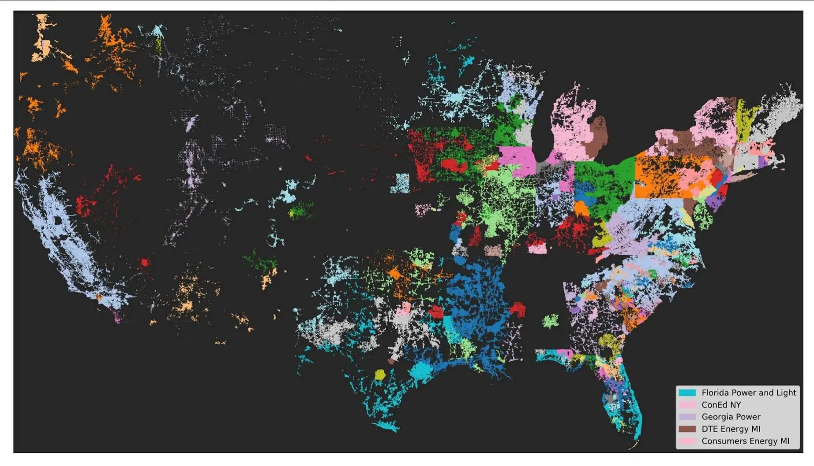
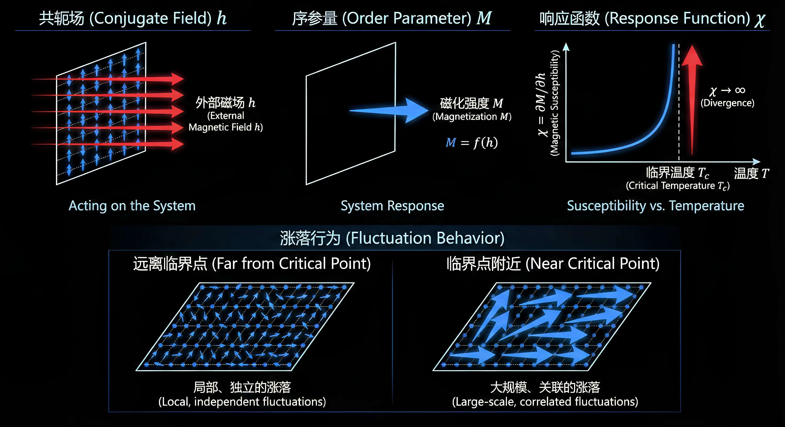

由于篇幅较长，分为上下两篇，以下目录便于查阅：

**【上篇】**
- **引言**
- **1. 相变的分类：一阶与连续相变**
- **2. 序参量、共轭场与响应函数**
- **3. 关联函数、关联长度与"无标度"**

**【下篇】**
- **4. 临界指数：定义、物理意义与"最小参数集"**
- **5. 标度假设与齐次性：从一个假设推出一堆定律**
- **6. 普适类：谁决定指数？**
- **7. 实践：纠缠颗粒网络中的渗流相变**
- **总结**

# 引言

**第3讲**建立了统计力学的数学框架。配分函数 $Z$ 作为生成泛函编码了系统的全部统计信息，自由能 $F = -k_B T \ln Z$ 构成热力学势能景观，涨落-耗散定理则揭示了响应函数与涨落方差之间的内在联系。**第3讲**的核心结论是，当系统逼近连续相变的临界点时，相关长度 $\xi \to \infty$，传统的平均场近似与微扰展开同时失效，配分函数的直接计算陷入不可行。

然而，**第3讲**尚未回答的问题是，临界点附近物理量所呈现的幂律发散具有怎样的定量结构，这些幂律指数之间是否存在内在约束，以及为何微观机制迥异的系统会在临界点附近表现出相同的标度行为。

这些问题的答案构成了本讲的主题。在重整化群系列教程的逻辑链条中，本讲承担着**从现象学描述过渡到可量化操作语言**的关键角色，将**第3讲**揭示的 **$\xi \to \infty$ 导致计算崩溃**这一定性图像转化为一套**可测量、可分类、可预测**的临界指数体系，同时为后续 Landau 理论、Ginzburg 判据以及 Wilson 重整化群的正式引入奠定概念基础。

临界行为并非凝聚态物理的专利。2003年8月的北美大停电事件中，局部电网故障通过级联效应在数秒内扩展至整个东北部电网，导致五千万人断电。事后分析表明，电力网络在高负荷状态下运行于接近临界的边缘，节点间的负载关联跨越了整个网络尺度，单点扰动的影响范围不再局限于邻近区域，**而是可以传播至任意远处**。这一现象与第二讲讨论的鸟群集体运动具有深刻的结构相似性——两者的相关长度均接近系统尺寸，局部涨落与全局响应之间形成强耦合。

类似的临界行为还出现在金融市场崩盘前夕的波动率长程关联、传染病传播阈值附近的感染网络渗流相变、以及神经系统自组织临界态中的神经雪崩幂律分布。这些表面上毫无关联的系统之所以呈现相似的统计特征，根本原因在于它们在临界点附近共享相同的数学结构，这正是**普适性（Universality）**概念的核心内涵。

本讲将从三个层次展开。**首先是临界指数的定义与测量。**临界点附近的物理量，如比热 $C$、磁化率 $\chi$、序参量 $M$、相关长度 $\xi$，均呈现幂律行为，其指数 $\alpha, \beta, \gamma, \nu$ 等构成描述临界现象的基本参数集，本讲将给出这些指数的严格定义并讨论如何从实验或模拟数据中提取它们。

**其次是标度律的数学结构。**这些临界指数并非相互独立的拟合参数，基于标度假设，即奇异自由能密度满足广义齐次函数的形式，可以推导出 Rushbrooke、Widom、Fisher 等标度恒等式，将六个指数压缩为仅有两个独立参数，这一数学结构的存在表明临界现象背后存在更深层的对称性约束。

**最后是普适类的物理根源。**不同物理系统为何会共享同一组临界指数？本讲将从现象学层面给出答案，决定普适类的因素仅包括空间维度 $d$、序参量的对称性以及相互作用的力程，而与微观哈密顿量的具体参数无关；这一结论的深层机制将在后续讲座中通过重整化群的完整框架给出严格证明。

通过这三个层次的展开，本讲将把**临界点处发生了什么**这一物理问题转化为**临界指数取什么值、满足什么关系、由什么因素决定**这一可操作的**定量框架**，为重整化群的正式引入提供必要的概念储备。

# 1. 相变的分类：一阶与连续相变

物理学中存在两类截然不同的相变。第一类是**跳跃式的相变**。水在标准大气压下加热到 $100°\text{C}$ 时沸腾，液态水突然变成水蒸气。在这个过程中，即使持续加热，温度也不会上升，所有的热量都被用于打破液体分子之间的束缚——这部分热量称为**潜热**（latent heat），因为它"潜藏"在相变过程中，不体现为温度的升高。在相变点，液态和气态可以共存，锅中同时存在沸腾的水和上升的蒸汽。冰融化为水、金属凝固、晶体熔化，都属于这一类相变。

第二类是**渐进式的相变**。铁是典型的铁磁体，在室温下具有自发磁化——即使没有外加磁场，铁块内部的原子磁矩也倾向于平行排列。但当温度升高到居里温度 $T_c \approx 770°\text{C}$ 附近时，热涨落逐渐瓦解这种有序排列，自发磁化强度**连续地趋于零**，而非突然消失。这个过程中没有潜热，没有相共存，温度可以平滑地穿过 $T_c$。然而，系统对外界扰动的响应却变得**异常剧烈**：在 $T_c$ 附近，一个微弱的外加磁场就能引起巨大的磁化响应。超流氦的 $\lambda$ 相变、超导体的正常态-超导态转变、液晶的各向同性-向列相转变，都属于这一类。

这两类相变不仅在实验现象上不同，其背后的数学结构也完全不同。**重整化群理论所要处理的，正是后一类相变——连续相变。** 本节从热力学的角度严格区分这两类相变，并揭示为什么只有连续相变才需要重整化群这一全新的理论工具。

## 1.1 相变的热力学定义

相变的严格定义建立在自由能的数学性质之上。在**热力学极限**下（系统自由度 $N \to \infty$），相变对应于自由能 $F(T, h, \ldots)$ 在某一点失去解析性，即无法在该点展开为收敛的泰勒级数。

这一定义看似抽象，但其物理根源十分清晰。对于有限系统（即粒子数 $N$ 或系统线度 $L$ 有限的系统，如数值模拟中的 $100 \times 100$ 格点），配分函数 $Z = \sum_{\{\sigma\}} e^{-\beta H[\sigma]}$ 是有限个解析项的求和，因此 $Z$ 和 $F = -k_B T \ln Z$ 都是解析的。只有当 $N \to \infty$ 时，求和项数趋于无穷，才可能出现非解析性。这意味着**真正的相变只存在于无穷大系统中**，有限系统只能表现出相变的"前兆"——响应函数的峰值随系统尺寸增大而增高、变尖，但永远不会真正发散。这一事实直接导致了后续**有限尺寸标度理论**的必要性。

根据非解析性出现的阶数，相变分为两大类。若自由能的**一阶导数不连续**，称为**一阶相变**；若一阶导数连续但**二阶导数发散**，称为**连续相变**（或二阶相变）。这一分类由 Ehrenfest 于 1933 年提出，虽然实际情况更为复杂，但一阶与连续相变的区分仍然是理解临界现象的基本出发点。

## 1.2 一阶相变：势垒跃迁与有限关联

一阶相变的核心特征是**序参量的跳变**。以温度驱动的相变为例，熵 $S = -\partial F / \partial T$ 在相变温度 $T_{\text{tr}}$ 处不连续，两相的熵差 $\Delta S$ 对应于潜热 $L = T_{\text{tr}} \Delta S$。序参量 $M$ 从一个非零值突变为另一个值，中间没有平滑过渡。

从自由能景观的角度看，一阶相变对应于**双势阱结构**。所谓**势阱**（potential well），是指自由能曲线上的局域极小值点，系统倾向于停留在势阱底部，就像小球滚入碗底一样稳定；所谓**势垒**（potential barrier），是指两个势阱之间的隆起部分，系统必须获得足够的能量才能越过势垒从一个稳定态跃迁到另一个稳定态。在一阶相变中，两个势阱代表两个热力学稳定相，之间由有限的势垒隔开。当温度穿过相变点时，两个势阱的深度发生交换，系统从一个势阱"跳"到另一个势阱。正是这个势垒的存在，导致了亚稳态、成核、相共存等动力学现象。

**关键的一点是：一阶相变点的相关长度 $\xi$ 保持有限。** 尽管两相可以共存形成宏观的相界面，但每一相内部的涨落仍然是短程关联的。这意味着一阶相变虽然在宏观上表现剧烈，但其微观物理仍然可以用标准的统计力学方法处理，不需要重整化群。

## 1.3 连续相变：平坦景观与发散关联

连续相变的物理图像与一阶相变截然不同。序参量不是跳变，而是**连续趋于零**；没有潜热，没有相共存；但响应函数——磁化率 $\chi$、比热 $C$ ——却在临界点**发散趋于无穷**。

$$
\chi = -\frac{\partial^2 F}{\partial h^2} \to \infty, \quad C = -T\frac{\partial^2 F}{\partial T^2} \to \infty \quad (T \to T_c)
$$

这种发散的根源在于自由能景观的形状。在临界点，势阱底部变得**极度平坦**，曲率趋于零。序参量可以几乎无代价地涨落，导致涨落幅度趋于无穷。更关键的是，这种涨落不是局域的，而是跨越整个系统的**集体行为**。相关长度 $\xi$ 在临界点发散：

$$
\xi \sim |T - T_c|^{-\nu}
$$

其中 $\nu > 0$ 是相关长度临界指数。当 $\xi \to \infty$ 时，**系统失去了内禀的长度标度**，局部扰动的影响可以传播到任意远处。这正是临界现象区别于一般热力学行为的核心特征，也是**第3讲**所揭示的"计算崩溃"的物理根源——当所有标度的涨落强烈耦合时，传统的平均场近似和微扰展开同时失效。

# 2. 序参量、共轭场与响应函数

上一节从自由能的解析性质出发，区分了一阶相变与连续相变。然而，这种分类是数学层面的。实验物理学家在实验室中并不直接测量自由能的导数是否连续，而是测量一系列**可观测量**——磁化强度、密度、比热、磁化率——并从这些量的行为推断相变的存在与类型。这节将建立描述相变的可观测量体系，并揭示这些量之间的内在联系。

## 2.1 序参量：区分有序与无序的宏观指标

相变的本质是系统从一种宏观状态转变为另一种宏观状态。要定量描述这种转变，需要引入一个能够**区分不同相**的物理量，这就是**序参量（Order Parameter）**。

以铁磁体为例。在低温下，铁块内部的原子磁矩倾向于平行排列，产生宏观的自发磁化强度 $M$。即使没有外加磁场，$M$ 也不为零。当温度升高到居里温度 $T_c$ 以上，热涨落瓦解了这种有序排列，$M$ 降为零。因此，**自发磁化强度 $M$ 就是铁磁-顺磁相变的序参量**：在有序相中 $M \neq 0$，在无序相中 $M = 0$，$M$ 的值标记了系统处于哪一个相。

序参量的选择并非任意。在液-气相变中，序参量是液相与气相的密度差 $\Delta\rho = \rho_l - \rho_g$；在超流氦中，序参量是玻色-爱因斯坦凝聚的波函数振幅；在超导体中，序参量是 Cooper 对凝聚的复序参量 $\psi = |\psi|e^{i\phi}$；在渗流系统中，序参量是最大连通团簇占系统总格点数的比例 $P_\infty = s_{\max}/N$。不同系统的序参量具有不同的数学结构——标量、矢量或复数——这种结构上的差异将在后续普适类的讨论中扮演关键角色。

从统计力学的角度看，序参量并非凭直觉定义的，而是通过配分函数自然导出的。**第3讲**指出配分函数 $Z$ 是一个生成泛函，对其取对数并对外参数求导即可得到宏观可观测量。对于磁性系统，若哈密顿量中包含外磁场项 $-hM$，则：

$$
\langle M \rangle = \frac{1}{\beta}\frac{\partial \ln Z}{\partial h}
$$

这一关系将序参量与配分函数的结构紧密联系在一起，也为后续定义临界指数提供了数学基础。

## 2.2 共轭场：驱动序参量变化的外界手段

序参量描述的是系统的内禀状态，但实验物理学家需要一种**外界可控的手段**来探测系统对扰动的响应。与序参量相对应的外参量称为**共轭场（Conjugate Field）**，它在热力学中扮演与序参量共轭的角色。

对于磁化强度 $M$，其共轭场是外加磁场 $h$；对于密度差 $\Delta\rho$，其共轭场是化学势差 $\Delta\mu$；对于应变，其共轭场是外应力。共轭场与序参量的乘积具有能量的量纲，出现在哈密顿量的相互作用项中。例如，磁性系统的塞曼能为 $-hM$，流体系统的压强功为 $-pV$。

共轭场的物理意义在于：**它提供了一种打破对称性的外界机制**。在零外场下，铁磁体的自由能对于 $M \to -M$ 是对称的，系统在 $+M$ 和 $-M$ 两个态之间没有偏好。一旦施加微弱的外磁场 $h > 0$，这种对称性被打破，系统倾向于选择 $M > 0$ 的态。

**为什么需要打破对称性？** 这不仅仅是一个理论上的技巧，而是实验测量的实际需求。想象一个完全对称的系统：在零外场下，铁磁体可能随机选择向上或向下的磁化方向，每次测量结果都不确定。这种不确定性使得我们无法定量研究系统的响应行为。通过施加一个微小的外场，我们"引导"系统选择特定的方向，从而可以稳定地测量系统对外界扰动的敏感程度。这就像在黑暗中用手电筒照亮一个方向——虽然手电筒的光很微弱，但它打破了空间的对称性，让我们能够看清这个方向上的细节。

打破对称性的作用还体现在对临界行为的探测上。在临界点附近，系统处于一种"犹豫不决"的状态，微小的扰动就能引起巨大的响应。共轭场的作用就像是在天平上轻轻放下一根羽毛——虽然羽毛本身很轻，但在临界点这个极度敏感的时刻，它足以让天平倾斜，从而揭示系统内在的不稳定性。

例如，在电力网络中，一个节点的轻微负载变化（相当于共轭场）在临界状态下可以触发整个网络的级联响应；在金融市场中，一个微小的价格信号在临界点附近可以引发全市场的波动。正是通过这种"打破对称性"的机制，我们才能观察到系统在临界点附近的异常敏感行为。

正是通过这种方式，实验物理学家可以控制系统的状态，并测量系统对外场的响应。这种可控性使得我们能够定量地研究相变行为，而不是仅仅被动地观察系统的自发演化。

## 2.3 响应函数：临界点最敏感的实验信号

在实验中，

直接测量序参量的绝对值往往比较困难，而测量系统对外界扰动的**响应强度**则相对容易。这类量称为**响应函数（Response Function）**，它们是相变实验中最常用的探测手段。

响应函数与共轭场之间有着直接的定义关系：**响应函数就是序参量对共轭场的变化率**。当我们施加一个微小的共轭场变化时，序参量会发生相应的变化，响应函数就量化了这种变化的敏感程度。这种关系使得响应函数成为连接外界控制（共轭场）与系统状态（序参量）之间的桥梁。

**磁化率（Susceptibility）** $\chi$ 定义为磁化强度对外磁场的响应

$$
\chi_T = \left(\frac{\partial M}{\partial h}\right)_T
$$

它反映了系统在给定温度下对外磁场变化的敏感程度。**比热（Heat Capacity）** $C$ 定义为内能对温度的响应

$$
C_V = \left(\frac{\partial \langle E \rangle}{\partial T}\right)_V
$$

它反映了系统吸收热量后温度变化的难易程度。**等温压缩率** $\kappa_T$ 定义为体积对压强的响应

$$
\kappa_T = -\frac{1}{V}\left(\frac{\partial V}{\partial p}\right)_T
$$

它反映了流体在压缩时体积变化的程度。

这些响应函数在连续相变的临界点附近表现出共同的特征：**发散趋于无穷**。这意味着系统对微弱扰动的响应变得异常剧烈——微小的外磁场可以引起巨大的磁化变化，微小的温度波动可以引起剧烈的能量重排。这种"超敏感"状态正是临界现象的标志性特征。

回到引言中提到的例子，我们可以用响应函数的概念来理解这些现象。在2003年北美大停电事件中，电力网络的"响应函数"——即局部故障对整个网络的影响范围——在临界状态下变得极大，一个节点的微小扰动就能触发整个系统的级联响应。在金融市场中，价格对信息的响应函数（类似于磁化率）在崩盘前夕急剧增大，微小的负面消息就能引发全市场的剧烈波动。在传染病传播中，感染率对接触频率的响应在传播阈值附近变得异常敏感，轻微的社交活动增加就能导致感染人数的指数级增长。这些看似不同的系统，在临界点附近都表现出相同的特征：**对微小扰动的超常敏感，即响应函数的发散**。

那么，这种超常的敏感性从何而来？为什么系统在临界点附近会变得如此"脆弱"，以至于微小的外界扰动就能引起巨大的响应？要回答这个问题，我们需要深入理解响应函数的微观起源。

## 2.4 涨落-耗散定理：响应函数的微观起源

响应函数的发散并非凭空出现，它有着深刻的微观根源。**第3讲**详细推导了涨落-耗散定理（Fluctuation-Dissipation Theorem, FDT），该定理建立了宏观响应函数与微观涨落之间的精确联系。

对于磁化率，FDT 给出

$$
\chi_T = \frac{1}{k_B T}\text{Var}(M) = \frac{1}{k_B T}\left(\langle M^2 \rangle - \langle M \rangle^2\right)
$$

对于比热，FDT 给出

$$
C_V = \frac{1}{k_B T^2}\text{Var}(E) = \frac{1}{k_B T^2}\left(\langle E^2 \rangle - \langle E \rangle^2\right)
$$

这两个公式揭示了一个关键事实：**响应函数的发散等价于涨落方差的发散**。当 $\chi \to \infty$ 时，磁化的涨落 $\text{Var}(M) \to \infty$；当 $C \to \infty$ 时，能量的涨落 $\text{Var}(E) \to \infty$。

然而，这里的"涨落发散"需要仔细理解。它并非意味着系统变得更加混乱或噪声更大，而是意味着**涨落在更大的空间尺度上协同起来**。在远离临界点时，不同区域的涨落是独立的、局域的，它们相互抵消，宏观量的方差很小。在临界点附近，涨落之间产生长程关联，遥远区域的涨落不再独立，而是协同一致地波动，导致宏观量的方差急剧增大。这种"集体涨落"正是相关长度 $\xi \to \infty$ 的直接体现，也是下一节讨论关联函数时将深入分析的核心内容。

# 3. 关联函数、关联长度与"无标度"

上一节通过涨落-耗散定理揭示了响应函数发散的微观根源：**临界点附近，涨落在更大的空间尺度上协同起来，导致宏观量的方差急剧增大**。然而，这种"协同"究竟是如何在空间中传递的？为什么远离临界点时涨落是局部的、独立的，而临界点附近却形成跨越整个系统的长程关联？要回答这些问题，我们需要引入一个描述涨落空间结构的物理量——**关联函数（Correlation Function）**。

关联函数不仅揭示了涨落如何在空间中传递，更重要的是，它将**宏观响应**与**微观关联**紧密地联系在一起。通过关联函数，我们可以定量地理解为什么相关长度 $\xi$ 的发散会导致响应函数的发散，以及为什么临界点附近会出现幂律行为而非指数衰减。这种从空间关联到宏观响应的桥梁，正是理解临界现象的关键。

## 3.1 关联函数：涨落如何在空间上传递

想象一个铁磁体系统，其中的原子磁矩（自旋）在热涨落的作用下不断翻转。在远离临界点时，如果你观察某个位置的自旋，它的翻转只会影响邻近的几个自旋，远处的自旋几乎不受影响。但在临界点附近，情况完全不同：一个自旋的翻转会"传染"给远处的自旋，形成跨越整个系统的集体波动。这种"传染"的强度如何随距离衰减？这正是关联函数要回答的问题。

以 Ising 自旋模型为例，每个格点上的自旋 $s_i = \pm 1$。定义**两点关联函数**（connected correlation function）：

$$
G(r) = \langle s(0)s(r) \rangle - \langle s \rangle^2
$$

这个定义的物理含义需要仔细理解。$\langle s(0)s(r) \rangle$ 是两个相距 $r$ 的自旋乘积的统计平均值。如果两个自旋总是同向，这个平均值接近 $+1$；如果总是反向，接近 $-1$；如果完全无关，则接近 $\langle s \rangle^2$（因为 $\langle s(0)s(r) \rangle = \langle s(0) \rangle \langle s(r) \rangle = \langle s \rangle^2$）。因此，$G(r) = \langle s(0)s(r) \rangle - \langle s \rangle^2$ 衡量的是**两个自旋之间的关联程度**，它去除了平均值的贡献，只保留涨落部分的关联。

关联函数的物理意义可以这样理解：

- **$G(r) \approx 0$** ：相距 $r$ 的两个自旋几乎独立，一个自旋的涨落不会影响另一个。这就像两个相距很远的城市，一个城市的天气变化不会影响另一个城市。

- **$G(r) > 0$** ：两个自旋倾向于同向，一个自旋向上时，另一个也倾向于向上。这就像在电力网络中，一个节点的负载增加会"传染"给邻近节点，导致它们也增加负载。

- **$G(r) < 0$** ：两个自旋倾向于反向，一个自旋向上时，另一个倾向于向下。这在某些反铁磁系统中会出现。

更直观地说，如果 $\langle s(0)s(r) \rangle$ 很快就接近 $\langle s \rangle^2$，说明远处几乎不"知道"近处在涨落什么，涨落的影响范围有限；如果它衰减很慢，说明远处会"跟着近处一起摇摆"，涨落的影响范围很大。这正是我们在第2节末尾看到的：远离临界点时涨落是局部的，临界点附近涨落是长程关联的。

## 3.2 非临界：指数衰减与有限相关长度

在远离临界点时，关联函数表现出典型的**指数衰减**行为：

$$
G(r) \sim e^{-r/\xi}, \qquad (T \neq T_c)
$$

这个公式的物理意义非常清晰。指数因子 $e^{-r/\xi}$ 告诉我们，关联强度随距离 $r$ 指数衰减，衰减的特征长度就是 $\xi$。当 $r = \xi$ 时，关联强度衰减到原来的 $1/e \approx 0.37$；当 $r = 2\xi$ 时，衰减到 $1/e^2 \approx 0.14$；当 $r = 3\xi$ 时，衰减到 $1/e^3 \approx 0.05$。因此，$\xi$ 给出了一个**自然的长度标度**：超过这个距离，关联就变得很弱了。

$\xi$ 被称为**相关长度（Correlation Length）**，它告诉你"一个涨落团簇的典型尺度"。想象在铁磁体中，由于热涨落，某些区域的自旋会暂时翻转，形成一个涨落团簇。在远离临界点时，这些团簇的典型大小就是 $\xi$。如果两个自旋之间的距离小于 $\xi$，它们很可能属于同一个涨落团簇，因此关联较强；如果距离大于 $\xi$，它们属于不同的团簇，关联很弱。

这种指数衰减的物理根源在于**局域性**。在远离临界点时，系统的相互作用是短程的，一个自旋的翻转只能通过邻近自旋的"接力"传递到远处。每传递一步，信号都会衰减，因此关联强度随距离指数衰减。这就像声音在空气中传播：距离越远，声音越弱，衰减规律是指数型的。

在这种情况下，体系是"有标度"的：你有一个天然长度 $\xi$，它控制一切空间结构。所有与空间相关的物理量，如关联函数、涨落团簇的大小、系统的响应范围，都由 $\xi$ 决定。这种"有标度"的特性使得我们可以用标准的统计力学方法处理，因为系统的行为在特征长度 $\xi$ 之外就"切断"了。

然而，识别"有标度"与"无标度"并不总是那么简单。一个例子来自人类移动性的研究。长期以来，大量研究基于手机定位数据发现，人类移动的位移分布呈现幂律形式，似乎表明人类移动是"无标度"的——没有特征距离，短距离和长距离的移动都同样常见。然而，2020年发表在 **Nature** 的一项研究[*Alessandretti et al., Nature 587, 402-407 (2020)*]揭示了一个深刻的矛盾：虽然位移分布看起来是无标度的，但人类移动实际上存在有意义的空间标度——从社区、城市到区域、国家，这些"容器"（containers）限制了移动行为。无标度的结果来自于跨容器的位移聚合：当你把所有容器内的移动和容器间的移动混合在一起时，就得到了看似无标度的分布。但如果正确识别出这些容器，就会发现每个容器内部都有典型的标度，容器大小的分布也遵循对数正态分布而非幂律分布。

![图4. 人类移动性的标度结构。a, 展示了丹麦哥本哈根一位居民移动的"容器"示例，这些容器根据其空间大小被划分为不同的层级：邻里（蓝色）、城市（橙色）、城市群（绿色）和区域（红色）。地图数据版权归OpenStreetMap贡献者所有。b, 描绘了不同层级容器的尺寸（左图）和个体在同一容器内停留时间的中位数（右图）的分布。虚线标记了各分布的中位数。这些在不同层级容器上的结果，是通过将本文提出的"容器模型"拟合到D1数据集得到的，该数据集包含了约70万匿名个体在全球范围内的GPS移动轨迹数据。c, "容器模型"的示意图。个体在多层嵌套的容器集合内部的不同位置（黑点）之间进行移动。从位置j到位置k的转换概率被建模为两个关键因素的乘积：一是选择跨越的层级距离，二是选择特定目的地的吸引力。d, 左图展示了在对数-对数坐标系下具有不同方差的高斯分布，而右图则显示了这些高斯分布的混合结果。右图中的虚线代表了一个幂律函数 $P(x) \approx x^{-\beta}$，其中 $x$ 是感兴趣的变量，指数 $\beta=1$ 用于直观地引导对混合分布幂律行为的观察。该图说明了如何通过聚合不同标度的分布（每个容器内部都有特征标度）而产生看似无标度的幂律分布。来源：Alessandretti, L., Aslak, U. & Lehmann, S. The scales of human mobility. Nature 587 （2020）](assets/images/04_002_3ba90181-26e3-48fe-9f71-77c48d254f4f.png)

这个例子揭示了 **"无标度"现象背后的复杂性**。在相变理论中，远离临界点时系统是"有标度"的，相关长度 $\xi$ 给出了明确的特征标度；但在临界点附近，$\xi \to \infty$ 导致的"无标度"是系统内禀的性质，不是分析方法的假象。人类移动性的例子则展示了另一种可能性：**看似无标度的幂律分布，实际上可能源于多个有标度分布的聚合**。如何区分这两种情况？关键在于理解系统的内在结构：如果存在某种"容器"或"层次结构"可以解释观察到的幂律行为，那么系统可能仍然是"有标度"的；如果幂律行为来自系统本身的临界特性（如 $\xi \to \infty$），那么系统才是真正的"无标度"。这一区分对于理解复杂系统中的标度行为至关重要。

## 3.3 临界：幂律衰减与 $\xi \to \infty$

当系统逼近临界点时，情况发生了根本性的变化。相关长度 $\xi$ 开始急剧增大，按照幂律规律发散：

$$
\xi \sim |T - T_c|^{-\nu}
$$

其中 $\nu > 0$ 是相关长度临界指数。当 $T \to T_c$ 时，$\xi \to \infty$，这意味着**系统失去了内禀的长度标度**。没有特征长度，指数衰减 $e^{-r/\xi}$ 中的指数因子 $r/\xi$ 在 $\xi \to \infty$ 时趋于零，指数衰减的机制失效了。

在临界点 $T = T_c$，关联函数从指数衰减转变为**幂律衰减**：

$$
G(r) \sim \frac{1}{r^{d-2+\eta}}, \qquad (T = T_c)
$$

这里 $d$ 是空间维度，$\eta$ 是一个关键的临界指数，常被称为**异常维度（Anomalous Dimension）**。这个名称的由来将在后续讲座中详细解释，它反映了场论中重正化对场算符标度维数的修正。

幂律衰减与指数衰减的本质区别在于：指数衰减有一个特征长度 $\xi$，超过这个长度关联就变得很弱；而幂律衰减没有特征长度，关联强度随距离缓慢衰减，在任何距离上都有非零的关联。这就像在电力网络中，当系统运行在临界状态时，一个节点的故障不再局限于局部区域，而是可以传播到任意远处，影响整个网络。

### 3.3.1 为什么无标度系统必然呈现幂律分布？

在阅读临界现象的论文时，我们几乎总是会看到这样的图：横轴是某个物理量 $x$（如距离 $r$、团簇大小 $s$、能量 $E$），纵轴是概率密度 $P(x)$ 或累积分布，**两个坐标轴都取对数**，然后数据点神奇地排成一条直线。这条直线的斜率就是幂律指数。为什么无标度系统会呈现这种幂律行为？为什么必须用双对数图？这背后有深刻的数学和物理原因。

#### **标度不变性的数学表达**

"无标度"（scale-free）的严格数学定义是**标度不变性（scale invariance）**。如果一个分布 $P(x)$ 是无标度的，那么当改变观察的尺度时，分布的形状应该保持不变。具体来说，如果将变量 $x$ 放大 $\lambda$ 倍（即 $x \to \lambda x$），那么分布应该满足：

$$
P(\lambda x) = \lambda^{-\alpha} P(x)
$$

这里 $\alpha$ 是某个常数。这个等式的物理意义是：**改变观察尺度后，分布的形状（除了一个归一化因子）保持不变**。这正是"无标度"的含义——没有特征尺度，所有尺度都是等价的。

现在的问题是：什么样的函数 $P(x)$ 满足这个标度不变性条件？答案是：**只有幂律函数**。让我们验证一下。假设 $P(x) = C x^{-\beta}$（其中 $C$ 是归一化常数，$\beta$ 是幂律指数），那么：

$$
P(\lambda x) = C (\lambda x)^{-\beta} = C \lambda^{-\beta} x^{-\beta} = \lambda^{-\beta} P(x)
$$

这正是标度不变性的形式，其中 $\alpha = \beta$。反过来，可以证明（通过求解函数方程）**只有幂律函数满足标度不变性**。因此，**无标度系统必然呈现幂律分布**，这不是巧合，而是数学上的必然。

#### **为什么用双对数图？**

双对数图（log-log plot）在临界现象研究中无处不在，原因有两个：

**1. 幂律在双对数坐标下变成直线**

如果 $P(x) = C x^{-\beta}$，那么取对数：

$$
\log P(x) = \log C - \beta \log x
$$

这是一个线性关系：$\log P$ 对 $\log x$ 的图是一条直线，斜率为 $-\beta$。因此，**在双对数图上，幂律分布表现为一条直线**。这不仅使得幂律行为一目了然，还使得从数据中提取幂律指数变得极其简单——只需测量直线的斜率。

**2. 双对数图能够同时展示多个数量级的数据**

幂律分布的一个重要特征是**跨越多个数量级**。例如，在临界渗流中，团簇大小可以从几个格点到整个系统大小，跨越 $10^0$ 到 $10^6$ 个数量级。在普通线性坐标下，小团簇的数据点会挤在一起，大团簇的数据点会稀疏分布，很难同时观察。但在双对数坐标下，每个数量级占据相同的视觉空间，使得整个分布的结构清晰可见。

#### **标度不变性的直观理解**

标度不变性可以用一个简单的思想实验来理解。想象有一张临界点附近系统的快照（比如 Ising 模型的自旋构型）。现在，用一个"魔法放大镜"将系统放大 2 倍，但神奇的是，**放大后的图像看起来和原图几乎一模一样**——同样的分形结构，同样的团簇大小分布，同样的关联函数形状。这就是标度不变性：系统在所有尺度上看起来都一样，没有"特征尺度"。

这种标度不变性直接导致了幂律分布。因为如果系统在所有尺度上看起来都一样，那么小团簇和大团簇应该遵循相同的统计规律。假设团簇大小的分布是 $P(s)$，那么"放大 2 倍"意味着将 $s \to 2s$，标度不变性要求 $P(2s) \propto P(s)$。满足这个条件的唯一函数形式就是幂律 $P(s) \sim s^{-\tau}$。

#### **从实验数据中识别幂律**

在实际研究中，如何判断一个系统是否真的呈现幂律分布？这并不总是简单的，因为：

1. **有限系统效应**：真实系统总是有限的，因此幂律分布总会在某个上截止（cutoff）处截断。例如，团簇大小不能超过系统总大小 $N$。

2. **有限数据**：实验或模拟数据总是有限的，统计涨落会使得小概率事件（大 $x$ 值）的数据点稀疏且不可靠。

3. **伪幂律**：某些非幂律分布（如对数正态分布、指数截断的幂律）在双对数图上也可能看起来像直线，特别是在有限的数据范围内。

因此，仅仅在双对数图上看到一条直线并不足以证明幂律行为。更可靠的方法包括：
- **拟合优度检验**：使用 Kolmogorov-Smirnov 检验或最大似然估计来评估幂律假设的合理性。

- **有限尺寸标度**：检查幂律指数是否与系统尺寸无关（真正的幂律应该如此）。

- **数据塌缩**：使用标度变换将不同参数下的数据塌缩到同一条曲线上。

**幂律分布与临界指数的关系**

在临界现象中，幂律分布无处不在：

- **关联函数**：$G(r) \sim r^{-(d-2+\eta)}$ 在临界点。

- **团簇大小分布**：$P(s) \sim s^{-\tau}$ 在渗流阈值。

- **能量分布**：$P(E) \sim E^{-\alpha}$ 在某些临界系统中。

这些幂律指数（$\eta, \tau, \alpha$）正是**临界指数**，它们通过标度律相互关联，构成了描述临界现象的完整参数集。第4节我们将系统地定义这些临界指数。

现在，让我们回到"$\xi \to \infty$"的物理图像。结合上面的讨论，应该把"$\xi \to \infty$"理解为：

- **不存在"涨落团簇的典型尺度"** ：团簇的大小不再集中在某个特征值附近，而是分布在所有尺度上，从微观尺度到宏观尺度都有贡献。这正是幂律分布 $P(s) \sim s^{-\tau}$ 的直接体现——所有尺度的团簇都按照相同的统计规律出现。

- **团簇大小分布在所有尺度上都有贡献**：小的团簇、中等大小的团簇、大的团簇，甚至跨越整个系统的团簇，都同时存在。这种多尺度结构正是分形几何的特征，也是标度不变性的必然结果。

- **放大/缩小系统的快照，统计结构近似不变**：如果你放大或缩小系统的快照，统计结构（如团簇大小的分布、关联函数的形状）基本保持不变。这就是"无标度世界"（scale-free world）的含义，也是为什么在双对数图上会看到直线——因为系统在所有尺度上都遵循相同的幂律规律。

这种"无标度"的特性使得临界点附近的系统表现出分形结构。就像引言中提到的2003年北美大停电事件，电力网络在临界状态下形成了跨越整个网络标度的关联结构，局部故障的影响不再局限于邻近区域，而是可以传播到任意远处。这种长程关联正是幂律行为的直接体现。

## 3.4 关键桥梁：响应函数发散的几何根源

现在我们可以回答第2节末尾提出的问题：为什么响应函数会在临界点发散？答案隐藏在关联函数与响应函数之间的精确关系中。

**第3讲**已经给出了涨落-耗散定理的静态形式，它将磁化率与关联函数的积分联系起来：

$$
k_B T \chi = \int d^d r \, G(r)
$$

这个公式的物理意义非常深刻。左边是宏观响应函数 $\chi$，它衡量系统对外磁场的敏感程度；右边是关联函数在整个空间上的积分，它衡量涨落在空间上的累积效应。这个公式告诉我们：**响应函数的发散等价于关联函数在空间上的积分发散**。

让我们仔细分析这个积分的行为。在 $d$ 维空间中，体积元 $d^d r$ 在球坐标系下可以写成 $r^{d-1} dr$ 乘以角度部分的积分。因此，积分 $\int d^d r \, G(r)$ 实际上是在计算 $\int_0^\infty r^{d-1} G(r) dr$。

**远离临界点时**：关联函数按指数衰减 $G(r) \sim e^{-r/\xi}$，积分 $\int_0^\infty r^{d-1} e^{-r/\xi} dr$ 是收敛的（因为指数衰减足够快），因此 $\chi$ 是有限的。这符合我们的物理直觉：在远离临界点时，涨落的影响范围有限，系统的响应也是有限的。

**临界点附近**：关联函数按幂律衰减 $G(r) \sim 1/r^{d-2+\eta}$，积分变成 $\int_0^\infty r^{d-1} \cdot r^{-(d-2+\eta)} dr = \int_0^\infty r^{1-\eta} dr$。当 $\eta < 1$ 时（这在大多数系统中都成立），这个积分在 $r \to \infty$ 处发散，因此 $\chi \to \infty$。这正是响应函数发散的几何根源：**幂律衰减的"长尾"使得关联函数在空间上的积分发散，从而导致响应函数发散**。

这段推理非常重要，因为它把三件事锁死在一起：

$$
\boxed{\text{相关长度发散} \Leftrightarrow \text{幂律关联} \Leftrightarrow \text{响应发散}}
$$

相关长度 $\xi \to \infty$ 导致指数衰减失效，关联函数从指数衰减转变为幂律衰减；幂律衰减的长尾使得关联函数在空间上的积分发散，从而导致响应函数 $\chi \to \infty$。这三个现象是等价的，它们从不同角度描述了临界点附近的同一物理本质：**系统失去了内禀的长度标度，涨落的影响范围扩展到整个系统**。

从这一刻起，"临界指数"就不再是抽象的数学参数，而是直接对应**实验上可测的发散律**。$\nu$ 描述了相关长度的发散速度，$\eta$ 描述了关联函数的幂律衰减指数，$\gamma$ 描述了响应函数的发散速度。这些指数之间通过标度律相互关联，构成了描述临界现象的完整参数集。下一节我们将系统地定义这些临界指数，并揭示它们之间的内在联系。

