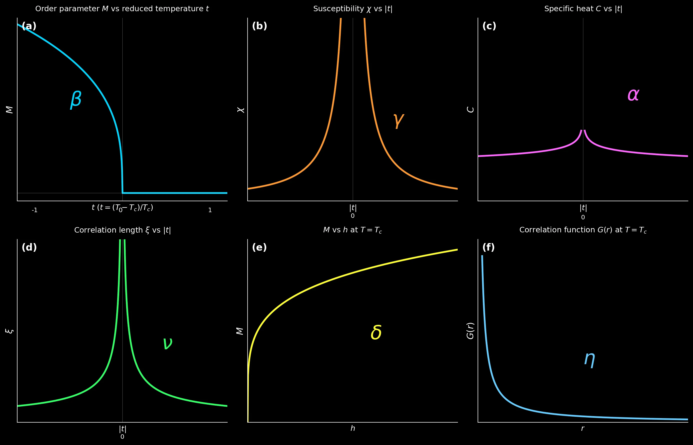
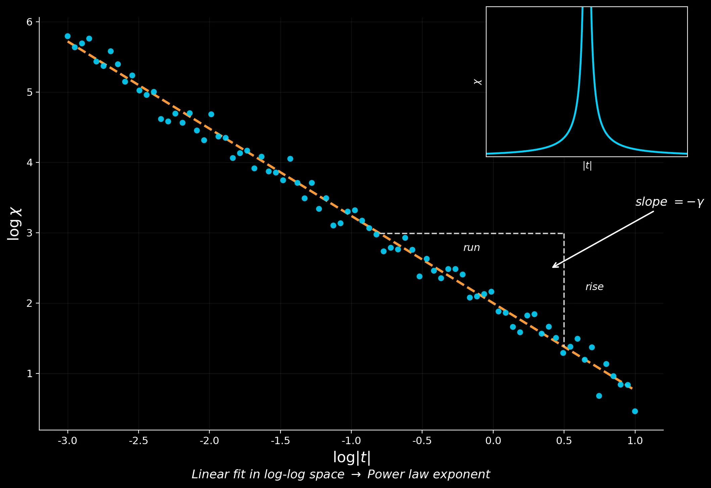
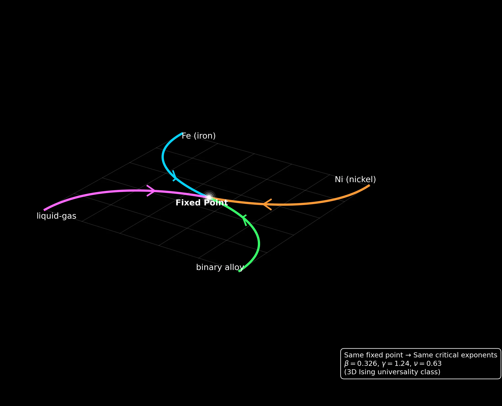
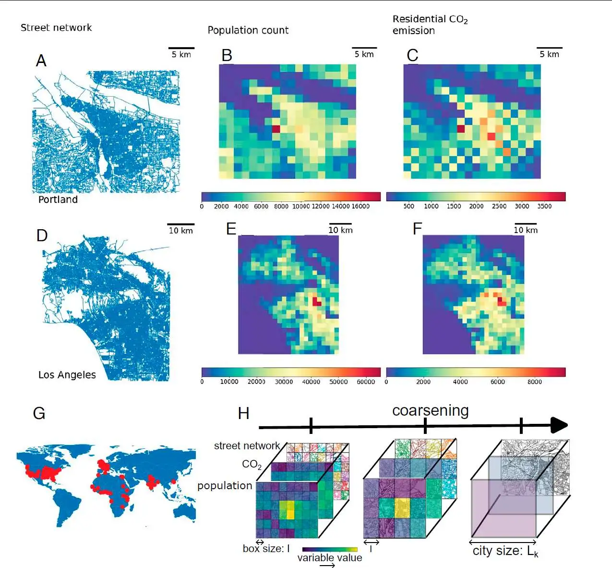
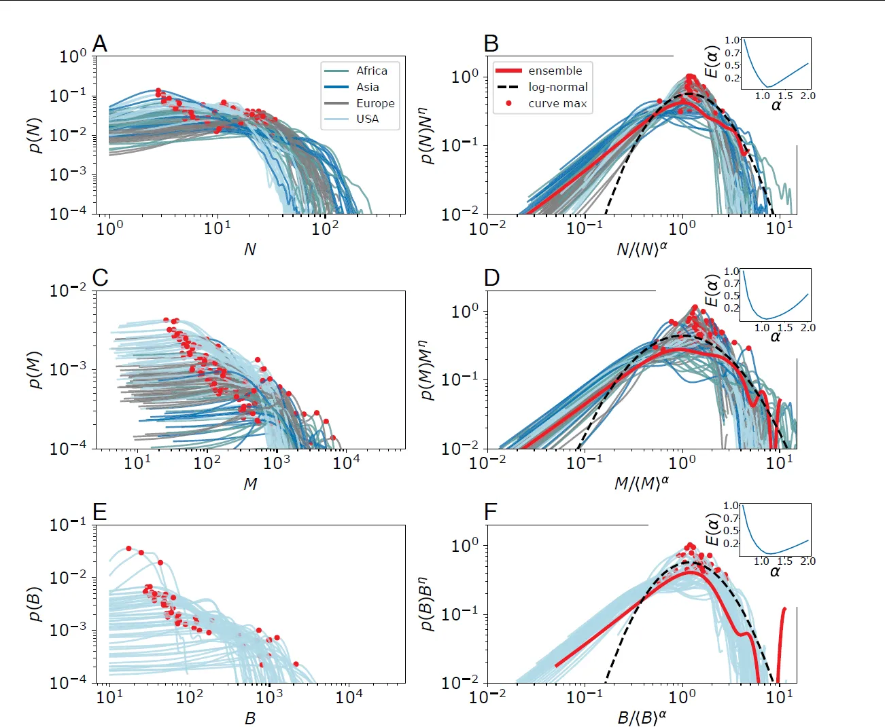
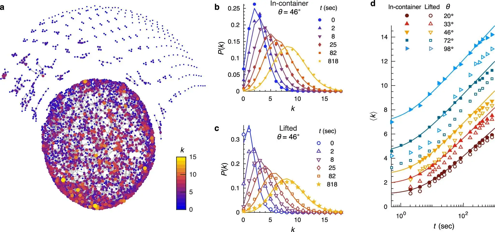

由于篇幅较长，分为上下两篇，以下目录便于查阅：

**【上篇】**
- **引言**
- **1. 相变的分类：一阶与连续相变**
- **2. 序参量、共轭场与响应函数**
- **3. 关联函数、关联长度与"无标度"**

**【下篇】**
- **4. 临界指数：定义、物理意义与"最小参数集"**
- **5. 标度假设与齐次性：从一个假设推出一堆定律**
- **6. 普适类：谁决定指数？**
- **7. 实践：纠缠颗粒网络中的渗流相变**
- **总结**

# 4. 临界指数：从发散行为中提炼"最小参数集"

**上篇**的第3节揭示了一个深刻的事实：临界点附近，物理量不再呈现**正常**的行为——响应函数 $\chi$ 趋于无穷，相关长度 $\xi$ 发散，关联函数从指数衰减转变为幂律衰减。这些发散与幂律行为并非相互独立的偶然现象，而是源于同一个物理根源：系统失去了内禀的长度标度，进入了**无标度世界**。

然而，仅仅知道发散还远远不够。物理学家需要回答的问题是：**这些发散究竟有多快？** 以铁磁体为例，当温度从 $800°\text{C}$ 逼近居里温度 $770°\text{C}$ 时，磁化率 $\chi$ 会增长到原来的多少倍？如果温度再靠近一些呢？同样地，对于2003年北美大停电前夕的电力网络，节点间的负载关联范围扩展的速度有多快？对于传染病传播，当感染率逼近临界阈值时，感染网络的连通规模如何增长？

答案隐藏在一组被称为**临界指数（Critical Exponents）**的数字中。这些指数精确刻画了各种物理量在临界点附近的幂律行为——它们告诉我们**发散的速度、消失的速度、衰减的快慢。**更令人惊讶的是，尽管临界点附近的物理量多达数十种，描述它们行为的独立指数却只有**两个**。所有看似不同的发散行为，最终都可以从这两个独立参数导出。这种**数据压缩**的背后，是深刻的数学结构——**标度假设**与**齐次性**。

本节将系统地定义这些临界指数，阐明每个指数的物理意义，并展示如何从实验或模拟数据中提取它们。这些概念将为下一节的标度律推导奠定基础。

## 4.1 约化温度：临界区的统一度量

在讨论临界行为之前，我们需要一种统一的方式来衡量**系统离临界点有多近**。不同物质的临界温度 $T_c$ 可能相差几个数量级——铁的居里温度是 $1043 \, \text{K}$，而超导体 YBCO 的临界温度只有 $92 \, \text{K}$——但在临界点附近的物理行为却具有普适性。为了比较不同系统的临界行为，我们引入**约化温度（Reduced Temperature）**：

$$
t = \frac{T - T_c}{T_c}
$$

这是一个无量纲量，它将临界点定义为 $t = 0$，高温相对应 $t > 0$，低温相对应 $t < 0$。约化温度的绝对值 $|t|$ 衡量了系统偏离临界点的程度。

**为什么要这样定义？** 直接使用 $T - T_c$ 作为控制参数当然也可以，但那会保留温度的量纲。用 $T_c$ 做归一化后，$t$ 变成一个纯粹的**相对偏离**，使得不同系统之间的比较成为可能。例如，当我们说"铁在 $|t| = 0.01$ 处"和"水在 $|t| = 0.01$ 处"时，尽管两者的绝对温度差完全不同，但它们与各自临界点的相对距离是相同的——这意味着它们在临界区域内处于**相同的物理位置**。

约化温度的引入还带来一个重要的简化。在临界点附近，大多数物理量的行为可以写成 $|t|$ 的幂律形式。例如，相关长度 $\xi \sim |t|^{-\nu}$，磁化率 $\chi \sim |t|^{-\gamma}$。这种统一的幂律形式使得我们可以用几个简洁的指数来描述临界行为，而不需要为每种物质单独建立复杂的经验公式。

**一个需要注意的细节**：许多公式在高温侧（$t > 0$）和低温侧（$t < 0$）会有不同的**振幅（amplitude）**，即幂律前面的系数。例如，磁化率的完整形式可以写成：

$$
\chi = \begin{cases}
\Gamma^+ |t|^{-\gamma} & \text{if } t > 0 \\
\Gamma^- |t|^{-\gamma} & \text{if } t < 0
\end{cases}
$$

其中 $\Gamma^+$ 和 $\Gamma^-$ 通常不相等，它们取决于系统的微观细节。然而，**幂律指数 $\gamma$ 在两侧是相同的**——这正是普适性的体现之一。振幅比 $\Gamma^+/\Gamma^-$ 本身也是一个普适量，与具体材料无关，但这属于更深层的讨论，我们暂且略过。

## 4.2 六个标准临界指数：临界行为的完整字典

临界点附近，系统的各种物理量——比热、序参量、响应函数、相关长度、关联函数——都呈现出幂律行为。物理学家定义了一组**标准临界指数**来描述这些行为。以下以磁性系统为例进行阐述，但这些定义可以直接推广到任何具有连续相变的系统（液-气相变、超流相变、渗流相变等），只需将序参量和共轭场替换为相应的物理量即可。




### 4.2.1 比热指数 $\alpha$：系统吸收能量的异常

**定义**：

$$
C \sim |t|^{-\alpha} \qquad (h = 0)
$$

**物理意义**：比热 $C$ 衡量系统温度每升高一度需要吸收多少热量。在远离临界点时，比热是一个有限且平缓变化的量——你需要一定的热量才能让系统升温。但在临界点附近，比热可能变得异常大，意味着系统变成了一个"贪婪的热库"：微小的热量输入几乎不能改变温度，因为能量都被用于驱动临界涨落。

**$\alpha$ 值的三种情况**：

- **$\alpha > 0$** ：比热真正发散，$C \to \infty$。这意味着临界点处系统对热量的"胃口"趋于无穷。
- **$\alpha = 0$** ：比热不发散，但呈现对数发散 $C \sim \ln|t|$。这是一种边界情况，增长比任何幂律都慢，但仍然趋于无穷。**2D Ising 模型**就是这种情况的典型代表。
- **$\alpha < 0$** ：比热保持有限，但在临界点处有一个**尖点（cusp）**——即导数不连续。3D 渗流模型（$\alpha \approx -0.62$）就属于这种情况。

**与第2节的联系**：回忆涨落-耗散定理 $C_V \sim \text{Var}(E) / T^2$。比热的发散等价于能量涨落 $\text{Var}(E)$ 的发散。临界点附近，能量涨落变得巨大，这正是系统进入"超敏感"状态的体现。

### 4.2.2 序参量指数 $\beta$：有序如何从无序中涌现

**定义**：

$$
M \sim (-t)^\beta \qquad (t < 0, h = 0)
$$

**物理意义**：这个指数描述了**低温侧**有序相中序参量如何从零连续增长。注意定义中的 $(-t)$——因为 $t < 0$ 对应低温相，所以 $-t > 0$。当温度从高温侧降到 $T_c$ 以下时，序参量 $M$ 从零开始连续增长，增长的速率由 $\beta$ 控制。

**$\beta$ 值的物理含义**：

- **$\beta$ 越小**，序参量在 $T_c$ 附近的增长越陡峭。想象两条从原点出发的曲线：$M \sim |t|^{0.1}$ 比 $M \sim |t|^{0.5}$ 在 $t \to 0$ 附近增长得更快。因此，$\beta$ 小意味着一旦温度降到 $T_c$ 以下，有序态"迅速"建立起来。

- **$\beta$ 越大**，序参量增长越缓慢，有序态需要更大的温度偏离才能发展完全。

**一个直观的类比**：想象一群原本随机飞行的鸟（高温无序相）。当某个参数（如鸟群密度）超过临界值时，鸟群开始形成集体运动（低温有序相）。$\beta$ 描述的是这种集体运动"强度"（类似于序参量）如何随参数变化而增长。$\beta$ 小意味着一旦超过临界点，集体运动迅速变强；$\beta$ 大意味着集体运动缓慢增强。

**典型数值**：平均场理论给出 $\beta = 1/2$，2D Ising 模型的精确解给出 $\beta = 1/8 = 0.125$，3D Ising 模型的数值结果约为 $\beta \approx 0.326$。

### 4.2.3 磁化率指数 $\gamma$：响应的发散

**定义**：

$$
\chi \sim |t|^{-\gamma} \qquad (h = 0)
$$

**物理意义**：磁化率 $\chi = \partial M / \partial h$ 衡量系统对外场的响应强度。这个指数直接对应于第2节讨论的"响应函数发散"：当 $\gamma > 0$（通常如此），磁化率在临界点趋于无穷，意味着系统对微弱扰动变得极其敏感。

**与第3节的深层联系**：第3节通过涨落-耗散定理建立了响应与涨落之间的联系 $k_B T \chi = \int d^d r \, G(r)$，又通过关联函数的积分与相关长度 $\xi$ 的关系，推导出 $\chi \sim \xi^{2-\eta}$。结合 $\xi \sim |t|^{-\nu}$，我们得到 $\chi \sim |t|^{-\nu(2-\eta)}$。这意味着 $\gamma = \nu(2-\eta)$——这正是 **Fisher 标度律**的内容。我们在第5节会系统地推导这些关系，但现在你可以看到：**不同的临界指数之间存在内在的联系**，它们并非独立的参数。

**回到北美大停电的例子**：电力网络中，"磁化率"类比于局部故障对全网影响的传播系数。当网络运行在高负荷（临界状态）时，这个传播系数急剧增大——一个节点的微小故障可以触发整个网络的级联响应。$\gamma$ 描述了这种"超敏感性"增长的速度。

### 4.2.4 临界等温线指数 $\delta$：非线性响应的极端

**定义**：

$$
M(t=0) \sim h^{1/\delta}
$$

**物理意义**：这个指数描述的是一种特殊情况——**恰好在临界温度 $T = T_c$（即 $t = 0$）时**，序参量对外场的响应。在这种情况下，$M$ 与 $h$ 之间的关系不再是线性的（$M \propto h$），而是呈现强烈的非线性行为 $M \propto h^{1/\delta}$。

**为什么是非线性的？** 在远离临界点时，自由能关于 $M$ 的曲率（即二阶导数）是有限的，因此微小的外场引起微小的序参量变化，响应是线性的。但在临界点，自由能景观变得极度平坦，曲率趋于零——这正是第1节讨论的"平坦景观"。在这种情况下，线性响应失效，取而代之的是幂律形式的非线性响应。

**$\delta$ 值的物理含义**：

- **$\delta$ 越大**，临界等温线越"平坦"，即需要很大的外场 $h$ 才能产生可观的序参量 $M$。这对应于临界点附近自由能景观极度平坦的情况。
- 典型数值：平均场理论 $\delta = 3$，2D Ising 模型 $\delta = 15$，3D Ising 模型 $\delta \approx 4.79$。

**测量方法**：在实验中，将温度精确调节到 $T_c$，然后测量序参量随外场的变化关系。在双对数图（$\log M$ vs $\log h$）上，数据应该排成直线，斜率为 $1/\delta$。

### 4.2.5 相关长度指数 $\nu$：标度理论的"主角"

**定义**：

$$
\xi \sim |t|^{-\nu}
$$

**物理意义**：相关长度 $\xi$ 是临界现象中最核心的长度标度，它定义了涨落团簇的典型尺寸。$\nu$ 描述了 $\xi$ 如何随着系统逼近临界点而发散。

**为什么 $\nu$ 是"最核心"的指数？** 第3节已经揭示，相关长度的发散是临界现象的根本特征——正是 $\xi \to \infty$ 导致了系统进入"无标度世界"，幂律行为才得以出现。从某种意义上说，$\nu$ 控制了"系统多快进入临界区域"。一旦知道了 $\nu$，许多其他指数可以通过标度律导出。

**$\nu$ 与空间维度的关系**：$\nu$ 的值与空间维度 $d$ 密切相关。在低维系统中，涨落更强烈，$\nu$ 通常更大。例如，2D Ising 模型 $\nu = 1$，而 3D Ising 模型 $\nu \approx 0.63$。平均场理论给出 $\nu = 1/2$，但只在高维（$d > 4$）时才正确。

**测量方法**：从非临界态的关联函数 $G(r) \sim e^{-r/\xi}$ 中拟合出 $\xi$，然后画 $\log \xi$ vs $\log |t|$ 的图，斜率的负值就是 $\nu$。

### 4.2.6 关联函数指数 $\eta$：涨落的"异常维度"

**定义**：

$$
G(r, t=0) \sim r^{-(d-2+\eta)}
$$

**物理意义**：在临界点（$t = 0$）处，关联函数呈现幂律衰减。如果没有涨落的修正，简单的平均场理论（Ornstein-Zernike 理论）预测 $G(r) \sim r^{-(d-2)}$，即 $\eta = 0$。然而，真实系统中涨落的存在会修正这一结果，使得衰减指数变为 $d - 2 + \eta$。

**为什么叫"异常维度"？** 在场论的语言中，$\eta$ 被称为**异常维度（Anomalous Dimension）**。这个名称的来源与重整化群有关。在自由场论中，场算符 $\phi$ 有一个确定的标度维数（scaling dimension），由量纲分析给出。但当相互作用存在时，涨落会"修正"这个标度维数，使其偏离自由场的值——这种偏离就是"异常"的来源，偏离量就是 $\eta$。我们将在后续的场论重整化群讲座中详细讨论这一点。

**$\eta$ 的典型数值**：$\eta$ 通常是一个较小的量。2D Ising 模型 $\eta = 1/4 = 0.25$，3D Ising 模型 $\eta \approx 0.036$，平均场理论 $\eta = 0$。$\eta$ 虽然数值小，但它的存在是涨落效应的直接标志，也是区分平均场与非平均场行为的关键参数。

**测量方法**：在临界点（$t = 0$）处测量关联函数 $G(r)$，在双对数图（$\log G$ vs $\log r$）上拟合直线，斜率为 $-(d-2+\eta)$。

## 4.3 从数据到指数：log-log 图与临界指数的提取

第3节详细讨论了为什么无标度系统必然呈现幂律分布，以及为什么双对数图（log-log plot）是研究临界现象的标准工具。现在我们将这些知识应用于临界指数的实际测量。

**核心思想**：如果一个物理量 $A$ 与控制参数 $x$ 满足幂律关系 $A \sim x^p$，那么取对数后：

$$
\log A = p \log x + \text{const}
$$

这是一个线性关系：$\log A$ 对 $\log x$ 的图是一条直线，**斜率就是幂律指数 $p$** 。

下表总结了各临界指数的测量方法：

**表1：临界指数的测量方法与 log-log 斜率**
| 指数 | 对应物理量 | 实验/模拟条件 | log-log 图上斜率 |
| :---: | :--- | :--- | :--- |
| $\beta$ | 序参量 $M$ vs 约化温度 $t < 0$ | 零外场 $h = 0$，低温侧 | $\log M$ 对 $\log(-t)$：斜率 $= +\beta$ |
| $\gamma$ | 磁化率 $\chi$ vs 约化温度 $t$ | 零外场极限 $h \to 0$ | $\log \chi$ 对 $\log \|t\|$：斜率 $= -\gamma$ |
| $\alpha$ | 比热 $C$ vs 约化温度 $t$ | 零外场 $h = 0$ | $\log C$ 对 $\log \|t\|$：斜率 $= -\alpha$ |
| $\nu$ | 相关长度 $\xi$ vs 约化温度 $t$ | 从 $G(r) \sim e^{-r/\xi}$ 拟合 $\xi$ | $\log \xi$ 对 $\log \|t\|$：斜率 $= -\nu$ |
| $\eta$ | 关联函数 $G(r)$ at $t = 0$ | 在临界点测量 | $\log G$ 对 $\log r$：斜率 $= -(d-2+\eta)$ |
| $\delta$ | 序参量 $M$ vs 外场 $h$ at $t = 0$ | 临界等温线 | $\log M$ 对 $\log h$：斜率 $= +1/\delta$ |

**注意斜率的符号**：表中斜率的符号需要仔细理解。以 $\gamma$ 为例：$\chi \sim |t|^{-\gamma}$ 意味着 $|t|$ 减小时 $\chi$ 增大，所以 $\log \chi$ 对 $\log |t|$ 的斜率是**负的** $-\gamma$。而 $\beta$ 的情况不同：$M \sim (-t)^\beta$ 表示 $(-t)$ 增大时 $M$ 也增大（低温侧 $-t > 0$），斜率是**正的** $+\beta$。




**实际测量中的挑战**：

尽管上述方法在原理上非常直接，实际操作中却面临许多困难：

1. **有限尺寸效应（Finite-Size Effects）**：真正的相变只存在于无穷大系统。实验和模拟中的有限系统会导致"假临界点"的位置偏移，响应函数的峰值有限而非发散，从而系统性地偏离理论预测的幂律行为。

2. **临界区的宽度**：幂律只在 $|t| \ll 1$ 的临界区内成立。远离临界点时，会出现对幂律的修正（correction to scaling）。因此，数据拟合需要小心选择拟合范围——太远离临界点会引入修正项；太接近临界点又会受到有限尺寸效应的影响。

3. **临界点位置的不确定性**：实验中 $T_c$ 的精确值往往不能预先知道，需要从数据中确定。但 $T_c$ 的误差会传播到约化温度 $t$ 的计算中，进而影响指数的测量。

4. **统计涨落与系统误差**：实验噪声和模拟中的有限采样都会在 log-log 图上产生散点，尤其是在 $|t|$ 很小时数据往往稀疏且噪声大。

**更可靠的方法**：由于上述挑战，单纯的 log-log 拟合往往不够可靠。现代研究中广泛采用**有限尺寸标度（Finite-Size Scaling, FSS）**与**数据塌缩（Data Collapse）**方法。这些技术利用不同系统尺寸的数据，通过恰当的标度变换将它们"塌缩"到同一条主曲线上。如果选择了正确的临界指数和临界点位置，塌缩会成功；否则数据会分散。这种方法比单纯的幂律拟合更加稳健，因为它同时利用了**多组数据**和**标度函数的形状**信息。第7节将通过渗流相变的实例详细展示这一方法。

## 4.4 不同普适类的临界指数对比

前三节已经多次提到一个关键概念：**普适性（Universality）**。不同的物理系统——铁磁体、液体、超导体、渗流网络——在临界点附近可能表现出完全相同的临界指数。这些共享同一组指数的系统被归入同一个**普适类（Universality Class）**。

下表列出了几个最常见的普适类的临界指数：

**表2：不同普适类的临界指数**

| 指数 | 物理定义 | 平均场 (Landau) | 2D Ising (精确) | 3D Ising (数值) | 3D 渗流 (数值) |
|:---:|:---:|:---:|:---:|:---:|:---:|
| $\alpha$ | $C \sim \|t\|^{-\alpha}$ | 0 (跳变) | 0 (对数) | ~0.11 | ~-0.62 |
| $\beta$ | $M \sim (-t)^\beta$ | 1/2 | 1/8 = 0.125 | ~0.326 | ~0.41 |
| $\gamma$ | $\chi \sim \|t\|^{-\gamma}$ | 1 | 7/4 = 1.75 | ~1.24 | ~1.80 |
| $\delta$ | $M(t=0) \sim h^{1/\delta}$ | 3 | 15 | ~4.79 | ~18 |
| $\nu$ | $\xi \sim \|t\|^{-\nu}$ | 1/2 | 1 | ~0.63 | ~0.88 |
| $\eta$ | $G(r) \sim r^{-(d-2+\eta)}$ | 0 | 1/4 = 0.25 | ~0.036 | ~-0.05 |

1. **平均场理论**给出了一组"简单"的指数值（$\beta = 1/2$，$\gamma = 1$ 等）。这些值在高维空间（$d > 4$）中是正确的，但在低维空间中被涨落效应修正。平均场的 $\alpha = 0$ 对应的是比热的**跳变**（不是发散，而是一个有限的阶跃不连续），这与 2D Ising 的对数发散是不同的情况。

2. **2D Ising 模型**的临界指数可以精确计算（Onsager 解），是理论检验的重要基准。注意 $\eta = 1/4$ 和 $\delta = 15$ 都显著偏离平均场值，显示了二维涨落的强烈效应。

3. **3D Ising 模型**没有精确解，指数值来自高精度的数值模拟和场论计算（$\epsilon$-展开）。3D Ising 普适类包括了单轴铁磁体、液-气相变的临界点、二元合金的有序-无序相变等。

4. **3D 渗流模型**描述的是几何连通性的相变（如本讲第7节将讨论的纠缠颗粒网络）。它的指数与 Ising 普适类不同，反映了渗流相变的"非热力学"性质。特别注意 $\alpha < 0$，意味着比热在临界点**不发散**，而是有一个尖点。

**普适类的深层含义**：表中不同列代表不同的普适类，同一列中的系统共享相同的临界指数。这一事实的深层原因是：**决定临界指数的只有空间维度 $d$、序参量的对称性、以及相互作用的力程**，而与系统的微观细节（如晶格结构、相互作用强度、原子质量）无关。在重整化群的语言中，同一普适类的系统在 RG 流中汇聚到同一个**固定点**，而临界指数正是由固定点的性质决定的。第6节将详细讨论普适类的概念。

## 4.5 临界指数的本质：固定点的"指纹"

在结束本节之前，我们需要澄清一个关键的概念问题：**临界指数究竟是什么？**

一种常见但错误的理解是：临界指数是从实验数据中拟合出来的参数，类似于拟合一条抛物线时确定的系数。如果是这样，不同的实验就可能给出不同的指数值，而且这些值没有特别的物理意义。

然而，临界指数的真正本质完全不同。**临界指数是固定点的"指纹"——它们不是拟合参数，而是由系统的普适类唯一决定的数学常数。**

这个观点可以从两个角度理解：

**从现象学角度**：第3节已经揭示，临界点附近系统进入"无标度世界"，失去了内禀的长度标度。在这种情况下，微观细节（如晶格常数、相互作用强度）被"遗忘"了，只有普适性质（如对称性、维度）幸存下来。这意味着临界指数不可能依赖于微观参数——它们必须是**普适的**。

**从重整化群角度**：第一讲和第二讲已经介绍了RG的核心图像：粗粒化过程将系统从微观尺度"流动"到宏观尺度。不同微观起点的系统在这个流动中可能汇聚到同一个**固定点（Fixed Point）**——一个在RG变换下不再改变的特殊点。临界指数正是由固定点附近的线性化行为决定的：当系统接近固定点时，RG流的行为完全由固定点的性质控制，而与初始条件无关。

这个图像可以用一个简单的类比来理解。想象一个山谷（固定点）和从四面八方流向山谷的河流（RG流）。不同河流从不同的起点出发（不同的微观系统），但它们最终都汇入同一个山谷。一旦进入山谷附近，所有河流的行为都由山谷的地形决定，与它们的起点无关。临界指数就是描述"山谷地形"的参数——它们是固定点的内禀性质，与具体的"河流"（微观系统）无关。




 **临界指数是固定点的"指纹"：看指数，就像看指纹认人。**这个类比也解释了为什么精确测量临界指数如此重要。指纹可以用来识别身份——同样，临界指数可以用来判断系统属于哪个普适类。如果测得的指数与 3D Ising 普适类匹配，那么系统就"认证"为 3D Ising 类成员，无论它是铁磁体、液体还是合金。

在本讲中，我们暂时不使用重整化群的完整数学机器来推导临界指数的值——那是后续讲座的重头戏。我们将采用一种更直接的方法：**标度假设（Scaling Hypothesis）**与**齐次性（Homogeneity）**。下一节将展示，仅仅从一个简洁的数学假设出发，就可以推导出临界指数之间必须满足的**标度律（Scaling Laws）**，将六个看似独立的指数压缩为仅有两个独立参数。这种**数据压缩**的成功，本身就是标度假设正确性的有力证据。


# 5. 标度假设与齐次性：六个指数为何只有两个独立？

第4节定义了六个临界指数 $(\alpha, \beta, \gamma, \delta, \nu, \eta)$，它们分别描述比热、序参量、磁化率、临界等温线、相关长度和关联函数在临界点附近的幂律行为。如果这六个指数是完全独立的拟合参数，那么描述一个临界系统就需要六个自由度——这意味着不同系统之间几乎不可能存在任何普遍联系。

然而，实验和理论都揭示了一个惊人的事实：**这六个指数并非独立**。它们之间存在严格的数学关系，称为**标度律（Scaling Laws）**。例如，Rushbrooke 标度律声称 $\alpha + 2\beta + \gamma = 2$；Widom 标度律声称 $\gamma = \beta(\delta - 1)$。这些关系将六个指数压缩为仅有**两个独立参数**——一旦知道了其中任意两个（比如 $\nu$ 和 $\eta$），其他四个就完全确定了。

这种**数据压缩**不是巧合，而是源于临界点附近物理的深层结构。第3节已经揭示，临界点处系统进入**无标度世界**，失去了内禀的长度标度。这种标度不变性对自由能的数学形式施加了强约束——自由能的奇异部分必须是一个特殊的函数形式，称为**广义齐次函数（Generalized Homogeneous Function）**。从这个简洁的数学假设出发，所有标度律都可以作为必然的推论被推导出来。

## 5.1 为什么临界点附近只能是幂律？

在深入标度假设的数学形式之前，我们先回答一个更基本的问题：**为什么临界点附近的物理量必然呈现幂律行为，而不是其他形式（如指数、对数、多项式）？**

答案隐藏在第3节揭示的核心事实中：**临界点处，系统只有一个发散的长度标度——相关长度 $\xi$**。当 $\xi \to \infty$ 时，系统失去了内禀的长度标度，进入无标度世界。在这种情况下，物理量的行为只能由 $\xi$ 来决定。

考虑自由能密度 $f$（单位体积的自由能）。从量纲分析的角度，$f$ 的量纲是 $[\text{能量}]/[\text{体积}] = [\text{能量}] \cdot [\text{长度}]^{-d}$。在临界点附近，唯一可用的长度标度是 $\xi$，因此自由能密度的**奇异部分**（即导致临界行为的那部分）只能是：

$$
f_s \sim \xi^{-d}
$$

这是一个量纲论证：如果没有其他长度标度可用，$f_s$ 就必须与 $\xi^{-d}$ 成正比，因为这是唯一能给出正确量纲的组合。

现在，由于 $\xi \sim |t|^{-\nu}$，我们立刻得到：

$$
f_s \sim \xi^{-d} \sim |t|^{d\nu}
$$

这就是幂律行为的起源：**临界点附近只有一个发散的长度标度，所有物理量都必须由这个标度构建，而"构建"的唯一方式就是幂次组合。**

回到引言中的北美大停电例子：当电力网络运行在临界状态时，节点间的负载关联范围（类似于 $\xi$）扩展到整个网络。在这种情况下，局部故障的影响范围不再由网络的任何内禀尺度（如节点间距）决定，而是由这个发散的关联长度决定。系统对扰动的响应（类似于 $\chi$）因此呈现幂律发散，而不是保持有限或指数增长。

## 5.2 广义齐次函数：标度假设的数学表达

上一小节的量纲论证虽然直观，但不够严格——它假设了 $f_s \sim \xi^{-d}$，而这其实是一个额外的假设（称为**超标度假设**，hyperscaling）。我们需要一个更普遍的数学框架来描述临界行为，这就是**标度假设（Scaling Hypothesis）**。

### 5.2.1 什么是齐次函数？

在引入标度假设之前，我们需要理解一个数学概念：**齐次函数（Homogeneous Function）**。

一个函数 $f(x, y)$ 如果满足以下性质：

$$
f(\lambda x, \lambda y) = \lambda^p f(x, y)
$$

对于任意正数 $\lambda$ 和某个固定的指数 $p$，就称 $f$ 是 $p$ 阶齐次函数。

**物理直觉**：齐次函数描述的是一种**标度不变性**——如果你同时将所有自变量放大 $\lambda$ 倍，函数值也会以确定的方式（放大 $\lambda^p$ 倍）响应。

**一个简单的例子**：圆的面积公式 $A = \pi r^2$ 是 $r$ 的2阶齐次函数。如果半径放大2倍，面积放大4倍。这就是几何中的标度关系。

然而，临界现象中的标度行为更加复杂：约化温度 $t$ 和外场 $h$ 对物理量的影响程度不同。我们需要一个更灵活的概念——**广义齐次函数（Generalized Homogeneous Function）**：

$$
f(\lambda^a x, \lambda^b y) = \lambda f(x, y)
$$

这里 $a$ 和 $b$ 是两个不同的指数，描述了 $x$ 和 $y$ 在标度变换下的不同"权重"。

### 5.2.2 Widom 标度假设

1965年，Benjamin Widom 提出了一个大胆的假设：**自由能的奇异部分是约化温度 $t$ 和外场 $h$ 的广义齐次函数**。

首先，我们需要将自由能分为两部分：

$$
f(t, h) = f_{\text{reg}}(t, h) + f_s(t, h)
$$

第一部分 $f_{\text{reg}}$ 是**解析部分**，它在临界点附近是光滑的，可以展开为约化温度 $t$ 和外场 $h$ 的泰勒级数，对应于"正常"的热力学行为。第二部分 $f_s$ 是**奇异部分**，它在临界点 $(t=0, h=0)$ 不解析——正是这个非解析性导致了响应函数的发散和所有临界现象。标度假设关注的正是这个奇异部分。

**Widom 标度假设**声称，奇异部分满足一个特殊的函数方程：

$$
\boxed{f_s(t, h) = b^{-d} f_s(b^{y_t} t, b^{y_h} h)}
$$

这个公式的物理含义需要仔细解读。其中 $b > 1$ 是一个任意的标度因子，可以理解为"将系统粗粒化 $b$ 倍"——想象把 $b^d$ 个原来的格点合并成一个新的"超格点"。在这个粗粒化过程中，自由能密度（单位体积的自由能）按 $b^{-d}$ 的因子变化，因为单位体积变大了 $b^d$ 倍。与此同时，约化温度 $t$ 和外场 $h$ 也会随粗粒化而变化：$t$ 乘以因子 $b^{y_t}$，$h$ 乘以因子 $b^{y_h}$。这里的 $y_t$ 和 $y_h$ 称为 $t$ 和 $h$ 的**标度维数（Scaling Dimensions）**，它们描述了这两个参数在粗粒化过程中**增长**或**缩小**的速率。

从物理直觉上看，这个公式捕捉的是临界点附近系统的**自相似性**：如果你"站远一点"观察系统（即粗粒化），系统的统计行为与原来的行为有确定的数学关系。约化温度和外场以特定的速率变化，而自由能密度按体积因子变化。这正是第3节讨论的**标度不变性**的精确数学表达。


在重整化群的语言中，$y_t$ 和 $y_h$ 正是固定点附近线性化RG变换的特征指数。它们的符号决定了对应参数在RG流中是**相关的**（relevant，$y > 0$，会远离固定点）还是**无关的**（irrelevant，$y < 0$，会流向固定点）。对于临界现象，$t$ 和 $h$ 都是相关参数（$y_t, y_h > 0$），这解释了为什么只需要调控这两个参数就能驱动系统穿越相变。这一RG图像将在后续讲座中完整展开。

## 5.3 从标度假设推导临界指数的关系

标度假设的威力在于：从这一个公式出发，可以推导出所有临界指数之间的关系。下面我们展示这一推导过程。

### 5.3.1 消去标度因子 $b$

标度假设中的 $b$ 是任意的，我们可以选择一个特定的值来简化计算。经典的技巧是：**选择 $b$ 使得 $b^{y_t} |t| = 1$** 。

这意味着 $b = |t|^{-1/y_t}$。代入标度假设：

$$
f_s(t, h) = |t|^{d/y_t} f_s\left(\pm 1, \frac{h}{|t|^{y_h/y_t}}\right)
$$

其中 $\pm 1$ 对应于 $t > 0$（高温相）和 $t < 0$（低温相）。

定义两个重要的量：

$$
\nu \equiv \frac{1}{y_t}, \qquad \Delta \equiv \frac{y_h}{y_t}
$$

这里 $\nu$ 正是相关长度指数（因为在RG语言中，$\xi \sim |t|^{-1/y_t} = |t|^{-\nu}$），而 $\Delta$ 称为**间隙指数（Gap Exponent）**，它描述了外场 $h$ 相对于温度 $t$ 的标度权重。

于是，自由能的奇异部分可以写成：

$$
\boxed{f_s(t, h) = |t|^{d\nu} \Phi_\pm\left(\frac{h}{|t|^\Delta}\right)}
$$

其中 $\Phi_\pm$ 是两个**标度函数（Scaling Functions）**，分别对应高温相和低温相。这个形式告诉我们：自由能的奇异部分不是 $t$ 和 $h$ 的任意函数，而是一个特定的组合形式——$|t|^{d\nu}$ 乘以一个只依赖于 $h/|t|^\Delta$ 的函数。

### 5.3.2 推导各个临界指数

现在我们可以从自由能的标度形式出发，推导各个临界指数与 $\nu$ 和 $\Delta$ 的关系。

**序参量 $M$ 与指数 $\beta$**

序参量是自由能对外场的导数：

$$
M(t, h) = -\frac{\partial f_s}{\partial h}
$$

对标度形式求导：

$$
M(t, h) = -\frac{\partial}{\partial h}\left[|t|^{d\nu} \Phi_\pm\left(\frac{h}{|t|^\Delta}\right)\right] = |t|^{d\nu - \Delta} \mathcal{M}_\pm\left(\frac{h}{|t|^\Delta}\right)
$$

其中 $\mathcal{M}_\pm(x) = -\Phi'_\pm(x)$ 是另一个标度函数。

在零外场（$h = 0$）的低温相（$t < 0$）中，序参量按 $M \sim (-t)^\beta$ 增长。比较两边，我们得到：

$$
\boxed{\beta = d\nu - \Delta}
$$

**磁化率 $\chi$ 与指数 $\gamma$**

磁化率是序参量对外场的导数：

$$
\chi(t) = \left.\frac{\partial M}{\partial h}\right|_{h=0}
$$

从 $M$ 的标度形式再求一次导数：

$$
\chi(t) \sim |t|^{d\nu - 2\Delta}
$$

由于 $\chi \sim |t|^{-\gamma}$，比较两边：

$$
\boxed{\gamma = 2\Delta - d\nu}
$$

**比热 $C$ 与指数 $\alpha$**

比热是自由能对温度的二阶导数：

$$
C \sim -\frac{\partial^2 f}{\partial T^2} \sim \frac{\partial^2 f_s}{\partial t^2}
$$

在 $h = 0$ 时，$f_s(t, 0) \sim |t|^{d\nu}$。对 $t$ 求两次导数：

$$
C \sim |t|^{d\nu - 2}
$$

由于 $C \sim |t|^{-\alpha}$，比较两边：

$$
\boxed{2 - \alpha = d\nu}
$$

这就是著名的 **Josephson 超标度律（Hyperscaling Relation）**。它将比热指数 $\alpha$、相关长度指数 $\nu$ 和空间维度 $d$ 联系在一起。

**临界等温线指数 $\delta$**

在恰好 $t = 0$ 时，我们需要用另一种方式选择 $b$。令 $b = h^{-1/y_h}$，代入标度假设：

$$
f_s(0, h) = h^{d/y_h} f_s(0, 1)
$$

对 $h$ 求导得到序参量：

$$
M(0, h) \sim h^{d/y_h - 1} = h^{(d - y_h)/y_h}
$$

由于 $M(0, h) \sim h^{1/\delta}$，比较两边：

$$
\boxed{\delta = \frac{y_h}{d - y_h}}
$$

这可以用 $\nu$ 和 $\Delta$ 重新表示为 $\delta = \Delta / (d\nu - \Delta) = \Delta / \beta$，从而给出 $\Delta = \beta \delta$。

### 5.3.3 小结：所有指数由两个参数决定

让我们整理一下已经推导的关系：

$$
\begin{aligned}
\beta &= d\nu - \Delta \\
\gamma &= 2\Delta - d\nu \\
2 - \alpha &= d\nu \\
\delta &= \frac{\Delta}{\beta} = \frac{\Delta}{d\nu - \Delta}
\end{aligned}
$$

这四个方程包含四个指数 $(\alpha, \beta, \gamma, \delta)$ 和两个基本参数 $(\nu, \Delta)$。这意味着：**一旦知道 $\nu$ 和 $\Delta$（或等价地，$\nu$ 和 $\eta$），所有其他指数都完全确定。**

六个临界指数，只有两个是独立的——这正是标度假设的核心预言。

## 5.4 四大标度律：指数之间的恒等式

通过消去 $\nu$ 和 $\Delta$，我们可以得到直接联系临界指数的恒等式，这些就是著名的**标度律（Scaling Laws）**。

### 5.4.1 Rushbrooke 标度律

$$
\boxed{\alpha + 2\beta + \gamma = 2}
$$

**推导**：将 $\alpha = 2 - d\nu$，$\beta = d\nu - \Delta$，$\gamma = 2\Delta - d\nu$ 代入左边：

$$
(2 - d\nu) + 2(d\nu - \Delta) + (2\Delta - d\nu) = 2 - d\nu + 2d\nu - 2\Delta + 2\Delta - d\nu = 2
$$

恒等式成立！

**物理意义**：Rushbrooke 标度律联系了三个最容易测量的热力学响应函数——比热（$\alpha$）、序参量（$\beta$）和磁化率（$\gamma$）。它是标度理论最早被实验验证的预言之一。

**数值验证**：以3D Ising 模型为例，$\alpha \approx 0.11$，$\beta \approx 0.326$，$\gamma \approx 1.24$。代入：$0.11 + 2 \times 0.326 + 1.24 = 2.002 \approx 2$。符合得非常好！

### 5.4.2 Widom 标度律

$$
\boxed{\gamma = \beta(\delta - 1)}
$$

**推导**：从 $\gamma = 2\Delta - d\nu$ 和 $\beta = d\nu - \Delta$，我们有 $\gamma + \beta = \Delta$。又从 $\delta = \Delta / \beta$，得 $\Delta = \beta \delta$。因此：

$$
\gamma = \Delta - \beta = \beta \delta - \beta = \beta(\delta - 1)
$$

**物理意义**：Widom 标度律将磁化率的发散（$\gamma$）与临界等温线的非线性（$\delta$）和序参量的增长（$\beta$）联系起来。它体现了状态方程 $M = M(t, h)$ 的齐次性结构。

### 5.4.3 Fisher 标度律

$$
\boxed{\gamma = (2 - \eta)\nu}
$$

**推导**：这个标度律的推导需要用到第3节建立的涨落-耗散定理 $k_B T \chi = \int d^d r \, G(r)$。

在临界点附近，关联函数的完整形式是（Ornstein-Zernike 形式加幂律修正）：

$$
G(r) \sim \frac{1}{r^{d-2+\eta}} e^{-r/\xi}
$$

在 $d$ 维空间中对关联函数积分：

$$
\chi \sim \int_0^\infty dr \, r^{d-1} \cdot \frac{1}{r^{d-2+\eta}} e^{-r/\xi} = \int_0^\infty dr \, r^{1-\eta} e^{-r/\xi}
$$

这个积分可以用换元 $u = r/\xi$ 来计算：

$$
\chi \sim \xi^{2-\eta} \int_0^\infty du \, u^{1-\eta} e^{-u} \sim \xi^{2-\eta}
$$

代入 $\xi \sim |t|^{-\nu}$：

$$
\chi \sim |t|^{-\nu(2-\eta)}
$$

与 $\chi \sim |t|^{-\gamma}$ 比较，得到 $\gamma = (2-\eta)\nu$。

**物理意义**：Fisher 标度律将**热力学响应**（磁化率 $\chi$）与**空间几何结构**（关联函数的衰减指数 $\eta$）联系起来。它的深刻之处在于：宏观的"超敏感"响应完全可以用微观的关联函数"长尾"来解释。这正是第3节建立的"相关长度发散 $\Leftrightarrow$ 幂律关联 $\Leftrightarrow$ 响应发散"等价链的数学体现。

### 5.4.4 Josephson 超标度律

$$
\boxed{d\nu = 2 - \alpha}
$$

这个关系也称为**hyperscaling**，因为它包含了空间维度 $d$。

**物理意义**：超标度律来自5.1节讨论的量纲论证 $f_s \sim \xi^{-d}$。它将比热指数 $\alpha$、相关长度指数 $\nu$ 和空间维度 $d$ 联系在一起。

与其他三个标度律不同，超标度律在高维空间中会**失效**。当空间维度 $d$ 超过某个临界值 $d_c$（称为**上临界维度**，对于 Ising 模型 $d_c = 4$）时，涨落变得相对较弱，系统的行为由平均场理论主导。在这种情况下，$f_s \sim \xi^{-d}$ 的直觉不再成立，超标度律被修正。

我们将在后续关于 Landau 理论和 Ginzburg 判据的讲座中详细讨论这一点。现在只需记住：**当 $d > d_c$ 时，超标度律失效，但其他三个标度律仍然成立。**

### 5.4.5 标度律汇总

**表：四大标度律及其性质**

| 名称 | 公式 | 涉及的指数 | 适用条件 |
|:---:|:---:|:---:|:---:|
| Rushbrooke | $\alpha + 2\beta + \gamma = 2$ | $\alpha, \beta, \gamma$ | 标度假设成立时精确 |
| Widom | $\gamma = \beta(\delta - 1)$ | $\beta, \gamma, \delta$ | 标度假设成立时精确 |
| Fisher | $\gamma = (2 - \eta)\nu$ | $\gamma, \eta, \nu$ | 标度假设成立时精确 |
| Josephson | $d\nu = 2 - \alpha$ | $\alpha, \nu, d$ | 仅当 $d < d_c$ 时成立 |

## 5.5 数据塌缩：标度假设的实验检验

标度假设不仅给出指数之间的关系，还给出了一种强大的实验检验方法——**数据塌缩（Data Collapse）**。

### 5.5.1 从标度形式到数据塌缩

回到序参量的标度形式：

$$
M(t, h) = |t|^\beta \mathcal{M}_\pm\left(\frac{h}{|t|^\Delta}\right)
$$

这个公式告诉我们：虽然不同温度 $t$ 和外场 $h$ 下的磁化曲线看起来各不相同，但如果用**正确的方式重新标度坐标轴**，所有曲线都应该**塌缩到同一条主曲线**上。

具体操作方法是这样的：首先在多个不同的温度 $t_1, t_2, \ldots$ 下测量磁化强度 $M$ 随外场 $h$ 的变化，得到一族看起来杂乱无章的曲线。然后对每组数据做标度变换——将横轴改为 $x = h / |t|^\Delta$，将纵轴改为 $y = M / |t|^\beta$。如果标度假设正确，经过这个变换后，所有数据点都应该落在同一条曲线 $y = \mathcal{M}_\pm(x)$ 上。

塌缩的成功与否提供了关键的诊断信息。如果数据确实塌缩到一条主曲线上，这意味着你选择的 $\beta$ 和 $\Delta$ 是正确的，标度假设得到了验证。相反，如果塌缩失败（数据点散乱分布），则说明要么参数值不对，要么系统根本不满足标度假设——可能是因为测量不在真正的临界区，或者存在对标度行为的修正项。

### 5.5.2 数据塌缩的威力

数据塌缩方法相比传统的单点幂律拟合有显著优势。首先，它利用了整个临界区的全部测量结果，而不是只用临界点附近的少数几个数据点，因此统计精度更高、对系统误差更不敏感。其次，如果使用从其他独立测量（如比热测量）得到的指数值来尝试塌缩，塌缩是否成功就提供了标度假设的独立检验——这是一种强大的自洽性测试。

此外，通过调整 $T_c$ 的值使塌缩质量最优，可以非常精确地确定临界温度——这往往比直接寻找响应函数峰值更准确。最后，数据塌缩还可以用来判别普适类：使用不同普适类的理论指数值分别尝试塌缩，成功塌缩的那组指数就揭示了系统的普适类归属。

以下图的城市数据为例，将城市街道网络、人口数量与住宅 CO₂ 排放在不同空间分辨率下进行系统性粗粒化。通过逐步增大盒尺度（box size），将城市视为由多尺度单元组成的统计系统，为后续的尺度分析与分布重标度提供基础。该过程揭示了城市代谢变量随空间尺度变化的结构一致性。相关论文解读可以查看：城市也有“物理相变”：在涨落中发现普适的城市“坍缩”规律




不同城市（跨大洲样本）中，人口 (N)、排放 (M)、建筑规模 (B) 等城市代谢变量在原始尺度下呈现明显差异（左列）。当变量按其均值进行适当的幂律重标度后（右列），所有城市的分布函数坍缩到**同一条普适曲线**上，表明城市数据并非各自独立，而是受同一尺度不变结构支配。该数据坍缩现象显示：**城市系统在统计意义上可视为属于同一普适类，其空间与社会异质性被有效吸收到单一标度函数中**。





### 5.5.3 有限尺寸标度

在实际的数值模拟中，系统总是有限大小的（比如 $L \times L \times L$ 的格点）。有限系统无法展现真正的相变——响应函数不会发散，只会出现有限的峰值。如何从有限系统的数据中提取无穷大系统的临界行为？

答案是**有限尺寸标度（Finite-Size Scaling, FSS）**。核心思想是：在有限系统中，当相关长度 $\xi$ 增长到接近系统尺寸 $L$ 时，系统"感觉到"了边界的存在，临界行为被截断。

FSS 预言：在临界点附近，物理量同时依赖于 $t$ 和 $L$，满足标度形式：

$$
M(t, L) = L^{-\beta/\nu} \widetilde{\mathcal{M}}\left(t \cdot L^{1/\nu}\right)
$$

$$
\chi(t, L) = L^{\gamma/\nu} \widetilde{\chi}\left(t \cdot L^{1/\nu}\right)
$$

这些公式导出了有限尺寸数据塌缩的具体方案：将横轴设为 $x = t \cdot L^{1/\nu}$（对于渗流则是 $(p - p_c) \cdot L^{1/\nu}$），将纵轴设为 $M \cdot L^{\beta/\nu}$ 或 $\chi \cdot L^{-\gamma/\nu}$。如果指数选择正确，不同系统尺寸 $L$ 的数据将塌缩到同一条主曲线上。这个方法的精妙之处在于：它把有限尺寸效应从"障碍"变成了"工具"——通过系统地改变 $L$，我们反而获得了更多可用于塌缩的数据。第7节的渗流相变实践将详细展示如何使用这些技术从模拟数据中提取临界指数。

## 5.6 超标度律何时失效？上临界维度

在结束本节之前，我们需要讨论一个重要的边界条件：**超标度律（hyperscaling）在什么情况下会失效？**

### 5.6.1 上临界维度

第5.4节已经提到，超标度律 $d\nu = 2 - \alpha$ 包含空间维度 $d$，这与其他标度律不同。更深层的原因是：这个关系依赖于 $f_s \sim \xi^{-d}$ 的假设，即自由能密度完全由相关长度决定。

然而，当空间维度足够高时，涨落的效应变得相对较弱。在高维空间中，粒子有更多的方向可以"躲避"彼此的涨落影响，因此平均场近似（忽略涨落的理论）变得越来越准确。

存在一个临界维度 $d_c$，称为**上临界维度（Upper Critical Dimension）**，它将空间维度分成三个区域。当 $d < d_c$ 时，涨落效应占主导，临界指数由涨落的集体行为决定，超标度律成立。当 $d > d_c$ 时，涨落相对不重要，系统表现出平均场行为，临界指数取 Landau 理论给出的"经典值"，超标度律失效。当恰好 $d = d_c$ 时，情况处于边界，通常会出现对数修正——幂律行为被乘以对数因子。

上临界维度的具体值取决于系统的普适类：

| 普适类 | 上临界维度 $d_c$ |
|:---:|:---:|
| Ising / 液-气 / 二元混合物 | 4 |
| XY / 超流相变 | 4 |
| Heisenberg / 铁磁相变 | 4 |
| 渗流 | 6 |

### 5.6.2 平均场指数

在 $d > d_c$ 时，临界指数取平均场值（也称为 Landau 指数）：

$$
\alpha = 0, \quad \beta = \frac{1}{2}, \quad \gamma = 1, \quad \delta = 3, \quad \nu = \frac{1}{2}, \quad \eta = 0
$$

可以验证，这些值满足 Rushbrooke、Widom 和 Fisher 标度律，但**不满足**超标度律（除非恰好 $d = 4$）。

以 $d = 5$ 的 Ising 模型为例，我们可以明确看到超标度律的失效。如果超标度律 $d\nu = 2 - \alpha$ 成立，代入 $d = 5$ 和平均场值 $\nu = 1/2$，会预测 $\alpha = 2 - 5 \times 0.5 = -0.5$。但实际上，$d = 5$ 的 Ising 模型的比热指数是 $\alpha = 0$（平均场值），与超标度律的预测矛盾。这种矛盾正是超标度律在高维失效的明确证据。

失效的根本原因涉及所谓的**危险无关变量（Dangerous Irrelevant Variables）**。在RG语言中，这些变量对应于流向固定点的方向（因此被称为"无关"），但它们仍然以微妙的方式影响某些物理量的标度行为。这一深层机制将在后续的 Landau 理论和 Wilson 重整化群讲座中详细讨论。

### 5.6.3 为什么这很重要？

理解超标度律何时成立、何时失效，对于正确应用标度理论至关重要。在实际研究中，对于三维系统（$d = 3$），由于 $3 < 4 = d_c$，超标度律通常成立，可以放心使用。但对于高维模型或采用平均场近似的情况，需要谨慎——直接套用超标度律会得到错误的结果。对于渗流问题，上临界维度是 $d_c = 6$，因此三维渗流（$d = 3 < 6$）仍然满足超标度律，这一点在第7节的实践中将得到验证。

**记住一个桥梁句**：RG 之所以必要，不只是为了计算临界指数的值，更是为了告诉我们哪些标度关系在什么条件下成立或失效。


# 6. 普适类：微观千差万别，临界行为却"殊途同归"

第4节末尾提出了一个深刻的问题：临界指数是"固定点的指纹"，同一普适类的不同系统共享相同的指数。但这引出了一个更根本的问题——**什么决定了一个系统属于哪个普适类？**

回顾引言中的例子：铁磁体的居里转变、水的液-气临界点、二元合金的有序-无序转变，这三个系统的微观物理完全不同——铁磁体涉及电子自旋的交换相互作用，液-气转变涉及分子间的范德华力，合金转变涉及原子在晶格上的占位。然而，它们的临界指数却几乎相同（都属于 3D Ising 普适类）！

这种**普适性（Universality）**是临界现象最令人惊奇的特征之一。它意味着：**微观细节在临界点附近被"遗忘"了，只有少数几个宏观特征决定了系统的临界行为。**

本节将揭示这些"宏观特征"是什么，以及为什么它们能够决定普适类。

## 6.1 普适性的物理根源：微观细节被涨落淹没

要理解普适性，我们需要回到第3节的核心结论：**临界点处，相关长度 $\xi \to \infty$** 。

在远离临界点时，系统的行为由微观相互作用的细节决定。不同的晶格结构、不同的相互作用强度、不同的原子质量，都会导致不同的热力学性质。这就像观察一幅马赛克画——站得太近，看到的是每一块小瓷砖的颜色和形状。

但在临界点附近，情况发生了根本变化。当 $\xi$ 远大于微观尺度（如晶格常数）时，系统的行为由跨越 $\xi$ 尺度的集体涨落主导。这就像站得足够远观察马赛克画——你看到的是整体的图案，而不再关心单个瓷砖的细节。

**数学上**，这种"遗忘"可以用RG流来理解：不同微观起点的系统在粗粒化过程中流向同一个固定点。一旦接近固定点，系统的行为完全由固定点的性质决定，与初始条件无关。这就像不同河流最终汇入同一个山谷——一旦进入山谷，河流的行为由山谷地形决定，与它们的源头无关。

**物理上**，这意味着临界行为只依赖于系统的**少数宏观特征**，而不依赖于微观细节。这些宏观特征正是决定普适类的因素。

## 6.2 决定普适类的三个关键因素

经过几十年的理论和实验研究，物理学家发现决定普适类的因素可以归结为三个：

### 6.2.1 空间维度 $d$

空间维度是决定普适类的最重要因素之一，同一个模型在不同维度下可以有完全不同的临界行为。物理原因在于维度决定了涨落的"强弱"：在低维系统中，粒子有更少的方向可以"躲避"涨落的影响，因此涨落效应更加强烈。

Ising 模型在不同维度下的行为鲜明地展示了这一点。在一维情况下，Ising 模型根本不存在有限温度的相变（$T_c = 0$），因为一维系统中的热涨落足以破坏任何有序态——只需要少数几个"畴壁"就能完全破坏长程序。

到了二维，情况发生质变：Ising 模型存在真正的相变，而且 Onsager 在1944年给出了精确解析解，临界指数取特殊值 $\beta = 1/8$，$\gamma = 7/4$，$\nu = 1$。三维 Ising 模型同样存在相变，但临界指数需要通过数值计算或场论方法获得，取值 $\beta \approx 0.326$，$\gamma \approx 1.24$，$\nu \approx 0.63$——与二维情况完全不同。

当维度达到四维以上时，涨落变得足够弱，系统进入平均场区域，临界指数取经典值 $\beta = 1/2$，$\gamma = 1$，$\nu = 1/2$。这个从无相变到非平凡相变再到平均场相变的演化序列，清楚地展示了维度对临界行为的决定性影响。

### 6.2.2 序参量的对称性

序参量的数学结构——它是标量、矢量还是张量，它具有什么对称性——是决定普适类的另一个关键因素。物理原因在于不同的对称性对应不同的低能激发模式（Goldstone 模式），从而导致不同的临界涨落结构。

最简单的情况是 **Ising 类**（$n = 1$），其序参量是一个标量，只能取正或负值，对称性群是离散的 $\mathbb{Z}_2 = \{+1, -1\}$。这种两态对称在物理中极为常见：铁磁体的自发磁化可以指向上或下，液-气相变中系统处于液相或气相，二元合金中 A 原子富集或 B 原子富集。所有这些系统都属于 Ising 普适类，尽管它们的微观物理完全不同。

当序参量具有连续旋转对称性时，情况变得更加丰富。**XY 类**（$n = 2$）的序参量是一个二维矢量，可以在平面内任意旋转，对称性群是连续的 $O(2)$。物理实现包括超流氦-4 的复序参量 $\psi = |\psi|e^{i\phi}$（相位 $\phi$ 可以取任意值）、薄膜超导体中的 Cooper 对凝聚、以及平面自旋系统。值得一提的是，二维 XY 模型存在一种特殊的相变——**BKT 相变**（Berezinskii-Kosterlitz-Thouless），它没有真正的长程序，而是由涡旋-反涡旋对的解绑定驱动的拓扑相变。

**Heisenberg 类**（$n = 3$）的序参量是一个三维矢量，可以在三维空间内任意旋转，对称性群是 $O(3)$。典型的物理实现是各向同性铁磁体（如 Fe、Ni、Co），其中磁化方向可以指向空间任意方向，以及反铁磁体的 Néel 矢量。


这些不同普适类之间存在一个一般规律：序参量的分量数 $n$ 越大，涨落越强（因为有更多的"方向"可以涨落），临界指数与平均场值的偏离也越大。这解释了为什么 Heisenberg 类的临界指数比 Ising 类更偏离平均场值。

### 6.2.3 相互作用的力程

相互作用随距离衰减的快慢也影响普适类。

**短程相互作用**（随距离指数衰减或截断）：

- 大多数固体中的相互作用属于这一类

- 不同的短程相互作用形式（最近邻、次近邻、有限程）属于同一普适类

**长程相互作用**（幂律衰减 $J(r) \sim r^{-\sigma}$）：

- 当 $\sigma$ 足够小时，相互作用"太强"，涨落被抑制，系统表现出平均场行为

- 当 $\sigma$ 增大时，系统逐渐过渡到短程普适类的行为

- 存在一个临界值 $\sigma_c$，当 $\sigma > \sigma_c$ 时，系统属于短程普适类

**例子**：

- 引力相互作用（$\sigma = 1$）是典型的长程相互作用，导致引力系统不满足通常的热力学极限。

- 偶极相互作用（$\sigma = 3$）在低维系统中可能导致特殊的临界行为。

## 6.3 普适类的"地图"

将上述因素组合起来，我们可以绘制一张普适类的"地图"：

**表：主要普适类及其特征**

| 普适类 | 维度 | 序参量对称性 | 典型物理系统 | 临界指数特征 |
|:---:|:---:|:---:|:---|:---|
| 2D Ising | $d=2$ | $\mathbb{Z}_2$ | 吸附层的气-液转变、单层磁性薄膜 | $\beta=1/8$, $\gamma=7/4$, $\nu=1$ (精确) |
| 3D Ising | $d=3$ | $\mathbb{Z}_2$ | 铁磁体居里点、液-气临界点、二元合金 | $\beta\approx0.326$, $\gamma\approx1.24$, $\nu\approx0.63$ |
| 3D XY | $d=3$ | $O(2)$ | 超流氦 $\lambda$ 转变、超导转变 | $\beta\approx0.35$, $\gamma\approx1.32$, $\nu\approx0.67$ |
| 3D Heisenberg | $d=3$ | $O(3)$ | 各向同性铁磁体 (Fe, Ni, Co) | $\beta\approx0.37$, $\gamma\approx1.40$, $\nu\approx0.71$ |
| 3D 渗流 | $d=3$ | 连通性 | 多孔介质渗透、网络连通 | $\beta\approx0.41$, $\gamma\approx1.80$, $\nu\approx0.88$ |
| 平均场 | $d>d_c$ | 任意 | 高维系统、长程相互作用 | $\beta=1/2$, $\gamma=1$, $\nu=1/2$ |

**注意渗流的特殊性**：渗流相变不涉及温度，而是由占据概率 $p$ 驱动。它的"序参量"是最大连通团簇的相对大小，"磁化率"类似物是团簇尺寸的涨落。尽管物理机制完全不同，渗流仍然满足标度律，形成自己的普适类。

## 6.4 普适性的验证：实验与数值

普适性假设的一个强大预言是：**完全不同的物理系统，只要属于同一普适类，就应该有相同的临界指数**。

这个预言已经被大量实验和数值模拟验证。例如：

**3D Ising 普适类的验证**：

| 系统 | $\beta$ | $\gamma$ | $\nu$ | 方法 |
|:---|:---:|:---:|:---:|:---|
| 铁的居里转变 | 0.34 ± 0.02 | 1.25 ± 0.05 | 0.64 ± 0.03 | 中子散射 |
| CO₂ 液-气临界点 | 0.32 ± 0.01 | 1.24 ± 0.02 | 0.63 ± 0.02 | 光散射 |
| 二元混合物分层 | 0.33 ± 0.02 | 1.23 ± 0.03 | 0.62 ± 0.02 | 光散射 |
| 3D Ising 模型 (MC) | 0.3265 ± 0.0003 | 1.237 ± 0.002 | 0.6301 ± 0.0004 | Monte Carlo |

这些测量结果在实验误差范围内高度一致，有力地支持了普适性假设。

## 6.5 普适类与重整化群固定点

本节一直在从**现象学**角度讨论普适类，但普适性的深层机制需要用重整化群来理解。让我们预览一下RG提供的图像。

RG 理论揭示了普适类与固定点之间的深刻联系：

$$
\boxed{\text{普适类} \longleftrightarrow \text{RG 固定点的吸引域}}
$$

$$
\boxed{\text{临界指数} \longleftrightarrow \text{固定点附近 RG 变换的特征指数}}
$$

**不同的微观系统对应于参数空间中不同的起点。**当我们进行RG变换（即粗粒化）时，系统在参数空间中"流动"——从微观尺度流向宏观尺度。属于同一普适类的系统，无论它们的起点多么不同，**最终都会汇聚到同一个固定点。**一旦系统接近固定点，它的行为就完全由固定点的性质决定，而与初始条件无关。

**临界指数正是由固定点附近RG变换的线性化行为（特征值）决定的。**这就是为什么微观完全不同的系统可以有相同的临界行为——它们在RG流中汇聚到同一个固定点，就像不同的河流最终汇入同一个山谷，而山谷的地形（固定点的性质）决定了河流的最终行为。

这个图像也解释了为什么只有**空间维度 $d$、序参量对称性和相互作用力程**决定普适类。在RG语言中，这些是"相关参数"（relevant parameters），它们的值决定了系统流向哪个固定点。相比之下，其他微观细节（如晶格结构、相互作用强度的具体数值）是"无关参数"（irrelevant parameters），它们在RG流中逐渐消失，不影响系统最终到达的固定点。这一完整的RG图像将在后续的 Landau 理论、块自旋RG和 Wilson 场论RG讲座中被严格展开和证明。

## 6.6 从临界指数到普适类

本节的核心信息可以概括如下。普适性是临界现象最令人惊奇的特征——微观物理完全不同的系统可以展现出相同的临界行为，共享相同的临界指数。这种普适性不是偶然的巧合，而是源于临界点附近涨落主导的物理机制：当相关长度发散时，微观细节被集体行为"淹没"，只有少数几个宏观特征——空间维度 $d$、序参量的对称性（$\mathbb{Z}_2$, $O(2)$, $O(3)$ 等）、以及相互作用的力程——决定了系统的临界行为。

从重整化群的角度，普适性有了更深刻的几何诠释：同一普适类的系统在参数空间的RG流中汇聚到同一个固定点，而临界指数正是这个固定点的"指纹"。通过精确测量临界指数，我们可以判断系统属于哪个普适类，就像通过指纹识别一个人的身份。

**这种"殊途同归"的普适性是物理学中最深刻的简化原理之一。**它告诉我们：在临界点附近，自然界隐藏着一种深层的秩序——**微观的复杂性被涨落淹没，只留下少数几个普遍的数字刻画整个临界行为**。


# 7. 实践：从纠缠颗粒网络到渗流相变的普适性验证

前面六节建立了临界现象的完整理论框架：从相变的分类和序参量的定义，到关联长度的发散和临界指数的物理意义，再到标度假设的数学结构和普适类的分类原则。这些概念虽然精美，但如果不能与真实的物理系统对接，就只是纸上谈兵。因此，本节将通过一个具体的案例——2025年发表于 **Nature Communications** 的纠缠颗粒网络研究——展示如何将这套理论框架应用于前沿研究，并通过数值模拟亲手验证普适性假设的威力。

## 7.1 论文解读：纠缠颗粒网络中的渗流相变

Seongmin Kim、Daihui Wu 和 Yilong Han 于2025年在 *Nature Communications* 发表的论文《Percolation transition in entangled granular networks》（DOI: 10.1038/s41467-025-66228-3）研究了一类非常特殊的颗粒系统。与传统的球形颗粒不同，这篇论文研究的是 C 形颗粒——形状类似于订书钉或开口的圆环。当这些 C 形颗粒在容器中振动时，它们会通过几何纠缠相互"钩住"，形成一个连通的网络结构。

![在振动与重力作用下，C 形钢颗粒通过几何纠缠逐步形成连通簇，展现出典型的渗流式相变行为。(a–c) 实验中，(N=4000) 个 C 形颗粒在圆锥容器中振动：在早期时间（t=8,s）形成细长簇，而在长时间振动后（t=120,s）演化为致密、刚性的宏观连通簇，能够保持其整体形态。(d) 离散元（DEM）模拟再现了颗粒被依次抬起后的簇结构，显示系统由大量小簇向单一巨大连通簇转变。(e–g) 最大连通簇的相对尺寸 S₁ 随振动时间 t 单调增长，可作为系统的序参量，刻画从非连通态到连通态的转变过程。(h–i) 簇尺寸涨落对应的易感性\chi(t) 在转变过程中显著增强，反映出系统对微小扰动的高度敏感性，这是临界行为的典型信号。(j) 在不同振动时间 (t) 与几何参数 theta 下，S₁ 的热图揭示了纠缠与解纠缠的相区：小 θ 下颗粒尚未纠缠，大 θ 下簇在抬升时易被破坏。图源：Kim, S., Wu, D. & Han, Y. Percolation transition in entangled granular networks. Nat. Commun. 16, 11410 (2025).](assets/images/05_007_73e90618-fe4c-4ace-b56f-96297782e97f.jpg)

这个系统的独特之处在于其"相互作用"的本质完全不同于传统的热力学系统。在铁磁体中，自旋之间通过交换相互作用耦合；在液-气系统中，分子通过范德华力吸引。但在纠缠颗粒网络中，颗粒之间的"粘合"完全是拓扑性质的——两个 C 形颗粒可以像链环一样相互穿过，形成所谓的 Hopf 链环结构。这种纠缠是纯几何的，不涉及任何能量势阱，因此系统是**非热力学的、纯几何驱动的**。

论文提出的核心问题是：当颗粒密度逐渐增加时，纠缠网络如何从孤立的小团簇演化为贯穿整个系统的宏观网络？这个**连通性的涌现**是否可以用相变的语言来描述？如果可以，**它属于哪个普适类？**

论文直接使用了我们在第4节定义的临界现象语言。最大连通团簇的相对大小 $S_1 = s_1/N$ 扮演序参量的角色，类比于铁磁体的磁化强度 $M$；排除最大团簇的团簇尺寸二阶矩 $\chi = \sum_{i \neq 1} s_i^2 / N$ 扮演磁化率的角色，衡量系统对扰动的响应；reduced density $\eta = n \cdot v_{\text{ex}}$（数密度乘以排除体积）扮演约化温度 $t$ 的角色，控制系统距离临界点的远近。

其次，论文采用了第5节介绍的**有限尺寸标度（FSS）方法和数据塌缩技术**来确定临界指数和验证普适类归属。由于实验和模拟中的系统总是有限大小的，真正的相变（响应函数发散）无法在有限系统中观测到。

论文的结论还直接验证了第6节讨论的普适性原理。尽管纠缠颗粒系统的微观物理（几何纠缠、摩擦、非凸形状）与传统渗流模型（格点占据）完全不同，论文发现它们属于**同一个普适类——3D 渗流普适类**。这意味着微观细节（如摩擦系数、颗粒开角）只影响非普适的临界点位置 $\eta_c$，而不影响临界指数。这正是普适性假设的核心预言。

## 7.2 论文复现

直接复现论文的完整 DEM 模拟或 RCP 模型需要大量的计算资源和专业的颗粒动力学代码，但论文的核心分析方法——有限尺寸标度和数据塌缩——可以在一个更简单的系统上完整演示：**三维立方格点渗流（3D site percolation）**。

3D site percolation 是渗流理论的经典模型：在三维立方格点上，每个格点以概率 $p$ 被"占据"，相邻的占据格点被视为"连接"，形成连通团簇。当 $p$ 低于临界概率 $p_c \approx 0.3116$ 时，系统只有孤立的小团簇；当 $p > p_c$ 时，出现贯穿整个系统的宏观团簇（"渗流团簇"）。这个模型与论文中的纠缠颗粒网络属于同一个普适类，因此具有相同的临界指数。

通过在这个简单模型上实现完整的分析流程，我们可以：验证序参量和 susceptibility 的定义是否正确；检验有限尺寸标度公式是否成立；演示数据塌缩技术的实际操作；确认 3D 渗流普适类的临界指数值。

在进入代码之前，我们需要明确将要计算的物理量。

**序参量 $S_1$** 定义为最大连通团簇包含的格点数 $s_1$ 除以系统总格点数 $N = L^3$。在 $p < p_c$ 时，$S_1 \to 0$（没有宏观团簇）；在 $p > p_c$ 时，$S_1 > 0$（渗流团簇出现）。在临界点附近，$S_1 \sim (p - p_c)^\beta$，其中 $\beta \approx 0.41$ 是 3D 渗流的序参量指数。

**Susceptibility $\chi$** 定义为排除最大团簇后所有团簇尺寸的二阶矩：$\chi = \sum_{i \neq 1} s_i^2 / N$。这个量衡量"典型团簇尺寸"的涨落程度。在临界点处，$\chi$ 达到峰值并随系统尺寸增大而发散：$\chi_{\max} \sim L^{\gamma/\nu}$，其中 $\gamma \approx 1.80$ 是 susceptibility 指数，$\nu \approx 0.88$ 是相关长度指数。

下面的代码实现了完整的 3D 渗流相变分析流程，展示相变过程中团簇结构的变化。


```python
"""
第4讲 3D 渗流相变分析
1. 3D site percolation 的 Monte Carlo 模拟
2. 序参量和 susceptibility 的计算与有限尺寸标度分析
3. 数据塌缩验证普适类归属
4. 生成渗流团簇演化的 3D 可视化
"""
import numpy as np
import matplotlib.pyplot as plt
from mpl_toolkits.mplot3d import Axes3D
from collections import defaultdict
import matplotlib.animation as animation
import os

# 设置绘图风格
plt.style.use('dark_background')
plt.rcParams['font.family'] = 'DejaVu Sans'
plt.rcParams['mathtext.fontset'] = 'dejavusans'

# ============================================================
# Part 1: 并查集（Union-Find）数据结构
# ============================================================
# 并查集是处理连通性问题的高效数据结构。在渗流问题中，
# 我们需要快速判断两个格点是否属于同一团簇，并在添加
# 新的连接时合并团簇。使用路径压缩和按秩合并优化后，
# 每次操作的均摊时间复杂度接近 O(1)。

class UnionFind:
    """
    并查集数据结构，用于高效计算连通分量。
    """
    def __init__(self, n):
        # parent[i] 存储节点 i 的父节点
        # 初始时每个节点是自己的父节点（即每个节点单独成一个团簇）
        self.parent = list(range(n))
        # size[i] 存储以节点 i 为根的树的大小
        self.size = [1] * n
        # 记录当前连通分量的数目
        self.n_components = n
    
    def find(self, x):
        """
        查找节点 x 所属团簇的根节点。
        使用路径压缩优化：在查找过程中将所有访问的节点直接连到根节点。
        """
        if self.parent[x] != x:
            self.parent[x] = self.find(self.parent[x])  # 路径压缩
        return self.parent[x]
    
    def union(self, a, b):
        """
        合并节点 a 和 b 所属的团簇。
        使用按秩合并优化：将小树挂到大树上，保持树的平衡。
        """
        ra, rb = self.find(a), self.find(b)
        if ra == rb:
            return False  # 已经在同一团簇中
        # 将小树挂到大树上
        if self.size[ra] < self.size[rb]:
            ra, rb = rb, ra
        self.parent[rb] = ra
        self.size[ra] += self.size[rb]
        self.n_components -= 1
        return True
    
    def get_cluster_sizes(self):
        """获取所有团簇的大小，按降序排列"""
        cnt = defaultdict(int)
        for i in range(len(self.parent)):
            root = self.find(i)
            cnt[root] += 1
        sizes = sorted(cnt.values(), reverse=True)
        return sizes
    
    def get_cluster_labels(self):
        """
        返回每个节点所属团簇的标签。
        标签按团簇大小排序：最大团簇标签为0，次大为1，依此类推。
        """
        cluster_map = defaultdict(list)
        for i in range(len(self.parent)):
            root = self.find(i)
            cluster_map[root].append(i)
        
        # 按团簇大小降序排列
        sorted_clusters = sorted(cluster_map.values(), key=len, reverse=True)
        labels = np.zeros(len(self.parent), dtype=int)
        for label, cluster in enumerate(sorted_clusters):
            for node in cluster:
                labels[node] = label
        return labels


# ============================================================
# Part 2: 3D Site Percolation 模拟核心函数
# ============================================================
# 3D site percolation 模型：在 L×L×L 的立方格点上，每个格点
# 以概率 p 被"占据"。如果两个相邻的格点都被占据，则它们
# 属于同一个连通团簇。当 p 超过临界概率 p_c ≈ 0.3116 时，
# 会出现贯穿整个系统的宏观团簇（渗流团簇）。

def generate_percolation_config(L, p):
    """
    生成 3D site percolation 构型并计算连通团簇。
    
    参数:
        L: 立方格点的边长
        p: 占据概率
    
    返回:
        occupied: 布尔数组，表示每个格点是否被占据
        cluster_labels: 每个格点所属团簇的标签（未占据格点标签为-1）
        S1: 序参量（最大团簇相对大小）
        chi: susceptibility（排除最大团簇的二阶矩）
        sizes: 所有团簇的大小列表（降序）
    """
    N = L * L * L
    # 随机决定每个格点是否被占据
    occupied = np.random.random(N) < p
    n_occupied = np.sum(occupied)
    
    # 如果没有格点被占据，返回零值
    if n_occupied == 0:
        return occupied, np.full(N, -1, dtype=int), 0, 0, []
    
    # 构建占据格点的索引映射
    # index_map: 原始索引 -> 压缩索引
    # reverse_map: 压缩索引 -> 原始索引
    occupied_indices = np.where(occupied)[0]
    index_map = {old: new for new, old in enumerate(occupied_indices)}
    reverse_map = {new: old for old, new in index_map.items()}
    
    # 构建边列表：连接相邻的占据格点
    edges = []
    for idx in occupied_indices:
        # 将一维索引转换为三维坐标
        x, y, z = idx // (L*L), (idx // L) % L, idx % L
        # 检查三个正方向的邻居
        for dx, dy, dz in [(1, 0, 0), (0, 1, 0), (0, 0, 1)]:
            nx, ny, nz = x + dx, y + dy, z + dz
            if nx < L and ny < L and nz < L:
                nidx = nx * L * L + ny * L + nz
                if occupied[nidx]:
                    edges.append((index_map[idx], index_map[nidx]))
    
    # 使用并查集计算连通分量
    uf = UnionFind(n_occupied)
    for a, b in edges:
        uf.union(a, b)
    
    sizes = uf.get_cluster_sizes()
    cluster_labels_occupied = uf.get_cluster_labels()
    
    # 将标签映射回原始索引空间
    cluster_labels = np.full(N, -1, dtype=int)
    for new_idx, old_idx in reverse_map.items():
        cluster_labels[old_idx] = cluster_labels_occupied[new_idx]
    
    # 计算物理量
    # 序参量 S1：最大团簇占总格点数的比例
    s1 = sizes[0] if sizes else 0
    S1 = s1 / N
    
    # Susceptibility χ：排除最大团簇后的二阶矩
    # 这衡量了"典型团簇尺寸"的涨落
    chi = sum(s**2 for s in sizes[1:]) / N if len(sizes) > 1 else 0
    
    return occupied, cluster_labels, S1, chi, sizes


def compute_observables(L, p, n_samples=50):
    """
    对给定参数进行 Monte Carlo 采样，返回物理量的均值和标准误差。
    
    参数:
        L: 系统线尺度
        p: 占据概率
        n_samples: Monte Carlo 采样次数
    
    返回:
        S1_mean, chi_mean: 物理量的均值
        S1_err, chi_err: 标准误差
    """
    S1_list, chi_list = [], []
    
    for _ in range(n_samples):
        _, _, S1, chi, _ = generate_percolation_config(L, p)
        S1_list.append(S1)
        chi_list.append(chi)
    
    return (np.mean(S1_list), np.mean(chi_list),
            np.std(S1_list)/np.sqrt(n_samples),
            np.std(chi_list)/np.sqrt(n_samples))


# ============================================================
# Part 3: 3D 可视化与 GIF 生成
# ============================================================
# 通过动画直观展示渗流相变过程：随着占据概率 p 从低到高变化，
# 团簇结构如何从孤立的小点演化为贯穿系统的大网络。

def create_percolation_gif(L=15, p_values=None, output_path='percolation_3d.gif'):
    """
    生成 3D 渗流团簇演化的 GIF 动画。
    
    动画展示随着占据概率 p 从低到高变化时，团簇结构的演化过程。
    最大团簇用红色标示，其他团簇用蓝色显示。
    
    参数:
        L: 系统线尺度（建议10-20，太大会很慢）
        p_values: 要展示的占据概率序列
        output_path: 输出 GIF 的路径
    """
    if p_values is None:
        # 从亚临界到超临界的渐变
        p_values = np.linspace(0.15, 0.45, 30)
    
    # 使用固定随机种子以保证动画的连贯性
    # 这样不同帧之间的格点占据具有一致性
    np.random.seed(42)
    base_random = np.random.random(L * L * L)
    
    fig = plt.figure(figsize=(12, 10), facecolor='black')
    
    def update(frame):
        """更新每一帧的绘图"""
        fig.clear()
        ax = fig.add_subplot(111, projection='3d', facecolor='black')
        
        p = p_values[frame]
        # 根据基础随机数和当前概率决定占据状态
        occupied = base_random < p
        
        # 计算团簇结构
        N = L * L * L
        n_occupied = np.sum(occupied)
        
        if n_occupied > 0:
            # 复用 generate_percolation_config 的逻辑
            occupied_indices = np.where(occupied)[0]
            index_map = {old: new for new, old in enumerate(occupied_indices)}
            reverse_map = {new: old for old, new in index_map.items()}
            
            edges = []
            for idx in occupied_indices:
                x, y, z = idx // (L*L), (idx // L) % L, idx % L
                for dx, dy, dz in [(1, 0, 0), (0, 1, 0), (0, 0, 1)]:
                    nx, ny, nz = x + dx, y + dy, z + dz
                    if nx < L and ny < L and nz < L:
                        nidx = nx * L * L + ny * L + nz
                        if occupied[nidx]:
                            edges.append((index_map[idx], index_map[nidx]))
            
            uf = UnionFind(n_occupied)
            for a, b in edges:
                uf.union(a, b)
            
            sizes = uf.get_cluster_sizes()
            cluster_labels_occupied = uf.get_cluster_labels()
            
            cluster_labels = np.full(N, -1, dtype=int)
            for new_idx, old_idx in reverse_map.items():
                cluster_labels[old_idx] = cluster_labels_occupied[new_idx]
            
            S1 = sizes[0] / N if sizes else 0
            chi = sum(s**2 for s in sizes[1:]) / N if len(sizes) > 1 else 0
        else:
            cluster_labels = np.full(N, -1, dtype=int)
            S1, chi = 0, 0
        
        # 绘制占据的格点
        occupied_mask = occupied.reshape(L, L, L)
        labels_3d = cluster_labels.reshape(L, L, L)
        
        x, y, z = np.where(occupied_mask)
        
        if len(x) > 0:
            labels_flat = labels_3d[occupied_mask]
            
            # 颜色映射：最大团簇用红色，其他用蓝色渐变
            colors = np.zeros((len(x), 4))
            for i, label in enumerate(labels_flat):
                if label == 0:  # 最大团簇
                    colors[i] = [1, 0.2, 0.2, 0.9]  # 红色，高不透明度
                else:
                    # 其他团簇用蓝色调，越小的团簇越暗
                    intensity = max(0.3, 1 - label * 0.03)
                    colors[i] = [0.2, 0.5, intensity, 0.6]
            
            ax.scatter(x, y, z, c=colors, s=60, depthshade=True)
        
        # 设置坐标轴
        ax.set_xlim(0, L)
        ax.set_ylim(0, L)
        ax.set_zlim(0, L)
        ax.set_xlabel('X', color='white', fontsize=12)
        ax.set_ylabel('Y', color='white', fontsize=12)
        ax.set_zlabel('Z', color='white', fontsize=12)
        
        # 设置背景透明
        ax.xaxis.pane.fill = False
        ax.yaxis.pane.fill = False
        ax.zaxis.pane.fill = False
        ax.xaxis.pane.set_edgecolor('gray')
        ax.yaxis.pane.set_edgecolor('gray')
        ax.zaxis.pane.set_edgecolor('gray')
        ax.tick_params(colors='white')
        
        # 判断当前相态
        p_c = 0.3116
        if p < p_c - 0.03:
            phase = "亚临界 (subcritical)"
            phase_color = '#66CCFF'
        elif abs(p - p_c) <= 0.03:
            phase = "临界区 (critical)"
            phase_color = '#FFFF66'
        else:
            phase = "超临界 (supercritical)"
            phase_color = '#FF6666'
        
        # 标题显示当前参数和物理量
        title = f'3D Site Percolation (L={L})\n'
        title += f'p = {p:.3f}  |  $p_c$ ≈ 0.3116  |  '
        ax.set_title(title, color='white', fontsize=14, pad=20)
        
        # 在图上添加物理量信息
        info_text = f'$S_1$ = {S1:.3f}\n$\\chi$ = {chi:.1f}\n{phase}'
        ax.text2D(0.02, 0.95, info_text, transform=ax.transAxes,
                  fontsize=12, color=phase_color, verticalalignment='top',
                  bbox=dict(boxstyle='round', facecolor='black', alpha=0.7))
        
        # 旋转视角以增加动态效果
        ax.view_init(elev=20, azim=frame * 4)
        
        return ax,
    
    print(f"正在生成 GIF 动画 ({len(p_values)} 帧)...")
    print(f"  系统尺寸: L = {L}")
    print(f"  概率范围: p ∈ [{p_values[0]:.2f}, {p_values[-1]:.2f}]")
    
    anim = animation.FuncAnimation(fig, update, frames=len(p_values), 
                                   interval=250, blit=False)
    anim.save(output_path, writer='pillow', fps=4, dpi=100)
    plt.close()
    print(f"GIF 已保存: {output_path}")


# ============================================================
# Part 4: 完整的 FSS 分析流程
# ============================================================

def run_fss_analysis(output_dir='.'):
    """
    运行完整的有限尺寸标度分析，生成分析图表。
    """
    print("=" * 70)
    print("3D Site Percolation 有限尺寸标度分析")
    print("=" * 70)
    
    # 参数设置
    p_c = 0.3116  # 3D site percolation 的临界概率
    p_values = np.linspace(0.20, 0.42, 25)
    L_values = [8, 12, 16, 20]
    n_samples = 50
    
    # 3D 渗流临界指数（文献值）
    beta = 0.41    # 序参量指数
    gamma = 1.80   # susceptibility 指数
    nu = 0.88      # 相关长度指数
    nu_bar = 3 * nu  # d * nu
    
    # Monte Carlo 采样
    print("\n正在进行 Monte Carlo 模拟...")
    results = {L: {'p': [], 'S1': [], 'chi': [], 'S1_err': [], 'chi_err': []} 
               for L in L_values}
    
    for L in L_values:
        print(f"  L = {L}:", end=" ")
        for i, p in enumerate(p_values):
            S1, chi, S1_err, chi_err = compute_observables(L, p, n_samples)
            results[L]['p'].append(p)
            results[L]['S1'].append(S1)
            results[L]['chi'].append(chi)
            results[L]['S1_err'].append(S1_err)
            results[L]['chi_err'].append(chi_err)
            if (i + 1) % 10 == 0:
                print(f"{i+1}", end=" ")
        print("完成")
    
    # 绘制分析图
    print("\n生成分析图...")
    fig, axes = plt.subplots(2, 2, figsize=(14, 12))
    colors = plt.cm.viridis(np.linspace(0.2, 0.8, len(L_values)))
    
    # (a) 序参量 vs p
    ax1 = axes[0, 0]
    for L, color in zip(L_values, colors):
        ax1.errorbar(results[L]['p'], results[L]['S1'], 
                     yerr=results[L]['S1_err'],
                     label=f'L = {L}', color=color, marker='o', 
                     markersize=4, capsize=2, linewidth=1.5)
    ax1.axvline(p_c, color='red', linestyle='--', label=f'$p_c$ = {p_c}', alpha=0.7)
    ax1.set_xlabel('Occupation probability $p$', fontsize=12)
    ax1.set_ylabel('Order parameter $S_1$', fontsize=12)
    ax1.set_title('(a) Order Parameter vs Occupation Probability', fontsize=14)
    ax1.legend(loc='upper left')
    ax1.grid(alpha=0.3)
    
    # (b) Susceptibility vs p
    ax2 = axes[0, 1]
    for L, color in zip(L_values, colors):
        ax2.errorbar(results[L]['p'], results[L]['chi'], 
                     yerr=results[L]['chi_err'],
                     label=f'L = {L}', color=color, marker='s', 
                     markersize=4, capsize=2, linewidth=1.5)
    ax2.axvline(p_c, color='red', linestyle='--', label=f'$p_c$ = {p_c}', alpha=0.7)
    ax2.set_xlabel('Occupation probability $p$', fontsize=12)
    ax2.set_ylabel('Susceptibility $\\chi$', fontsize=12)
    ax2.set_title('(b) Susceptibility vs Occupation Probability', fontsize=14)
    ax2.legend(loc='upper right')
    ax2.grid(alpha=0.3)
    
    # (c) S1 数据塌缩
    ax3 = axes[1, 0]
    for L, color in zip(L_values, colors):
        N = L ** 3
        p_arr = np.array(results[L]['p'])
        S1_arr = np.array(results[L]['S1'])
        x_scaled = (p_arr - p_c) * N ** (1/nu_bar)
        y_scaled = S1_arr * N ** (beta/nu_bar)
        ax3.scatter(x_scaled, y_scaled, label=f'L = {L}', color=color, s=40, alpha=0.8)
    ax3.axvline(0, color='white', linestyle=':', alpha=0.5)
    ax3.set_xlabel('$(p - p_c) N^{1/\\bar{\\nu}}$', fontsize=12)
    ax3.set_ylabel('$S_1 \\cdot N^{\\beta/\\bar{\\nu}}$', fontsize=12)
    ax3.set_title(f'(c) Data Collapse for $S_1$ ($\\beta$={beta}, $\\bar{{\\nu}}$={nu_bar:.2f})', fontsize=14)
    ax3.legend()
    ax3.grid(alpha=0.3)
    
    # (d) χ 数据塌缩
    ax4 = axes[1, 1]
    for L, color in zip(L_values, colors):
        N = L ** 3
        p_arr = np.array(results[L]['p'])
        chi_arr = np.array(results[L]['chi'])
        x_scaled = (p_arr - p_c) * N ** (1/nu_bar)
        y_scaled = chi_arr * N ** (-gamma/nu_bar)
        ax4.scatter(x_scaled, y_scaled, label=f'L = {L}', color=color, s=40, alpha=0.8)
    ax4.axvline(0, color='white', linestyle=':', alpha=0.5)
    ax4.set_xlabel('$(p - p_c) N^{1/\\bar{\\nu}}$', fontsize=12)
    ax4.set_ylabel('$\\chi \\cdot N^{-\\gamma/\\bar{\\nu}}$', fontsize=12)
    ax4.set_title(f'(d) Data Collapse for $\\chi$ ($\\gamma$={gamma}, $\\bar{{\\nu}}$={nu_bar:.2f})', fontsize=14)
    ax4.legend()
    ax4.grid(alpha=0.3)
    
    plt.tight_layout()
    plt.suptitle('3D Site Percolation: Finite-Size Scaling Analysis', fontsize=16, y=1.02)
    
    fig_path = os.path.join(output_dir, 'percolation_fss_analysis.png')
    plt.savefig(fig_path, dpi=300, bbox_inches='tight', facecolor='black')
    plt.close()
    print(f"FSS 分析图已保存: {fig_path}")
    
    # 输出标度律验证
    print("\n" + "=" * 70)
    print("标度律验证")
    print("=" * 70)
    alpha_perc = -0.62
    print(f"\n3D 渗流临界指数 (文献值):")
    print(f"  β = {beta}, γ = {gamma}, ν = {nu}, α = {alpha_perc}")
    
    rushbrooke = alpha_perc + 2*beta + gamma
    print(f"\nRushbrooke 标度律: α + 2β + γ = {rushbrooke:.2f} (理论值: 2)")
    print(f"Hyperscaling: dν = {3*nu:.2f}, 2-α = {2-alpha_perc:.2f}")
    
    return results


def main():
    """主函数：运行完整分析流程"""
    print("\n" + "=" * 70)
    print("3D 渗流相变分析与可视化")
    print("=" * 70)
    
    # 设置输出目录
    output_dir = os.path.dirname(os.path.abspath(__file__))
    
    # 运行 FSS 分析
    print("\n[1/2] 运行有限尺寸标度分析...")
    run_fss_analysis(output_dir)
    
    # 生成 GIF 动画
    print("\n[2/2] 生成 3D 可视化动画...")
    gif_path = os.path.join(output_dir, 'percolation_3d.gif')
    create_percolation_gif(L=15, output_path=gif_path)
    
    print("\n" + "=" * 70)
    print("分析完成！")
    print("=" * 70)

if __name__ == "__main__":
    main()
```


图(a)展示了序参量 $S_1$ 随占据概率 $p$ 的变化。在 $p < p_c$ 时，系统只有孤立的小团簇，最大团簇占总格点的比例很小，$S_1 \approx 0$。随着 $p$ 增加并越过临界点 $p_c \approx 0.3116$，出现贯穿系统的宏观团簇，$S_1$ 开始快速增长。不同系统尺寸 $L$ 的曲线在临界点附近交叉，这是有限尺寸效应的典型特征。

图(b)展示了 susceptibility $\chi$ 的行为。在远离临界点时，$\chi$ 较小，因为团簇尺寸分布比较均匀。当接近临界点时，出现各种尺度的团簇，尺寸涨落达到最大，$\chi$ 出现峰值。峰的高度随系统尺寸 $L$ 增大而增大，这正是"响应发散"的有限尺寸体现——如果 $L \to \infty$，峰高会趋于无穷大。

图(c)和(d)是本节的核心结果。通过 FSS 变换，我们将不同系统尺寸的数据映射到统一的标度坐标上。如果使用的临界指数正确，不同 $L$ 的数据应该塌缩到同一条主曲线上。

从图中可以看到，使用 3D 渗流普适类的指数 $\beta = 0.41$、$\gamma = 1.80$、$\bar{\nu} = 2.64$，数据确实很好地塌缩在一起。这个塌缩的成功具有双重意义：它验证了我们的模拟正确实现了 3D 渗流模型；它演示了如何通过数据塌缩判断系统的普适类归属。


动画展示了随着占据概率 $p$ 从低到高变化时，团簇结构如何从稀疏的孤立点（亚临界相）演化为互相连接的网络（超临界相）。最大团簇用红色标示，其他团簇用蓝色显示。在临界点附近，可以观察到各种尺度的团簇共存，系统呈现出自相似的分形结构——这正是"无标度"行为的视觉体现。


论文对纠缠颗粒网络做了与我们完全相同的分析：定义序参量 $S_1$ 和 susceptibility $\chi$，在不同系统尺寸下测量这些量随控制参数（reduced density $\eta$）的变化，然后使用 3D 渗流的临界指数进行 FSS 数据塌缩。





论文的关键发现是：尽管纠缠颗粒系统的微观物理与格点渗流完全不同——前者涉及真实的三维颗粒、摩擦力、几何纠缠和 Hopf 链环拓扑，后者只是格点上的随机占据——两者却属于同一个普适类，具有相同的临界指数。

这个结果印证了第6节讨论的普适性原理：**临界指数只依赖于空间维度、序参量对称性和相互作用力程，而不依赖于微观细节**。纠缠颗粒系统和格点渗流都是三维系统，都具有"连通性"类型的序参量，都是短程相互作用（纠缠只发生在相邻颗粒之间），因此它们属于同一普适类。微观的复杂性——摩擦系数、颗粒形状、振动参数——只影响非普适的临界点位置 $\eta_c$，而不影响描述临界行为的普适指数。

这就是为什么本讲如此强调**普适性概念**：一旦理解了它，就获得了一种强大的分析工具。**面对一个新的相变系统，不需要从头计算其临界行为，只需要判断它属于哪个普适类，就可以直接使用该普适类的临界指数。这种"知识复用"正是统计物理的魅力所在。**


# 总结

本讲从临界现象的实验事实出发，建立了描述相变的完整定量框架。首先将临界点附近物理量的发散和消失行为压缩编码进六个临界指数 $(\alpha, \beta, \gamma, \delta, \nu, \eta)$，它们分别刻画比热、序参量、磁化率、临界等温线、相关长度和关联函数的幂律行为。这套"最小参数集"将无穷多个可能的临界行为归约为少数几个普遍的数字。

随后揭示一个事实：这六个指数并非独立。标度假设声称自由能的奇异部分是约化温度和外场的广义齐次函数，从这一简洁的数学假设出发，可以系统推导出 Rushbrooke、Widom、Fisher 等标度律，将六个指数压缩为仅有两个独立参数。标度律的存在意味着临界指数不是任意的拟合参数，而是被临界点附近物理的深层数学结构强约束。

最后讨论了普适性的起源。在临界点附近，相关长度发散使系统进入"无标度世界"，微观细节被集体涨落淹没，只有少数宏观特征——空间维度、序参量对称性、相互作用力程——决定了系统的临界行为。**从重整化群的角度看，不同微观系统若在粗粒化过程中流向同一固定点，就共享同一组临界指数，属于同一普适类。临界指数正是固定点的"指纹"。**

下一讲将进入相变理论的"经典框架"——**Landau 平均场理论**。Landau 理论给出一套"非常好算"的临界指数（$\beta = 1/2$, $\gamma = 1$, $\delta = 3$ 等平均场值），而 Ginzburg 判据则告诉我们什么时候涨落效应足以击穿 Landau 的预测。这些"成功与失败"的边界最终会被重整化群统一解释：**为什么存在上临界维度？为什么 hyperscaling 会在某些维度失效？从那里开始，我们将正式踏入重整化群的数学机器。**

