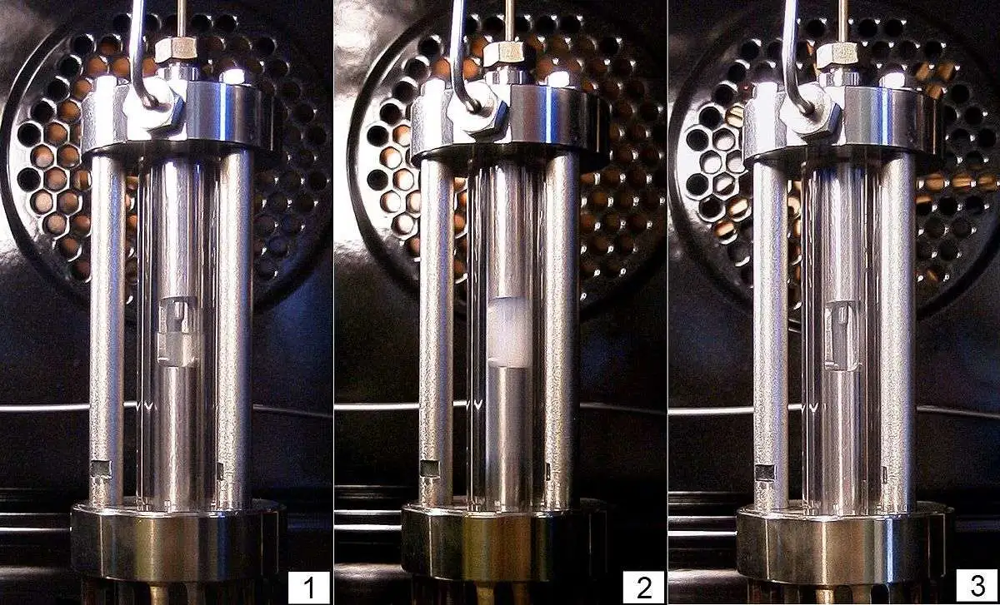
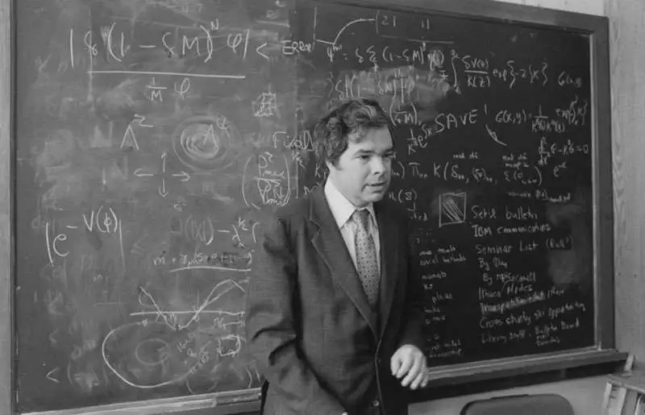
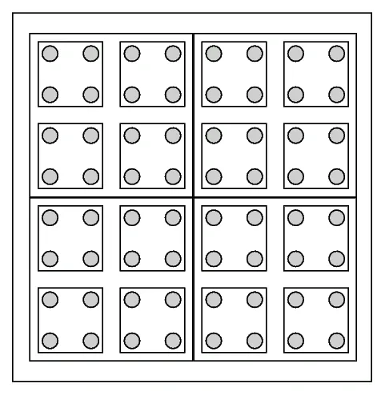

## Introduction - From Critical Phenomena to the Renormalization Group

When we look at everyday matter, we see a striking puzzle: the macroscopic world shows simple, regular behavior, yet behind it, a huge number of microscopic particles—of order $10^{23}$—move in complex, chaotic ways. For example, a liter of water has about $3 \times 10^{25}$ molecules; each molecule’s motion is hard to predict, but macroscopically that liter is described by just a few quantities such as density, pressure, and temperature. Even more striking, different materials can behave in very similar ways under certain special conditions.

Near the critical point of a continuous (second-order) phase transition, very different systems—e.g. the liquid–gas critical point and the Curie point of a ferromagnet—obey the same laws. This is called **universality**. That is, whether at the liquid–gas critical point of water or at the magnetic transition of a ferromagnet, the exponents that describe how some physical quantities vary with temperature—the **critical exponents**—are the same. This universal behavior is hard to explain with older theories: why should systems with very different microscopic details share the same macroscopic behavior?

In an experiment where ethane is heated at constant volume, the middle photo shows critical opalescence: a normally clear liquid becomes milky and cloudy near the critical point. The reason is that density fluctuations appear on all length scales—large droplets and bubbles form and vanish, with sizes comparable to the wavelength of visible light, so light is strongly scattered. At the critical point the **correlation length** (the typical range over which fluctuations are correlated) becomes very large, so the material is correlated from the molecular scale up to macroscopic scales.

So near the critical point, any two regions inside a small drop of liquid are no longer independent: a fluctuation in one place is echoed by fluctuations far away. That makes traditional statistical models (which assume different regions are independent) break down. Similarly, near the Curie temperature of a ferromagnet, the size and direction of magnetic domains fluctuate strongly; small domains merge into large ones, and the whole magnet shows huge magnetization fluctuations. In short, critical phenomena raise two main puzzles:

**1. Multi-scale fluctuations make computation nearly impossible (how can we handle $10^{23}$ particles fluctuating together?).**

**2. Why do different materials share the same critical laws?**

To tackle these questions, physicists developed a new theoretical framework—the **renormalization group** (RG). The renormalization group is not just a mathematical trick; it is a major change in how we think about physics. It gives a systematic way to “take apart” a problem step by step, by changing the scale and treating the system at different scales. By going from the microscopic to the macroscopic scale layer by layer, RG reveals how the parameters of the system “flow” as the observation scale changes.

In short, we can keep averaging out degrees of freedom on short scales and keep only those that matter on larger scales, then iterate this rescaling and watch how the system’s parameters evolve. This is like zooming out on a map: as you zoom out from a satellite view, street-level detail disappears and large-scale landscape appears. Likewise, RG shows which microscopic details get “washed out” and which macroscopic features remain.

It is this viewpoint that lets the renormalization group explain where critical universality comes from: even though different materials differ greatly at the microscopic level, under repeated coarse-graining their description flows to the same **fixed point**, so their macroscopic behavior becomes the same.

## 1. Why “Renormalization” and “Group”?

The two names are very “physical” but also carry historical baggage that can confuse beginners.

#### Why “Renormalization”?

Literally it means **“resetting the standard”** or **“re-normalizing.”**

**1. Historical origin (removing infinities):**

The term first appeared in quantum electrodynamics (QED). When physicists computed the electron’s mass and charge, the integrals gave infinity. To fix this, they introduced a trick: treat the measured quantity (e.g. the electron mass $m$) as the “dressed” value that already includes all interactions, rather than the “bare” parameter $m_0$ in the theory. By redefining parameters and absorbing the infinities into these definitions, the answers became finite. This process of redefining parameters is renormalization.

**2. Meaning in RG (resetting the scale):**

In the context of the renormalization group, the meaning shifts slightly but the core idea is the same—**to keep the form of the physical laws unchanged, we must adjust the parameters**. When we combine four spins in a $2\times2$ block into one block spin, the “lattice spacing” effectively grows (e.g. by a factor of 2). If we measure the new system with the old ruler, the laws would look different. To make the description of the new (coarse-grained) system—e.g. its Hamiltonian—look like the old (microscopic) one in form, we must **“renormalize”** the coupling constants (e.g. temperature $T$ or magnetic field $B$). Because the observation scale has changed, we must give the parameters new values so that the physical equations still hold; that is renormalization.

#### Why “Group”?

In mathematics, a “group” requires that every operation be **invertible** (have an inverse): if $A \to B$, we must be able to go from $B \to A$. The renormalization group is not actually a group; it is a **semigroup**. When we go from “microscopic states” to “coarse-grained” states, a rule like majority vote removes detail. Once we have a big block, we can no longer know exactly how the four small spins inside were arranged (3 up 1 down? 4 up 0 down? The information is lost). **The process is not reversible.** It is like blurring a photo—you cannot recover the sharp original.

Early workers (e.g. Gell-Mann) noticed that these scale transformations satisfy “associativity” and “closure”: doing a transformation $R_1$ and then $R_2$ is the same as doing a single transformation $R_{1+2}$. That sounds like group-like behavior, so the name stuck. In practice it means “the set of scale-transformation operations.”

Renormalization group theory fully resolved the problem of infinite scales in critical phenomena; Kenneth Wilson received the 1982 Nobel Prize in Physics for this. In what follows we will introduce the basic ideas of the renormalization group, the needed math and physics background, and its central role in modern physics.

## 2. Mathematical Prerequisites

Before discussing RG in earnest, we briefly recall some mathematical tools and how they are used in physics:

**Calculus (derivatives and integrals):** Derivatives describe rates of change; integrals describe sums and areas. In physics, derivatives are used to express how system parameters change with scale (e.g. RG equations are often differential equations in scale); integrals are used to sum (or average) over many microscopic degrees of freedom. For example, the **partition function** in statistical mechanics is usually a sum or integral over all microscopic states with exponential weights. Without calculus we cannot describe continuously varying quantities or handle sums over infinitely many degrees of freedom.

**Probability and statistics:** RG often deals with statistical properties of systems. Probability theory gives the language for random **fluctuations**; we need distributions, expectation values, variances, etc. In statistical physics, the **Gibbs distribution** gives the probability of each microscopic state. In short, lower-energy states have higher probability, and temperature sets how much high-energy states are suppressed. RG often averages over some degrees of freedom in probability space, so a solid grasp of statistics is needed.

**Logarithms and exponentials:** Many physical laws are exponential or power-law. The functions $e^x$ and $\ln x$ are central when we discuss scale changes. For example, microscopic states contribute probability with a factor like $e^{-H/T}$ ($H$ is energy, $T$ is temperature); when we discuss scale invariance, we often use log coordinates to turn power laws into linear relations and read off scaling exponents. Logarithms also turn products into sums, which simplifies many RG calculations of critical exponents.

**Functions and mappings:** RG can be viewed as a mapping in “function space”—it maps one theory to another effective theory. For example, after a coarse-graining step we get a new effective **Hamiltonian**. Understanding functions and how parameters map helps us see RG as “mapping theory to theory.” The RG flow is often written in terms of a $\beta$ function that describes how coupling constants change with scale. A clear picture of functions and their graphs helps us see how the RG flow moves toward fixed points.

**Differential equations:** RG evolution is often written as differential equations. For example, the Callan–Symanzik equation describes how parameters in quantum field theory change with energy scale. A simple form is:

$$
\frac{dg}{d\ell} = \beta(g)
$$

So the rate of change of the coupling constant $g$ with log scale $\ell$ is given by the function $\beta(g)$. Fixed points correspond to $\beta(g) = 0$. When $\beta(g)$ changes sign near a fixed point, we can tell whether that fixed point is stable (attractive) or unstable (repulsive).

These mathematical tools are the basis for understanding the language of the renormalization group; we will use them in the rest of the notes.

## 3. Basic Physical Concepts

Besides mathematics, this tutorial uses a few basic physical ideas:

**Energy and thermodynamic quantities:** Energy is a fundamental quantity of physical systems; in thermodynamics, internal energy and free energy are both related to energy. In statistical physics we often focus on the free energy, because its minimization determines equilibrium. Free energy can be thought of as total energy minus “useful work”; it balances energy and entropy. In the study of phase transitions, how free energy changes with temperature or other parameters reveals where the transition occurs.

**Hamiltonian:** This is the function that describes the total energy of the system. In classical mechanics, the Hamiltonian $H$ is usually kinetic plus potential energy; in statistical mechanics and quantum field theory, it generally means the energy function of the microscopic configuration. For the **Ising model** of a magnet, the Hamiltonian can be written as:

$$
H = -J \sum_{\langle i,j \rangle} s_i s_j
$$

(neighboring spins aligned lower the energy). Given the Hamiltonian, we can write the partition function of the ensemble and then compute thermodynamic quantities.

**Fluctuations and statistical mechanics:** Even in equilibrium, physical quantities are not constant; they fluctuate around their average. That is what we mean by fluctuations. Higher temperature means larger fluctuations; on macroscopic scales many fluctuations cancel, and the average obeys thermodynamic laws. Near the critical point, however, fluctuations become very strong and correlated over large distances, so that simple mean behavior fails. Statistical mechanics is the theory of fluctuations: it describes possible microscopic states and their probabilities. The partition function $Z$ is at the center; it sums the weights of all microscopic states:

$$
Z = \sum_{\Phi} e^{-H(\Phi)/T}
$$

The sum (or integral) is over all states $\Phi$; $H(\Phi)$ is the Hamiltonian of that state and $T$ is temperature (we absorb Boltzmann’s constant $k_B$ for convenience). The partition function is the sum of “state weights”; it has no direct physical meaning by itself, but $\ln Z$ is related to the free energy ($F = -T \ln Z$). By taking derivatives of the partition function we get internal energy, entropy, specific heat, etc. So computing the partition function is a central task in statistical physics. Near the critical point, long-range correlations make computing $Z$ directly almost impossible—and that is exactly where the renormalization group becomes powerful.

**Partition function and probability distribution:** The Gibbs probability formula:

$$
P(\Phi) = \frac{1}{Z} e^{-H(\Phi)/T}
$$

shows why the partition function matters: it is the normalization that makes the probabilities of all microscopic states sum to 1. The factor $e^{-H/T}$ is the “Boltzmann weight”: higher energy means lower probability. RG coarse-graining is essentially marginalizing the probability distribution (integrating out some degrees of freedom) to get a new distribution for the remaining variables. Understanding the partition function and this distribution helps us see how RG obtains an effective theory by averaging out microscopic degrees of freedom.

**Temperature and energy scale:** Temperature acts as a “control parameter” in statistical physics. For example, in a magnetic phase transition, lowering the temperature leads to an ordered magnetic state; in the liquid–gas transition, raising it turns liquid into gas. RG often studies the reduced temperature $t = (T - T_c)/T_c$ and how system parameters change with scale. In the RG of quantum field theory, “temperature” is often replaced by an energy or momentum scale. When we probe at higher energies (shorter distances, higher “energy scale”), interaction strengths change. This notion of “energy scale” in RG is analogous to temperature: in both cases we change an external parameter and see how the system responds.

These ideas form the physical setting for the renormalization group. With a clear picture of energy, the Hamiltonian, fluctuations, and the partition function, we can more easily follow RG reasoning in the next sections.

## 4. The Core Ideas of the Renormalization Group

The central idea of the renormalization group (RG) can be stated as: **study how scale transformations affect a physical system, and find what does not change with scale.** This involves several related concepts: scale, coarse-graining, correlation length, fixed points, and universality.

Kadanoff’s “block spin” idea: divide a 2D square lattice into $2 \times 2$ blocks; the state of each block is represented by one average block variable (in the figure, the gray dot in each large block stands for the average spin replacing the original four spins). This coarse-graining reduces the number of degrees of freedom to one quarter. Repeating this process and increasing the scale, we eventually shrink the system to a single block. Along the way we see how the system’s parameters change and whether they approach a stable value.

**Scale and coarse-graining:** Scale means the length or energy scale at which we observe the system. For example, a microscope shows magnetic domains; the naked eye sees macroscopic magnetic poles. RG studies the system by changing scale—usually via **coarse-graining**: we combine many neighboring microscopic degrees of freedom into one unit and describe them by an average or effective variable.

For a magnetic spin system, we can group neighboring $2 \times 2$ spins and use their average (or majority) as a new “block spin.” The lattice is then rescaled: the scale doubles and the number of degrees of freedom drops. We then rescale units so the new lattice “looks” the same size as the old one and watch how the form and parameters of the Hamiltonian change.

Coarse-graining in essence “filters out” small-scale detail, like blurring a high-resolution image and keeping only large outlines. The renormalization group does this by repeatedly coarse-graining and rescaling, giving a sequence of effective theories that show how the system behaves at different scales.

**Correlation length and long-range correlation:** A key question in coarse-graining is: how far can we coarse-grain? That depends on the system’s **correlation length**—the typical size over which fluctuations are correlated. On scales much smaller than the correlation length, local variables are strongly correlated; on scales much larger, different regions are almost independent. For most temperatures the correlation length is finite (often just a few particle spacings), so once we coarse-grain past that scale, microscopic detail is gone and the system looks uniform. At the critical point, however, the correlation length diverges, and the system has non-trivial structure on all scales.

So no matter how many times we coarse-grain, new fluctuations keep appearing; the system never becomes smooth. That is why the critical point is so hard to treat: we cannot remove all fluctuations by local averaging. RG deals with this by turning the problem into the study of fixed points—self-similar limiting states (see below). When the correlation length is finite, the system is like many small “independent blocks,” each coherent internally but loosely coupled to others; when it is infinite, the system is one tightly connected “giant block.”

**Fixed points and scale invariance:** Under repeated coarse-graining and rescaling, the system’s parameters (e.g. coupling constants, disorder) move along a trajectory in parameter space. This is the **RG flow**. Some special parameter values are unchanged by the transformation; these are **fixed points**.

A fixed point corresponds to a system with **scale invariance**: its structure looks similar at different scales. The critical point is a classic fixed point: e.g. at the Curie point $(T = T_c)$ of the 2D Ising model, if we zoom in, the statistical properties are unchanged. Fixed points can be infrared-stable or ultraviolet-stable. In simple terms, if the RG flow returns to the point after a small deviation, it is stable; otherwise it is unstable.

The fixed point at the critical point is usually unstable: as soon as $T$ moves away from $T_c$, the flow goes to other stable points (e.g. the high-temperature disordered or low-temperature ordered fixed points). Fixed points are crucial because RG shows that the macroscopic critical behavior is entirely determined by the fixed point. If we know the fixed point (e.g. the form of the critical Hamiltonian), we can compute critical exponents and other universal quantities.

**Universality and critical exponents:** Universality means that different systems show the same scaling behavior at the critical point. RG explains this neatly: different systems may have very different microscopic parameters, but if their RG flows go to the same fixed point, the macroscopic behavior governed by that fixed point is the same. Like streams that start in different places but flow into the same lake—the lake’s properties are the same. For critical phenomena, the “lake” is the effective theory at the fixed point.

Systems in the same **universality class** have critical exponents determined only by the fixed point and the spatial dimension, not by microscopic details. For example, the liquid–gas critical point and the magnetic Curie point both belong to the 3D Ising universality class, so their specific heat, magnetization, etc. have the same critical exponents. This is one of the main results of the renormalization group. Before RG, universality was an experimental fact without a theoretical explanation; RG gave a clear mechanism via fixed points.

With these ideas we have outlined the renormalization group picture. In short, **RG asks: how do physical laws change when we change the observation scale? In particular, at the critical point there is scale-invariant, self-similar structure, so the system shows universal behavior that does not depend on microscopic details.**

Using RG we can compute critical exponents, understand phase transitions, and assign different materials to a small number of universality classes. In the next section we look at how these ideas developed historically and who laid the foundations of RG theory.

## 5. Historical Background and Key Figures

The development of renormalization group theory combined ideas from particle and statistical physics; its history is full of conceptual leaps. Here we recall a few key people and events.

**Early renormalization:** Although RG later proved central to critical phenomena in condensed matter, the idea of “renormalization” first came from particle physics. In the mid-20th century, quantum electrodynamics (QED) ran into infinities when computing effects involving the electron and spin. Feynman, Schwinger, and Tomonaga developed a way to remove these divergences by renormalizing mass, charge, etc.—subtracting infinite quantities so that predictions agreed with experiment. They shared the 1965 Nobel Prize.

Note that this “renormalization” fixed the infinities but did not yet give the continuous scale-transformation picture of the “renormalization group.” The seeds were there: in 1954, Gell-Mann and Low wrote down the renormalization group equation for QED, showing how the coupling constant changes with energy scale. That can be seen as the beginning of RG thinking, though its full impact was not yet clear.

**Kadanoff and block spins:** The person who brought RG thinking into statistical physics was Leo Kadanoff. In 1966, thinking about phase transitions in magnets, he introduced the idea of block spins. He imagined dividing the lattice into blocks, representing each block by its average spin, and then asking how the effective interactions change. By repeating this blocking, Kadanoff showed that the critical point could be fixed by a self-consistency condition under this scale transformation—i.e. the critical point maps back to itself under coarse-graining (it is a fixed point).

Kadanoff’s block-spin picture gave an intuitive explanation of scaling laws and critical exponent relations and raised the understanding of universality to a quantitative level. He did not provide a precise computational scheme, but his work set the physical picture for the renormalization group and has been called “the key that opened Pandora’s box.”

**Wilson’s breakthrough:** Kenneth G. Wilson was the key figure who turned the renormalization group into a full framework. Building on Kadanoff’s work and using field-theory techniques from particle physics, he proposed the Wilson renormalization group in 1971. His main contribution was a step-by-step computational framework. Wilson first used RG to solve long-standing problems such as the Kondo problem (resistance anomaly due to magnetic impurities in solids). He then applied RG to compute critical exponents for continuous phase transitions with striking success: using the $\epsilon$-expansion (with $\epsilon$ the deviation of the spatial dimension from the critical dimension 4), he computed the critical exponents of 3D systems from first principles, in strong agreement with experiment.

**For the first time, critical exponents could be predicted from first principles rather than only measured.** Wilson’s work was a milestone in statistical physics. He received the 1982 Nobel Prize in Physics “for his theory for critical phenomena in connection with phase transitions.” The prize citation noted that his step-by-step renormalization method avoided the divergences that appeared in one-shot calculations.

**Other contributors:** Many others played important roles. In the 1960s, Michael Fisher, Benjamin Widom, and others proposed scaling hypotheses and homogeneity relations that gave an empirical basis for RG. Widom’s homogeneity assumption (1965) and Kadanoff’s block spins (1966) were direct precursors to Wilson’s work. In particle physics, Gell-Mann and Francis Low had already shown how coupling constants “flow” with scale.

In the early 1970s, Gross, Politzer, and Wilczek used RG ideas to discover asymptotic freedom in quantum chromodynamics (QCD)—the strong force weakens at high energy (short distance) and strengthens at low energy (long distance), explaining how quarks are confined and released. That work received the 2004 Nobel Prize. Renormalization group ideas have borne fruit in many areas, thanks to contributions from many physicists.

Historically, renormalization group theory bridged particle and statistical physics. It started to remove infinities in high-energy physics, became in Wilson’s hands the tool to understand critical phenomena in condensed matter, and then fed back into particle physics and our understanding of fundamental interactions. From Kadanoff’s intuitive picture to Wilson’s precise framework, RG is an example of how theory and computation advance together. Knowing this history deepens our understanding of RG and the way scientific ideas develop.

## The Renormalization Group in Modern Physics

The renormalization group did not only solve critical phenomena; today it is a basic method and conceptual tool across theoretical physics. **Wherever multi-scale behavior appears, the renormalization group has a role.**

**Quantum field theory and elementary particles:** In high-energy physics, the renormalization group describes how the strength of particle interactions changes with energy scale (or equivalently distance scale). This is often called “running” of the coupling constants. In QED, the effective electric charge grows with probe energy; in QCD, RG predicts asymptotic freedom: the strong interaction becomes very weak at high energy, so quarks behave almost freely in high-energy collisions.

That is the theoretical basis for observing free quarks in deep inelastic scattering. RG also fixes many technical issues in field theory—e.g. renormalization group equations remove dependence on unphysical parameters (such as cutoffs), so predictions do not depend on them. This is central in quantum field theory courses. With an introductory understanding of RG, readers will find it easier to master the scaling transformations and renormalization techniques when learning advanced topics such as electroweak unification and gauge theories.

**Statistical physics and condensed matter:** The “home” of RG is statistical physics. Besides critical phenomena at phase transitions, RG is used for finite-size scaling (e.g. how critical behavior changes with system size), quantum phase transitions (zero-temperature transitions driven by quantum fluctuations, analogous to classical phase transitions but with an extra “time” dimension), and many complex systems such as spin glasses, rough interfaces, and biological and ecological networks.

RG also appears in numerical methods: e.g. Monte Carlo renormalization group implements coarse-graining numerically to extract critical parameters; the density matrix renormalization group (DMRG) is a powerful algorithm for ground states of low-dimensional quantum systems. As computing and algorithms improve, RG ideas will play a larger role in complex systems. For the reader, RG offers a new way to look at statistical systems: focus not only on microscopic complexity but on how macroscopic behavior **emerges** from the microscopic through scale transformations.

**Emerging interdisciplinary areas:** The renormalization group has also spread beyond traditional physics into areas such as **machine learning** and data science. Some researchers find that deep neural networks have a hierarchical structure similar to RG: early layers capture local, high-frequency detail; later layers capture more global, abstract features—analogous to RG focusing step by step on the relevant degrees of freedom.

Some suggest that the training of a neural network can be viewed as an RG flow in “model parameter space,” with the final stable model corresponding to a fixed point of some kind of information. This view may help explain the universality of deep learning—**why different network architectures can learn similar high-level semantic features from seemingly unrelated data.** These ideas are still developing, but they show the depth of RG thinking: as a universal analytical tool, RG goes beyond physics and becomes a way to understand complex systems in general. In the future, RG may combine with information theory, computer science, and other fields in new ways.
