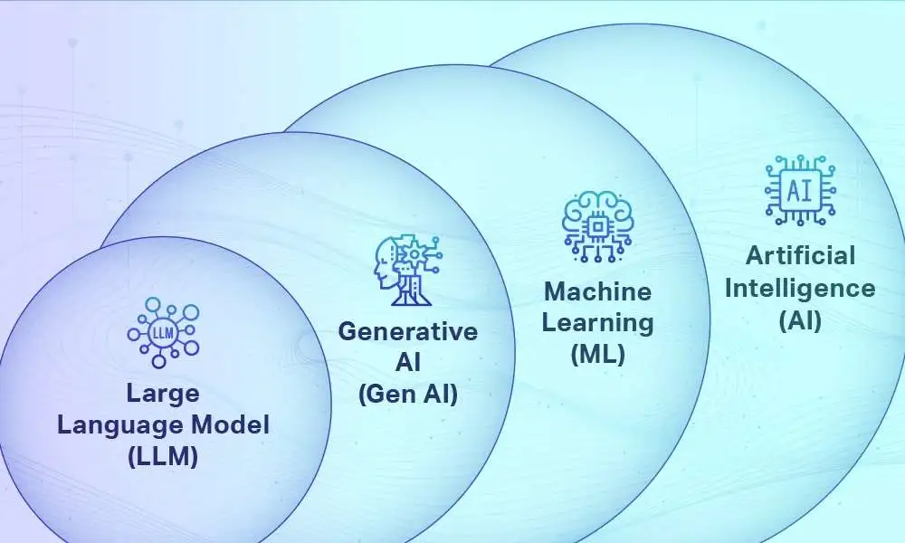
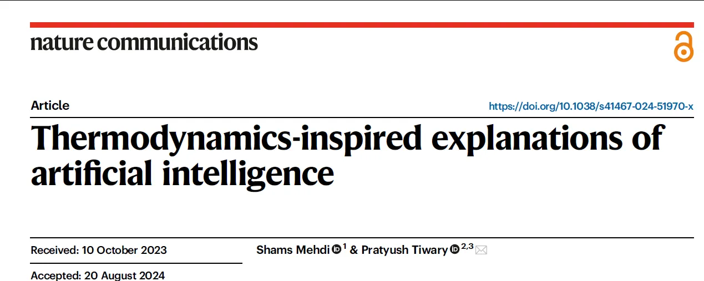

# Introduction - The Statistical Foundation of Criticality

Before formally embarking on the mathematical journey of the renormalization group (RG), we must return to the foundation of physics—**statistical mechanics**. The core mission of RG is not to create entirely new physical laws, but to solve a specific yet extremely stubborn mathematical and physical problem: **how to handle the nearly infinite degrees of freedom in multi-scale strongly coupled systems.**

The previous lecture established the motivation for the renormalization group, namely solving the "infinity" problem near the critical point. This lecture will delve into the mathematical essence of this problem.

In statistical physics, the laws of the microscopic world (such as quantum mechanics or classical mechanics) are usually deterministic for individual particles, or at least the probabilistic evolution is well-defined. However, when facing particles on the order of Avogadro's number ($N \approx 10^{23}$), tracking each particle's trajectory is neither possible nor necessary. Physics undergoes a shift in perspective here: from tracking **trajectories** to describing **probabilities**.

The renormalization group is often described as a tool for taming the infinities at critical points, but to understand how it "tames" them, we must first understand what is "diverging" and why standard methods fail. The partition function $Z$, free energy $F$, and fluctuation-dissipation relations constitute the language for describing this phenomenon. It is precisely because standard mathematical techniques cannot compute $Z$ near the critical temperature $T_c$—whose physical signature is the divergence of the correlation length $\xi$—that the necessity of the renormalization group becomes mathematically undeniable.

We will start from the definition of microscopic states, derive step by step to macroscopic susceptibility and specific heat, and ultimately reveal the collapse of the partition function at the critical point.


# 1. Statistical Description of the Microscopic World

The starting point of statistical mechanics is philosophically profound: it acknowledges the observer's **ignorance** of microscopic details and uses this ignorance to establish macroscopic **determinism**. The fundamental reason for transitioning from the deterministic description of Newtonian mechanics or the Schrödinger equation to a statistical description lies in the vastness of the phase space of many-body systems.

## 1.1 The Price of Ignorance — From Maxwell's Demon to Information Loss

Why can we measure the temperature of a cup of water but not know the exact position of any single water molecule? This is not a defect of measuring instruments, but an essential characteristic of macroscopic description.

In the early development of thermodynamics, Maxwell proposed a famous thought experiment—**Maxwell's Demon**. This involves a profound connection between physics and information theory:
If a little demon could know the velocity of each molecule and precisely control a valve to send fast molecules to one side and slow molecules to the other, it could create a temperature difference without expending energy, thereby violating the second law of thermodynamics.


This paradox puzzled the physics community for over a hundred years until Landauer and Bennett pointed out: **information is physical**. The demon must obtain "information" through measurement, and storing or erasing this information necessarily involves energy consumption and entropy increase.

This reveals a core truth: **Entropy is essentially a measure of our "information deficit" about the system's microscopic states.**
When we say a system is in thermal equilibrium, it means we have given up tracking all microscopic details and retained only a very few macroscopic quantities (such as energy $E$, volume $V$, particle number $N$). The task of statistical mechanics is to make the most accurate macroscopic predictions given extremely limited information.

## 1.2 What Is a Microstate? Constructing a "Toy Universe"

A **microstate** is a precise description of all microscopic variables of a system at a given moment.

- For a classical ideal gas, the microstate is the positions and momenta of $N$ particles $\{\mathbf{r}_i, \mathbf{p}_i\}$.

- But in the context of phase transitions, the renormalization group, and modern machine learning, discrete **lattice models** are more important and intuitive.

### The Ising Model - A Binary Microscopic World

As the "hydrogen atom" of phase transition research, the Ising model provides a perfect example of microstates. It not only explains magnets but also became the prototype for neural networks (such as **Hopfield networks**).

Consider a $d$-dimensional hypercubic lattice (grid), where each lattice site $i$ has a spin variable $s_i$. In the simplest case, the spin can only take two values:

$$
s_i \in \{+1, -1\}
$$

These represent the atomic magnetic moment pointing "up" or "down" respectively. In computer science, this corresponds to bits 0 and 1.

A **microstate** is a specific collection of spin configurations on the entire lattice:

$$
\{s\} = \{s_1, s_2, \dots, s_N\}
$$

### The Curse of Dimensionality

Why do we need statistical methods? Let's look at the numbers.

For a system with only $N$ lattice sites, the total number of possible microstates is $2^N$.

- If $N=10$ (a tiny system), the number of states is $2^{10} = 1024$.

- If $N=20 \times 20 = 400$ (a small image), the number of states is $2^{400} \approx 10^{120}$. This already exceeds the total number of atoms in the observable universe (about $10^{80}$).

- For macroscopic objects, $N \sim 10^{23}$, and the number of states is $2^{10^{23}}$.

This is an unimaginably astronomical number. This means we can never calculate macroscopic quantities by exhaustively enumerating all states. This **curse of dimensionality** is not only a challenge for statistical mechanics but also a core difficulty facing high-dimensional data analysis and machine learning. The greatness of RG lies in providing a strategy for navigating such enormous state spaces.


## 1.3 The Energy Landscape

If all microstates were equal, the world would be pure random noise. Fortunately, nature favors low-energy states.

The microscopic dynamics of the system is determined by the **Hamiltonian** $H(\{s\})$. The Hamiltonian is a function that assigns a scalar value—energy—to each microscopic configuration $\{s\}$. We can imagine it as the "elevation" in a high-dimensional state space.

For the nearest-neighbor Ising model under an external magnetic field $h$, the Hamiltonian is defined as:

$$
H(\{s\}) = -J \sum_{\langle i,j \rangle} s_i s_j - h \sum_i s_i
$$

Formula interpretation:

1.**Interaction term $-J \sum s_i s_j$**:

* $\langle i,j \rangle$ denotes summing over all adjacent pairs of lattice sites.

* $J$ is the **coupling constant**.
    
* If $J > 0$ (ferromagnetic): when $s_i$ and $s_j$ have the same sign (aligned), $s_i s_j = 1$, the term value is $-J$, and energy decreases. The system "prefers" order.
    
* If $J < 0$ (antiferromagnetic): the system "prefers" adjacent spins to be anti-aligned.

* **Foreshadowing for RG**: The core operation of RG is to see how this $J$ changes (flows) when we change the observation scale.

2.**External field term $-h \sum s_i$**:

* $h$ is the external magnetic field. It tries to force all spins to point in its direction.

This Hamiltonian encodes the fundamental contradiction of phase transitions: **energy vs entropy**.

- **Interaction $J$** tries to make the system fall into the deep valleys of the energy landscape (order).

- **Thermal perturbation (temperature $T$)** tries to kick the system out of the deep valleys, making it traverse more states (disorder).

In continuous field theory, the microstate generalizes from the discrete spin set $\{s_i\}$ to a continuous field $\phi(x)$, and the Hamiltonian becomes an **action functional** $\mathcal{H}[\phi]$. For example, in $\phi^4$ theory:

$$
\mathcal{H}[\phi] = \int d^dx \left[ \frac{1}{2}(\nabla \phi)^2 + \frac{1}{2}r \phi^2 + \frac{u}{4!} \phi^4 \right]
$$

Here $(\nabla \phi)^2$ penalizes abrupt changes in the field (analogous to nearest-neighbor interactions in the Ising model), while the $\phi^2$ and $\phi^4$ terms constitute a local potential well.

## 1.4 The Maximum Entropy Principle and the Boltzmann Distribution

Now we come to the most central question of statistical mechanics: **Given a macroscopic environment (temperature $T$), what is the probability $P(\{s\})$ that the system is in a particular microstate $\{s\}$?**

Textbooks usually give the answer directly: the **Boltzmann distribution**.

$$
P(\{s\}) \propto e^{-\beta H(\{s\})}
$$

But why the exponential form? Why not $H^{-2}$ or $\sin(H)$?

This distribution form is not arbitrarily chosen, but is a direct consequence of the **maximum entropy principle (MaxEnt)**. This is a profound perspective based on information theory: **Given known constraints, the most honest, unbiased probability distribution is the one with maximum entropy.**

### Derivation - From Ignorance to Distribution

Suppose we know very little about the system, only two facts:
1.**Normalization condition**: All probabilities sum to 1.

$$
\sum_{\{s\}} P(\{s\}) = 1
$$
    
2.**Energy observation**: We have measured the system's macroscopic average energy $\langle E \rangle$. This means the theoretical expected energy should equal the observed value.

$$
\sum_{\{s\}} P(\{s\}) H(\{s\}) = \langle E \rangle
$$

Beyond this, we know nothing. To avoid introducing any subjective assumptions, we must maximize the Shannon entropy:

$$
S = - \sum_{\{s\}} P(\{s\}) \ln P(\{s\})
$$

Entropy here represents the "flatness" or "uncertainty" of the distribution.

This is a typical constrained optimization problem, solved using **Lagrange multipliers**. Construct the Lagrangian $\mathcal{L}$, introducing two multipliers $\lambda$ (for normalization) and $\beta$ (for energy constraint):

$$
\mathcal{L} = \underbrace{-\sum_{\{s\}} P(\{s\}) \ln P(\{s\})}_{\text{Objective: Entropy}} - \underbrace{\lambda \left( \sum_{\{s\}} P(\{s\}) - 1 \right)}_{\text{Constraint 1: Normalization}} - \underbrace{\beta \left( \sum_{\{s\}} P(\{s\}) H(\{s\}) - \langle E \rangle \right)}_{\text{Constraint 2: Average Energy}}
$$


To find the extremum, take the partial derivative with respect to the probability of any state $P(\{s\})$ and set it to 0:

$$
\frac{\partial \mathcal{L}}{\partial P(\{s\})} = - (\ln P(\{s\}) + 1) - \lambda - \beta H(\{s\}) = 0
$$

Rearranging:

$$
\ln P(\{s\}) = - (1 + \lambda) - \beta H(\{s\})
$$

$$
P(\{s\}) = e^{-(1+\lambda)} e^{-\beta H(\{s\})}
$$

Here $e^{-(1+\lambda)}$ is a constant independent of the state $\{s\}$, determined by the normalization condition. Let us denote it as $1/Z$. Thus, the famous **Boltzmann distribution** emerges naturally:

$$
P(\{s\}) = \frac{1}{Z} e^{-\beta H(\{s\})}
$$

This derivation not only shows the origin of the physical formula, but also reveals the essence of $\beta$: **$\beta$ is the Lagrange multiplier controlling the average energy**.

In **machine learning**, this is entirely consistent with energy-based models (EBMs). Training a neural network is essentially adjusting parameters so that the Boltzmann distribution defined by the model is as close as possible to the true distribution of the data (minimizing KL divergence, equivalent to maximum likelihood estimation).


## 1.5 The Microscopic Essence of Temperature

In everyday life, we are accustomed to temperature $T$ (Kelvin or Celsius). But in the underlying logic of statistical mechanics, **$\beta$ is the more fundamental physical quantity**.

$$
\beta \equiv \frac{1}{k_B T}
$$

Here $k_B$ is just a historical unit conversion factor (to convert energy in joules to degrees that humans are used to).

### Temperature as a "Disorder Regulator"

$\beta$ can be understood as the **"hunger of microscopic degrees of freedom for energy"**, or the environment's tolerance for system disorder.

Let us examine the behavior of the Boltzmann factor $e^{-\beta E}$ in limiting cases, which is crucial for understanding phase transitions:

1.**Low-temperature limit ($\beta \to \infty$, $T \to 0$)**:

* If $E > E_{ground}$ (ground state energy), then $\beta E$ is very large, and $e^{-\beta E} \to 0$.

* **Physical picture**: The probability of any excited state is extremely suppressed. The system is "frozen" in the lowest energy ground state. In the Ising model, this means all spins are aligned (all up or all down), the system is completely ordered, and entropy is zero.

2.**High-temperature limit ($\beta \to 0$, $T \to \infty$)**:

* $\beta E \to 0$, so $e^{-\beta E} \to 1$.

* **Physical picture**: The weights of different energy states are nearly equal. High-energy and low-energy states have similar probabilities. The system jumps wildly among all microstates, exhibiting maximum randomness. In the Ising model, spins flip randomly, and total magnetization is zero.

3.**Critical point ($\beta \approx \beta_c$)**:

* This is the most fascinating region. The energy term (trying to order) and the entropy term (trying to disorder) are evenly matched. The system is neither completely ordered nor completely disordered, but is filled with **fluctuations** of various scales.

### **The story of RG happens right here!**

By introducing $\beta$, we transform the complex microscopic interactions $H$ into a probability distribution. Next, to connect with experimentally measurable macroscopic quantities, we need to sum over this probability distribution—this leads to the **partition function $Z$**.


# 2. Partition Function $Z$ — The Source of All Things

If the Hamiltonian constitutes the "axioms" of microscopic dynamics, specifying the energy distribution of the system in phase space, then the **partition function** $Z$ is the "fundamental theorem" connecting these microscopic axioms with macroscopic phenomenological theory. Within the framework of statistical physics and quantum field theory, the status of $Z$ is supreme: it is not only the normalization of the probability distribution, but also a holographic encoding containing all thermodynamic information of the system.

In the context of the renormalization group, understanding $Z$ is crucial. Because the entire raison d'être of RG boils down to one sentence: **directly calculating $Z$ is too difficult, so we must find another way to handle it.**

We will deeply analyze the mathematical structure of $Z$, its properties as a generating functional, and the fundamental reasons why standard computational methods fail near the critical point—the curse of dimensionality and strong coupling. We will see that the partition function $Z$ is not just a number contrived to normalize probabilities, but more like a "compressed package" or "hologram" containing all the system's secrets.

## 2.1 Definition of the Partition Function - From Summation to Functional


### Physical Definition - Weighted Statistics over States (Phase Space)

In the canonical ensemble, the system is in equilibrium with a heat bath at temperature $T$ ($\beta = 1/k_B T$). In the previous section, we derived the Boltzmann distribution based on the maximum entropy principle. The probability of the system being in a microstate $\{s\}$ is:

$$
P(\{s\}) = \frac{1}{Z} e^{-\beta H(\{s\})}
$$

To ensure that the sum of probabilities of all possible states equals 1 (i.e., $\sum P = 1$), the partition function $Z$ must be defined as the sum of Boltzmann factors over all possible microstates:

$$
Z = \sum_{\{s\}} e^{-\beta H(\{s\})}
$$

Here the summation $\sum_{\{s\}}$ represents **"traversing all possible microscopic worlds"**, i.e., traversing the system's **configuration space**.

**Physical meaning**: $Z$ measures the "effective phase space volume" accessible to the system under given thermodynamic conditions.

For a 10-particle Ising model, we need to sum up the $e^{-\beta E}$ values for all $2^{10}$ spin arrangements.

* **Weighting mechanism**: The numerical value of $Z$ reflects how many microstates the system can "actually" access at the current temperature (weighted volume).
    * **At low temperature**, only a few terms near the ground state contribute significantly, and $Z$ is small.
    
    * **At high temperature**, almost all states can be accessed, and $Z$ becomes huge.

### What Is a "Functional"?

In modern physics and RG, we often deal not with discrete lattice sites but with continuous fields (such as magnetic field distributions, fluid velocity fields). In this case, microstates are no longer a set of discrete numbers $\{s_i\}$ but a function $\phi(x)$.

The summation of the partition function becomes a **path integral**:

$$
Z = \int \mathcal{D}\phi \, e^{-\beta \mathcal{H}[\phi]}
$$

Here appears a concept that intimidates beginners: **functional**. Let us understand it in the most intuitive language:

* **Ordinary function**: Like a "number processing machine." You input a **number** $x$, it outputs a **number** $y$.

    * Example: $f(x) = x^2$. Input 2, output 4.
    
* **Functional**: Like a "shape evaluation machine." You feed it an **entire function** $\phi(x)$ (a curve or shape of a field), it outputs a **number**.

    * Example: The definite integral is a functional. $I[\phi] = \int_0^1 \phi(x) dx$. Give it the curve $y=x$, it outputs 0.5; give it the curve $y=x^2$, it outputs 1/3.
    
    * In physics, the **action** or **Hamiltonian** is a typical functional. You give it a specific field distribution shape (e.g., magnetization across all space), it immediately tells you the **energy** corresponding to that shape.

So, the partition function $Z$ in field theory is called a **generating functional**. It is not integrating over some variable, but **summing over all possible "function shapes."** This embodies the grand perspective of quantum field theory and statistical mechanics: **we consider not a particular field distribution, but the weighted sum of all possible field distributions that nature could have.**

This means we need to integrate over **all possible field configuration functions**. This is no longer Riemann integration in finite-dimensional space, but integration in infinite-dimensional function space.

Understanding this is crucial for mastering RG: each coarse-graining step of RG is essentially performing layered integration in this infinite-dimensional function space, progressively integrating out short-wavelength fluctuation modes.

## 2.2 Differentiation as Measurement

Why are theoretical physicists so obsessed with $Z$? Because $Z$ is a **"black box."** Once we obtain an analytical expression for the generating function $Z$ (though this is extremely difficult), we no longer need to care about microscopic details; we only need to perform simple mathematical operations (differentiation) on $Z$ to obtain all macroscopic physical quantities (internal energy, entropy, susceptibility, etc.).

This is like having the system's DNA, and by reading it (differentiation), you can know the system's height, weight, etc. This mechanism transforms complex statistical averaging operations into a series of standard calculus operations.

### Technique 1 - Extracting Internal Energy $\langle E \rangle$ from $\ln Z$

We want to calculate the system's average energy (internal energy) $\langle E \rangle$, defined as the ensemble average of the energy operator:

$$
\langle E \rangle = \sum_{\{s\}} H(\{s\}) P(\{s\}) = \sum_{\{s\}} H(\{s\}) \frac{e^{-\beta H(\{s\})}}{Z}
$$

Calculating this sum directly is difficult. Note the property of exponential function differentiation: $\frac{\partial}{\partial \beta} e^{-\beta H} = -H e^{-\beta H}$. Therefore, we can extract the energy term $H$ inside the sum through differentiation with respect to parameter $\beta$:

$$
\sum_{\{s\}} H(\{s\}) e^{-\beta H(\{s\})} = -\frac{\partial}{\partial \beta} \left( \sum_{\{s\}} e^{-\beta H(\{s\})} \right) = -\frac{\partial Z}{\partial \beta}
$$


Observe carefully—isn't this just $-Z \langle E \rangle$?
Using the chain rule $\frac{\partial \ln Z}{\partial \beta} = \frac{1}{Z} \frac{\partial Z}{\partial \beta}$, we get an elegant formula:

$$
\langle E \rangle = -\frac{\partial \ln Z}{\partial \beta}
$$

**Physical intuition**: By adjusting the temperature ($\beta$) and observing how $Z$ changes, we can probe the system's energy. This formula reveals the importance of $\ln Z$ (directly related to **free energy**, to be detailed in the next chapter) as a thermodynamic potential function.

### Technique 2 - Extracting Magnetization $\langle M \rangle$ from $\ln Z$

To probe the system's response to external perturbations, we introduce an external source field in the Hamiltonian. For a magnetic system, introducing an external magnetic field $h$, the Hamiltonian becomes $H = H_0 - h M$, where $M = \sum s_i$ is the total magnetization.


Now the partition function becomes a function of $h$, $Z(h)$. Differentiating with respect to $h$:

$$
\frac{\partial Z}{\partial h} = \sum_{\{s\}} \frac{\partial}{\partial h} \left( e^{-\beta (H_0 - h M)} \right) = \sum_{\{s\}} (\beta M) e^{-\beta H}
$$

Similarly using the logarithmic derivative technique, we get the **first derivative (order parameter)**:

$$
\langle M \rangle = \frac{1}{\beta} \frac{\partial \ln Z}{\partial h}
$$

**Going further**: If we differentiate once more, we get the **second derivative (response function)**:

$$
\chi = \frac{\partial \langle M \rangle}{\partial h} = \frac{1}{\beta} \frac{\partial^2 \ln Z}{\partial h^2}
$$

This is the **magnetic susceptibility**. It describes how sensitive the system is to external stimuli, and is also the quantity that diverges at the critical point.

Here a profound physical conclusion emerges: **The linear response function ($\chi$) is directly proportional to the fluctuations in thermodynamic equilibrium ($\text{Var}(M)$).** This is the static form of the famous **fluctuation-dissipation theorem (FDT)**.

By introducing an auxiliary source field $J(x)$ and taking functional derivatives of $Z[J]$, we can generate correlation functions of arbitrary order. Therefore, in field theory, $Z[J]$ is called the **generating functional**.


### Conclusion - $Z$ Is a Generating Function

In mathematics, this is called the **generating function** technique. We treat the external source field (such as $h$ or $J$) as an auxiliary variable—like hooks. By differentiating with respect to these hooks, we can pull out physical quantities (such as $E$ or $M$) that were originally buried inside the summation.

This is why in statistical mechanics, our primary task is always: **calculate the partition function Z**. Once we have $Z$, the rest is just simple calculus exercises.




**Here is an inspiring extension:**

What is the intrinsic connection between the statistical mechanics **generating** function and **generative** AI that is riding the wave of popularity?

**$Z$ in statistical mechanics (Generating Functional/Function)**: Here "generating" is purely mathematical in meaning. $Z$ is like a "compressed package" containing all the system's information. We do not use it to "create" individual microscopic particles, but through mathematical operations (usually **differentiation**) on it, we "generate" macroscopic statistical quantities (such as average energy, susceptibility, etc.). It is the manifestation in physics of the **moment generating function**.

**"Generative" in large models (Generative Model)**: This refers to creating data. The model outputs specific text, images, or audio through sampling. Its core goal is to produce specific **samples** according to the learned probability distribution.

Although the emphases differ, they converge **at the probability level**. The core step when a large language model (LLM) predicts the next word: the model outputs a set of raw scores (logits), then usually uses the **Softmax** function to convert them into probabilities. The formula is as follows:

$$
P(\text{word}_i) = \frac{e^{\text{logit}_i}}{\sum_j e^{\text{logit}_j}}
$$

Look carefully at this Softmax formula. If we view $\text{logit}$ as a kind of "negative energy," the Softmax denominator $\displaystyle \sum_j e^{\text{logit}_j}$ plays **exactly the same role** as the partition function $\displaystyle Z = \sum_s e^{-\beta E_s}$ in statistical mechanics: they are both normalizing constants, used to transform unnormalized "energies" or "scores" into valid probability distributions.

Both use exponential weighted sums to convert raw "energies" or "scores" into normalized probabilities. They do not directly give samples themselves, but define the shape of the entire probability distribution. In physics, $Z$ encodes all the system's thermodynamic information; in machine learning, the Softmax denominator implicitly defines the distributional properties of output tokens.

This is no coincidence, but stems from the universality of the maximum entropy principle and exponential family distributions. **The training objective of language models (such as minimizing cross-entropy) is equivalent to maximizing entropy under given constraints, which is consistent with the derivation logic of equilibrium states in statistical mechanics. Therefore, while generating functions (partition functions) and generative models (such as LLMs) have different purposes, they share the same mathematical language at the underlying level of probabilistic modeling.**

In other words, Softmax in large models is essentially performing a "Boltzmann sampling process at non-zero temperature," and its denominator is precisely the partition function of that system.


## 2.3 The Curse of Dimensionality and Computational Infeasibility

Since $Z$ contains all answers and results can be obtained through differentiation, why does statistical mechanics (especially critical phenomena theory) still face huge difficulties? Why can't we just compute $Z$ directly?

The birth of the renormalization group was precisely to address two insurmountable mathematical obstacles encountered when directly computing $Z$: **the curse of dimensionality** and **irreducible coupling**. We covered this in the previous lecture; let's review:

### 1. The Curse of Dimensionality

First is the explosion of computational complexity. For a discrete system containing $N$ degrees of freedom (such as the Ising model), the summation $\sum_{\{s\}}$ involves a total of $2^N$ states. For example:

* For a two-particle Ising system with $N=2$, there are only $2^2=4$ states: $\uparrow\uparrow, \uparrow\downarrow, \downarrow\uparrow, \downarrow\downarrow$. We need to calculate a sum of 4 terms. Hand calculation takes only 10 seconds.

* For a microscopic $10 \times 10$ grid, $N=100$. The number of states is $2^{100} \approx 10^{30}$. This already exceeds the number of all grains of sand on Earth.

* For a macroscopic piece of matter (such as a small magnet), $N \approx 10^{23}$ (Avogadro's number). The number of states is $2^{10^{23}}$.

This is a number that no supercomputer, no matter how powerful, can touch. Even if a computer could calculate $10^{18}$ times per second (a quintillion), the time needed to compute $Z$ would far exceed the age of the universe. This complexity that grows exponentially with particle number is called the **curse of dimensionality**.

This means that except for very few exactly solvable models (such as the 1D Ising model or Onsager's 2D solution), **brute-force exhaustive summation is physically impossible**.

### 2. Non-decomposability Due to Coupling

If particles in a system are mutually independent (like an ideal gas), the Hamiltonian can be written as a sum of single-particle energies: $H = \sum_i H_i(s_i)$. Using the property of exponential functions $e^{\sum x_i} = \prod e^{x_i}$, the multiple summation can be decomposed into a product of $N$ independent summations:

$$
Z_{\text{total}} = (Z_1)^N
$$

In this case, the $10^{23}$-dimensional integral collapses into a 1-dimensional integral, making calculation effortless. Without interactions, the problem reduces to a single-body problem.

However, the essential characteristic of **complex systems and phase transitions** is **interaction (coupling)**.
In the Ising Hamiltonian $H = -J \sum s_i s_j$, the exchange interaction term $s_i s_j$ "entangles" the degrees of freedom at spatial positions $i$ and $j$. The behavior of particle $i$ depends on $j$, $j$ depends on $k$... This dependency relationship propagates instantly throughout the entire system.

Mathematically, this causes the exponential term $e^{\beta J \sum s_i s_j}$ to be **non-factorizable**. We are forced to face an inseparable, $10^{23}$-dimensional high-dimensional integral.


### 3. Failure of Standard Perturbation Theory at the Critical Point - RG Is the Only Way Out

Facing strongly coupled high-dimensional integrals, traditional physics usually resorts to **perturbation theory** and **mean-field approximation**:

The **mean-field approximation** assumes that each particle only feels an average background field, forcibly cutting off the coupling. This works at low or high temperatures, but at the critical point, long-range fluctuations (correlations) dominate, and mean field completely fails.

**Perturbation theory** assumes interactions are weak and performs Taylor expansions. But at the critical point, the correlation length is infinite, interactions are extremely strong, and perturbation series diverge.

Near the critical point $T_c$ of a second-order phase transition:

1.**Correlation length diverges** ($\xi \to \infty$): Different parts of the system are tightly correlated through long-range fluctuations, and there are no longer "local" small perturbations.

2.**Fluctuations are violent**: The contribution of interactions to the free energy is comparable to or even dominates over the Gaussian part. The coefficients of perturbation expansions diverge, and the series no longer converges.

This is precisely the historical opportunity for the renormalization group to enter the stage. The core philosophy of RG is **"divide and conquer"**: since we cannot calculate the integral of $10^{23}$ degrees of freedom all at once, we introduce the concept of scale and calculate in batches. Through iteration, we first integrate out the degrees of freedom that contribute only to tiny, local fluctuations (short-wavelength modes). We "package" the influence of these fast-moving degrees of freedom into the interaction parameters of the remaining slow degrees of freedom. The system's degrees of freedom decrease slightly ($N \to N'$), but the form of the Hamiltonian remains unchanged, only the parameters have changed ($J \to J'$). Repeat this process until only a few macroscopic degrees of freedom remain. This process does not seek to directly calculate the value of $Z$, but studies how the parameters of the Hamiltonian (such as $J$ and $h$) **flow** in parameter space as microscopic details are progressively "erased."

Through this approach, RG transforms an incalculable static integral problem into an analyzable dynamical system flow problem.

# 3. Free Energy $F$ — The Thermodynamic Potential and Phase Transition Landscape

In the previous section, the partition function $Z$ was established as the generating functional for microstates, containing all statistical information of the system mathematically. However, facing degrees of freedom on the order of Avogadro's number, directly computing $Z$ often falls into the mire of the curse of dimensionality. More importantly, in real physical experiments or natural evolution, the system does not "compute" its own partition function.

Nature follows **optimization principles**. Just as light follows Fermat's principle to choose the path of least time, the evolution direction of a thermodynamic system at constant temperature always points toward the minimum of some potential function. This potential function is the **free energy**.

**Free energy** is a core concept in thermodynamics and statistical physics. Intuitively, it represents the part of energy in the system that "**can be used to do useful work**" under constant temperature conditions. Specifically, the Helmholtz free energy is defined as $F = U - TS$, where $U$ is the system's internal energy, $T$ is temperature, and $S$ is entropy—the latter measures the degree of disorder in the system. Therefore, **free energy is essentially the "free" energy remaining after subtracting from the total energy the part that cannot be utilized due to disorder**.

In statistical mechanics, free energy has a direct connection to the partition function $Z$: $F = -k_B T \ln Z$. This relationship is extremely important because once the partition function is known (which summarizes information about all microstates), almost all macroscopically observable quantities such as pressure, entropy, and average energy can be derived through the free energy, **making free energy the bridge connecting the microscopic world with macroscopic phenomena.**

In the renormalization group for studying phase transitions and critical phenomena, free energy plays an indispensable role. The core idea of renormalization is to progressively ignore short-range microscopic details and focus on the system's behavior at long distances, and this process must ensure that macroscopic physical properties remain unchanged. Since free energy completely determines the system's thermodynamic behavior, **it naturally becomes the key measure for judging whether a coarse-grained model is "physically equivalent."** Under renormalization transformations, the scale dependence of free energy (or its density) reveals how the system changes with observation scale, and phase transition points correspond precisely to fixed points in the renormalization flow—where free energy exhibits singularities (such as non-differentiability), marking qualitative changes in the system. Therefore, free energy is not only the generating function of thermodynamics but also the theoretical cornerstone for understanding universality and critical phenomena.

If $Z$ is the "omniscient record" from God's perspective, then free energy $F$ is the "survival rule" that the system follows in the mundane world. In the context of the renormalization group (RG), the importance of free energy is further elevated: it constitutes the **free energy landscape**. The renormalization flow of RG is essentially a kind of smoothing and reshaping of this landscape topography, aiming to find the true "valley bottom" that determines macroscopic phase transitions. This section will start from the competition between energy and entropy, utilize the geometric duality of the Legendre transform, and construct the framework of Landau phase transition theory, paving the way for the final entrance of RG.


## 3.1 The Tug-of-War Between Energy and Entropy - The Microscopic Origin of $F = U - TS$

The relationship $F = -k_B T \ln Z$ between Helmholtz free energy $F$ and partition function $Z$ is not artificially set but is the macroscopic manifestation of the natural evolution of microscopic statistical laws. This formula reveals how the system dynamically balances between energy and disorder, becoming the hub for understanding material behavior.

### 3.1.1 Extensivity and the Inevitability of the Law of Large Numbers

Properties of macroscopic systems (such as energy and entropy) grow linearly with system size; this is called **extensivity**.

Consider two spatially separated, non-interacting subsystems $A$ and $B$.

* **Independence of microscopic probabilities**: The joint probability distribution is the product of subsystem probabilities, so the total partition function is a product: $Z_{\text{tot}} = Z_A \cdot Z_B$.

* **Additivity of macroscopic quantities**: Energy, volume, entropy, and other macroscopic quantities must be additive: $F_{\text{tot}} = F_A + F_B$.


**The logarithm is the only continuous mathematical transformation that converts products into sums**, so $\ln Z$ becomes the inevitable choice. The coefficient $-k_B T$ both ensures dimensional consistency (giving $F$ energy units) and originates from the asymptotic behavior of the partition function in large systems—when particle number $N$ is extremely large, statistical fluctuations become negligible, and microscopic details are dominated by macroscopic laws, i.e., the **law of large numbers**.

### 3.1.2 Deriving the Thermodynamic Potential from the Saddle Point Approximation


To reveal the physical origin of $F = U - TS$, there is no need to invoke thermodynamic axioms; we only need to examine the statistical structure of the partition function.

$Z$ is a weighted sum (or integral) over energy $E$. Introducing the density of states $\Omega(E)$ (the number of microstates with energy $E$), the partition function can be written as:

$$
Z = \int dE \, \Omega(E) e^{-\beta E} = \int dE \, e^{\frac{S(E)}{k_B} - \beta E}
$$

Here we used Boltzmann's entropy formula $S(E) = k_B \ln \Omega(E)$.

For macroscopic systems, the integrand is an extremely sharp peak. According to the **saddle point approximation**, the integral value is mainly determined by the maximum of the exponential term. The maximum condition is:

$$
\frac{\partial}{\partial E} \left( \frac{S(E)}{k_B} - \beta E \right) = 0 \implies \frac{\partial S}{\partial E} = \frac{1}{T}
$$

This is precisely the thermodynamic definition of temperature. Let $E^*$ be the equilibrium internal energy that maximizes the integrand (i.e., the macroscopically observed $U$), then the main contribution to the logarithm of the partition function is:

$$
\ln Z \approx \frac{S(U)}{k_B} - \beta U
$$

Rearranging:

$$
F \equiv -k_B T \ln Z = U - TS
$$


### 3.1.3 The Ultimate Competition Between Order and Disorder


The above derivation reveals the **physical essence of free energy**: Free energy $F = U - TS$ is essentially a compromise between the dynamic competition of energy $U$ and the entropy term $TS$.

* **Energy-driven**: The interaction terms in the Hamiltonian (such as ferromagnetic coupling $-J \sum s_i s_j$) tend to make the system fall into deep valleys of the energy landscape (order). For ferromagnets, this means all spins align in the same direction. This represents the tendency toward "**order**" and "**stillness**."

* **Entropy-driven**: Thermal motion tends to maximize the number of microstates, making the system traverse all possible configurations. This represents the tendency toward "**chaos**" and "**freedom**."

Temperature $T$ plays the role of a **weight adjuster** here:

1.  **Low-temperature limit ($T \to 0$)**: The entropy term contribution $-TS \to 0$. Free energy is dominated by the energy term $U$. To minimize $F$, the system must minimize $U$. Result: The system "freezes" in an ordered ground state (such as ice, a magnet).

2.  **High-temperature limit ($T \to \infty$)**: The entropy term weight is extremely large, $F \approx -TS$. Minimizing $F$ is equivalent to maximizing $S$. Result: The system is in a completely disordered state (such as gas, paramagnet).

3.  **Critical region of phase transition ($T \approx T_c$)**: This is the region where $U$ and $TS$ are evenly matched. The forces of order and chaos reach a delicate balance, and tiny parameter changes can cause drastic reorganization of the system's macroscopic state.

It is precisely this competitive mechanism that allows nature to have not only dead crystals but also flowing liquids, and more importantly, **complex critical phenomena** between the two.

## 3.2 Geometric Intuition of the Legendre Transform - Duality in Thermodynamics

To further understand free energy, in addition to the probabilistic perspective "starting from the partition function," we need a more **geometric and variational** perspective—this is the **Legendre transform**. In thermodynamics, it is not merely a "small trick for variable substitution," but the core tool for characterizing **dual relationships between different thermodynamic potentials**; in more abstract field theory and RG frameworks, it is also one of the mathematical foundations connecting the Hamiltonian, free energy functional, and effective action.

Intuitively, what the Legendre transform accomplishes is this: rewrite "describing a curve by horizontal coordinates" as "describing the same curve by all tangent lines' slopes and intercepts."

This sounds somewhat abstract; let us unpack it step by step.


### 3.2.1 Transformation of Control Parameters - From $U(S)$ to $F(T)$

In microscopic, isolated systems (microcanonical ensemble), the most natural independent variables are **energy** $E$ (or internal energy $U$) and the corresponding extensive quantities such as **entropy** $S$ and volume $V$. Here we often view internal energy as a function of entropy:

$$
U = U(S, V, N)
$$

And if we only look at the relationship between $S$ and $U$, we can simply write $U(S)$ (treating $V, N$ as fixed parameters).

However, in real laboratory environments, it is rare to have the opportunity to precisely control the total energy of a macroscopic system—it is almost impossible to **precisely** inject energy for $10^{23}$ particles into a sample. In experimental operations, it is usually easier to:

- Place the system in a constant temperature bath;

- Control the system's **temperature** $T$ through a heat reservoir;

- Allow the system to exchange energy with the heat reservoir.

This brings a key question:

**How do we transform from the internal energy function $U(S)$ with $S$ as the independent variable to the potential function $F(T)$ with $T$ as the independent variable, without losing information?**

If we simply write $U(T)$, this is actually a "simple algebraic substitution of $T$ for $S$," which is neither rigorous mathematically nor guarantees a one-to-one correspondence. What thermodynamics needs is a **dual transformation**: in the new description, all information contained in $F(T)$ should be recoverable to the original $U(S)$. The Legendre transform is the standard tool for achieving this within the framework of convex functions.


### 3.2.2 Duality of Points and Tangent Lines - Geometric Legendre Transform

Let us temporarily forget thermodynamics and consider a simple convex function curve $y=f(x)$. For such a curve, there are two "equivalent" ways to describe it:

1. **Point set description**: Record all points $(x, f(x))$

2. **Tangent line description**: Record "slope + intercept" of all tangent lines

If the function $f(x)$ is convex, then for each slope $p$, there is a unique tangent line, whose equation can be written as:

$$
y = p\,x + b(p)
$$

Here $p$ is the slope, and $b(p)$ is the corresponding intercept. It can be proven that: **knowing the function $b(p)$ is equivalent to knowing the original curve $f(x)$**, and the two can be mutually recovered. This is the geometric essence of the Legendre transform.

A more common notation is: first write the tangent line at a point $(x,f(x))$ as

$$
y = p x + b \quad \Rightarrow\quad b = f(x) - p x
$$

If we now view $b$ as a function of $p$, and among all $x$ choose the tangent line with **minimum intercept**, we get the Legendre transform:

$$
g(p) = \min_x \big[ f(x) - p x \big]
$$

This new function $g(p)$ is the Legendre dual of $f(x)$. Conversely, we can also recover $f(x)$ from $g(p)$ through a similar minimization process, so this is a one-to-one "dual description."

### 3.2.3 Embedding Geometric Intuition into Thermodynamics - Tangent Lines of $U(S)$ and $F(T)$


Returning to thermodynamics. Internal energy $U(S)$ in equilibrium is a **convex function** of entropy (ignoring some special cases). At constant volume $V$, there is a fundamental relation:

$$
T = \left( \frac{\partial U}{\partial S} \right)_V
$$

That is, the slope of the tangent line to the internal energy curve $U(S)$ at a point $S$ is precisely the temperature $T$ of that state. Thus we can make a geometric imagination:

- The horizontal axis is entropy $S$;

- The vertical axis is internal energy $U$;

- Each equilibrium state corresponds to a point $(S,U)$ on this diagram;

- The slope of the tangent line at each point is $T$.

Therefore, for a given temperature $T$, we can find among all tangent lines the one with slope $T$. Let that tangent line touch $U(S)$ at $(S,U)$, with equation:

$$
y = T x + b
$$

Substituting the tangent point coordinates $(S,U)$:

$$
U = T S + b \quad\Rightarrow\quad b = U - T S
$$

This intercept $b$ changes as temperature $T$ changes. Thus we can view "the intercept of the tangent line with slope $T$" as a function of temperature:

$$
F(T) = U - T S
$$

This is the geometric meaning of **Helmholtz free energy**: at constant volume and particle number, free energy $F(T)$ can be understood as "**the intercept of the family of tangent lines labeled by temperature $T$**."

More precisely, since for each $T$ there may be multiple different entropy values $S$ (corresponding to different "phases" or different local extrema), thermodynamics only allows taking the one with **lowest free energy**. Therefore, the more complete mathematical definition is:

$$
F(T) = \min_S\big[\, U(S) - T S\,\big]
$$

This is precisely the specific realization of the earlier abstract function form

$$
g(p) = \min_x [f(x) - p x]
$$

in the case $f\leftrightarrow U$, $x\leftrightarrow S$, $p\leftrightarrow T$.

From this perspective, **Helmholtz free energy is the Legendre transform of the internal energy curve $U(S)$**. The two are dual: given $U(S)$ one can construct $F(T)$, and vice versa (mathematically, as long as certain convexity conditions are satisfied).


### 3.2.4 Physical Meaning - From "Hard Constraints" to "Allowing Fluctuations"

The significance of the Legendre transform in thermodynamics is not just a beautiful geometric picture; the more fundamental difference is that it changes **which quantities are viewed as "externally controlled parameters" and which quantities are allowed to "freely fluctuate."**

1.**In the $U(S)$ description (isolated, energy fixed, no fluctuation microcanonical ensemble)**:

   - Total energy $E$ (or $U$) and entropy $S$ are viewed as **strictly fixed**
   
   - The system "uniformly" wanders among microstates within the given energy shell
   
   - In essence, entropy acts as a "hard constraint": macroscopically $S$ is not allowed to change

   This is very suitable for describing equilibrium of isolated systems, but in actual experiments, it is difficult to achieve "complete isolation."

2.**In the $F(T)$ description (in contact with heat reservoir, temperature fixed, energy can fluctuate canonical ensemble)**:

   - The external world controls temperature $T$ through a heat reservoir
   
   - The system's energy $E$ and entropy $S$ are no longer strictly fixed, but can be **exchanged** with the heat reservoir
   
   - At given $T$, the system's energy and entropy **fluctuate** around some average value, and the magnitude of these fluctuations is controlled by the second derivative of free energy (heat capacity)

   In other words, the Legendre transform from $U(S)$ to $F(T)$ essentially replaces the "entropy fixed" hard constraint with a "temperature fixed" soft constraint, and allows statistical fluctuations of energy and entropy.

This transition of "relaxing constraints, allowing fluctuations" is crucial for statistical physics and RG. The reason is:

- Near the critical point, fluctuations of the system (energy fluctuations, magnetization fluctuations, density fluctuations, etc.) become extremely strong

- The statistical properties of these fluctuations are precisely reflected through the **curvature and higher derivatives of free energy**

- In RG analysis, what we care about is "how does the free energy and related functions deform at different length scales," in other words, "how are multi-scale fluctuations repackaged into a new effective free energy functional."

In the renormalization process, the scale is progressively enlarged (coarse-grained), short-scale degrees of freedom are "integrated out," and their effects are converted into new terms or correction terms in the free energy. This process is like continuously updating an "effective $F_{\text{eff}}$" so that it can still accurately describe the statistical fluctuations of the remaining degrees of freedom at coarser scales. **Without the conceptual shift from $U$ to $F$, from "hard constraints" to "allowing fluctuations," it is difficult to understand why RG unfolds around the "free energy functional."**

Looking back at the Legendre transform from this perspective, we can view it as a **mathematical switch for switching between different "control modes"**: the microcanonical ensemble controls energy (and entropy), the canonical ensemble controls temperature, the grand canonical ensemble (in contact with particle reservoir and heat reservoir, chemical potential fixed, energy and particle number can both fluctuate) controls chemical potential, etc. Each switch corresponds to a Legendre transform, and these different potentials ($U,F,G,\Omega,\dots$) together constitute different projections of the "multi-scale free energy landscape" in the grand RG framework.


## 3.3 Free Energy Landscape and Landau Phase Transition Theory

To describe phase transitions from a macroscopic perspective, Russian physicist Lev Landau introduced the concept of the **order parameter** and proposed a phenomenological theory based on symmetry analysis. This is the direct prelude to understanding the renormalization group.

### 3.3.1 Coarse-Graining and the Order Parameter Field

At the atomic scale, the system is described by discrete spins $s_i$. But when studying macroscopic phase transitions, we do not care about the orientation of individual atoms, but about the average properties within some mesoscopic region.

Define the **order parameter field** $m(\mathbf{x})$ as the average spin value within a small region (block) near position $\mathbf{x}$:

$$
m(\mathbf{x}) = \frac{1}{V_{\text{block}}} \sum_{i \in \text{block}} s_i
$$

This step is the prototype of **coarse-graining**. At this point, the partition function can be rewritten as a path integral over the continuous field $m(\mathbf{x})$:

$$
Z = \int \mathcal{D}m \, e^{-\beta F[m]}
$$

Here $F[m]$ is called the **Landau-Ginzburg free energy functional**, which describes the "energy cost" of a particular order parameter configuration $m(\mathbf{x})$.


### 3.3.2 Construction of the Landau Functional - Symmetry and Expansion

The core insight of Landau theory is that near the critical point, the order parameter $m$ is small and must satisfy the symmetry of the system. For Ising-type systems (up-down reversal symmetry, physics unchanged under $m \to -m$), the free energy density $\mathcal{L}$ must be an even function of $m$.

Retaining up to the lowest-order derivative term and fourth-order polynomial term, the Landau functional has the following form:

$$
F[m] = \int d^dx \left[ \underbrace{\frac{1}{2}(\nabla m)^2}_{\text{Gradient Cost}} + \underbrace{\frac{1}{2} r_0 m^2 + \frac{1}{4} u_0 m^4}_{\text{Local Potential Energy}} - \underbrace{h m}_{\text{External Field Coupling}} \right]
$$

* **Gradient term $(\nabla m)^2$**: Reflects spatial correlation. Inhomogeneity of the field (domain walls) requires energy consumption.

* **Parameter $r_0$**: Mainly controlled by temperature, generally assumed $r_0 \propto (T - T_c)$.

* **Parameter $u_0$**: Must be positive to ensure the potential energy has a lower bound (system stability).


### 3.3.3 Geometric Landscape of Symmetry Breaking

By analyzing the shape change of the potential energy function $V(m) = \frac{1}{2} r_0 m^2 + \frac{1}{4} u_0 m^4$, we can intuitively understand the phase transition mechanism. This change of geometric shape with parameters is called **bifurcation**.

1.**High-temperature phase ($T > T_c, r_0 > 0$)**:

The potential energy $V(m)$ exhibits a single well (parabolic shape), with minimum at $m=0$.
**Physical picture**: The system tends to be in a disordered state (zero magnetization). Thermal fluctuations cause the system to oscillate around $0$, but the average value is zero.

2.**Low-temperature phase ($T < T_c, r_0 < 0$)**:

This is the moment of witnessing a miracle. The coefficient of the $m^2$ term becomes negative, and the origin $m=0$ changes from a minimum to a **maximum** (hilltop).
The potential energy curve becomes a **double-well** or "Mexican hat" shape.
Two new minima appear at $m_0 = \pm \sqrt{-r_0/u_0}$.

3.**Spontaneous symmetry breaking**:

Although the potential energy function $V(m)$ itself is symmetric about the vertical axis, the ground state (lowest point) is no longer on the symmetry axis. The system must "choose" one of the two degenerate ground states ($+m_0$ or $-m_0$).

Once the system falls into one of the potential wells, macroscopic symmetry is broken. This is why ferromagnets spontaneously develop magnetization below the Curie temperature.


### 3.3.4 The Crisis of Landau Theory and the Foreshadowing of RG

Landau theory provides an extremely clear picture of phase transitions; it is the pinnacle of mean-field theory. However, it contains a fatal flaw: **it ignores the feedback of fluctuations.**

In Landau theory, we assume the system simply finds the minimum of the potential energy $V(m)$. But near the critical point, because the bottom of the potential well is extremely flat (restoring force approaches zero), fluctuations become infinitely large. Microscopic fluctuations couple strongly together, correcting or even completely changing the shape of the macroscopic potential energy.

Experiments show that in low-dimensional ($d < 4$) systems, the critical exponents predicted by Landau theory are wrong. For example, it predicts a finite jump in heat capacity at the phase transition, while experiments observe logarithmic divergence of heat capacity.

This foreshadows: merely writing down a static free energy functional is not enough. We need a mathematical tool that can handle these incessant, multi-scale fluctuations and calculate how they correct the free energy parameters ($r_0, u_0$). This tool is the **renormalization group**. RG will tell us that the free energy landscape is not static; it flows with observation scale.

# 4. Fluctuations and Response — Macroscopic Observable Consequences

In the previous section, free energy $F$ was established as the "topographical map" of the thermodynamic system. The minimum points of the free energy function define the system's equilibrium states. However, this static geometric picture can easily produce a misconception: as if once reaching the valley bottom, the system will forever quietly stay there.

The actual situation is exactly the opposite. Even in strict thermal equilibrium, the microscopic world is still highly active: molecules are constantly colliding, spins are constantly flipping, particle numbers and energy are fluctuating slightly around their averages. These random deviations around the mean are collectively called **fluctuations**.

From the perspective of free energy: equilibrium corresponds to the "most likely configuration," while fluctuations are all the configurations that are **not so likely but still have some probability of occurring**.

For the renormalization group (RG), fluctuations are not minor "noise" to be set aside, but the main characters that must be dealt with head-on:

At ordinary temperatures, fluctuations are often confined to local scales and easily averaged out; approaching the critical point, the correlation range of fluctuations (correlation length) rapidly increases, even extending from atomic scale to macroscopic scale; it is precisely this "from local to global" fluctuation that causes traditional mean-field theory to fail, and forces RG to enter the stage.

On the other hand, experiments cannot directly "measure" the partition function $Z$ or free energy $F$. What experimental instruments actually measure are **response quantities** such as specific heat, susceptibility, and conductivity. These response quantities describe: when the outside world gently pushes the system (changes temperature, applies a little magnetic field), how much does the system's average state change. And the **fluctuation-dissipation theorem (FDT)** in statistical physics gives the conclusion:

The intensity of internal spontaneous fluctuations and the system's linear response to small external perturbations are two sides of the same coin. In other words, the "crazy" behavior at the microscopic level precisely determines the "obedience" degree at the macroscopic level.

## 4.1 Why Discuss Fluctuations Seriously Before RG?

Tracing back from the question "why learn RG," fluctuations are a key link in the logical chain. This can be understood from three levels.

### (1) The Essence of Phase Transitions Is the "Takeover" by Fluctuations

In the previous section, the free energy landscape was used to explain ordered and disordered phases, and the double-well picture in Landau theory. But a core assumption of Landau theory is:

The system only needs to find the single configuration that minimizes free energy $F[m]$, and surrounding fluctuations can be ignored.

This is usually reasonable in non-critical regions. However, near the critical point, the free energy curve (or potential energy) becomes very flat at the valley bottom; a little push from thermal noise can make the order parameter $m$ wander over quite a large range; fluctuations at different spatial points will be strongly correlated, forming cross-scale patterns.

At this point, the real driving force of the phase transition is no longer "the shape of a single free energy curve," but the **overall behavior of multi-scale fluctuations**. If these fluctuations are ignored, it is like using a stationary 2D cross-section to describe an essentially high-dimensional, dynamic landscape—distortion is inevitable.

### (2) What RG Deals With Is Precisely the "Layer-by-Layer Integration of Fluctuations" Process

In field theory language, the first step of RG is always some form of "integrating out":

- In real-space coarse-graining: average the degrees of freedom in small-scale blocks to get new effective order parameters;
- In momentum-space RG: integrate out the fluctuations of high-wavevector (short-wavelength) modes, keeping only low-wavevector (long-wavelength) modes.

Regardless of which formulation is used, essentially the same thing is being done:

**"Calculate" the fluctuations below a certain scale, then re-describe the system with corrected parameters.**

For example, in $\phi^4$ field theory or the Landau-Ginzburg model, integrating out short-range fluctuations changes the values of parameters like $r_0, u_0$, thereby producing the so-called $\beta$ functions and RG flow. This phenomenon of "parameters flowing with scale" is essentially: **fluctuations at different scales are constantly feeding back, reshaping the effective free energy landscape**.

So, if we don't first clarify the role of fluctuations in statistical mechanics, the "integrating shell" and "parameter renormalization" of RG will seem very abstract. Understanding it as "layer-by-layer aggregation of the effects of fluctuations" makes the steps of RG much clearer.

### (3) Experiments See Responses, and FDT Links Response to Fluctuations

What can be directly measured in the laboratory is:

- Specific heat $C_V$: how much heat the system absorbs or releases when temperature changes;
- Susceptibility $\chi$: how much magnetization increases when a little magnetic field is applied;
- Compressibility, dielectric constant, conductivity, and various other linear response coefficients.

The connection between these quantities and fluctuations is:

- Energy fluctuations $(\Delta E)^2$ are proportional to specific heat $C_V$;
- Magnetization fluctuations $(\Delta M)^2$ are proportional to susceptibility $\chi$;
- More general correlation functions and response functions are precisely linked by FDT.

Therefore, **as long as we can calculate fluctuations, we can predict various response quantities**; conversely, measuring response quantities is equivalent to indirectly measuring the strength and correlation length of fluctuations.

And one of RG's goals is precisely to give the scaling behavior of these response quantities near the critical point, for example:

$$
\chi \sim |T-T_c|^{-\gamma},\quad C_V \sim |T-T_c|^{-\alpha},
$$

These critical exponents are completely determined by the **structure of large-scale fluctuations**. To use RG to calculate these exponents, we first need a language centered on fluctuations and correlation functions.


In summary, free energy gives the geometric picture of the "most likely state," fluctuations describe all possibilities of "deviating from the most likely state," FDT tells us: fluctuation strength = response strength; RG then "calculates away" fluctuations at different scales layer by layer, to see how free energy and response coefficients change with scale.

Therefore, fluctuations are not a minor episode beside the main line, but the core link connecting "free energy landscape → experimental response → RG scaling laws." This is also why we need to spend an entire section seriously discussing fluctuations and response before formally entering RG technical derivations.

## 4.2 Fluctuations Behind the Mean - Why Care About Higher Moments?

In standard thermodynamics textbooks, systems are often described by a series of "mean values":

- Internal energy $U = \langle E \rangle$

- Magnetization $m = \langle M \rangle$

These first moments describe the "most likely position" in the free energy landscape—the center of the potential well. But looking only at the center position is like knowing only the per capita income of a city but not the income inequality: **the mean value does not tell us about the fluctuations behind the distribution.**

Especially near the critical point, this "mean value perspective" becomes dangerous, because what truly dominates physical behavior is the **width and tails of the distribution**, that is, higher moments.


### 4.2.1 The Width of the Probability Distribution - Variance

Microstates $\{s\}$ satisfy the Boltzmann distribution:

$$
P(\{s\}) \propto e^{-\beta H(\{s\})}
$$

Macroscopic quantities (such as total energy $E$) correspond to an induced probability distribution $P(E)$. In ordinary regions far from the critical point, by the central limit theorem: many independent local contributions adding together, $P(E)$ is often close to a Gaussian curve.

In such a Gaussian distribution:

- **Mean** $\langle E \rangle$ determines the "peak position," telling us what the most typical energy is;

- **Variance**
  $$
  \operatorname{Var}(E) = \left\langle (E - \langle E \rangle)^2 \right\rangle 
  = \langle E^2 \rangle - \langle E \rangle^2
  $$
  
  determines "how wide the peak is."

For a large system composed of $N$ particles, the typical relative fluctuation size is

$$
\frac{\sqrt{\operatorname{Var}(E)}}{\langle E \rangle} \sim \frac{1}{\sqrt{N}}
$$

When $N \sim 10^{23}$, this ratio is almost invisible, so macroscopic measurements look very "smooth and reliable." This is why thermodynamics in most cases can ignore fluctuations—they are greatly suppressed by $1/\sqrt{N}$.

But this conclusion has a premise: **the correlation between local degrees of freedom is limited**, meaning fluctuations are just short-range, non-interlocking small waves. Once the correlation length becomes very large (e.g., approaching the critical point), this "$\sim 1/\sqrt{N}$" estimate fails: many degrees of freedom are no longer independent but influence each other together. At this point, variance and other higher moments become as important as, or even more important than, the mean.


### 4.2.2 The Curvature of the Free Energy Landscape - From "Depth of the Well" to Seeing Fluctuation Size

Return to the Landau free energy density $\mathcal{L}(m)$ from the previous section. If we imagine the system as a ball rolling in a potential well:

-  **Mean** corresponds to the minimum of the potential well—the most likely magnetization $\langle m \rangle$;
- Under thermal perturbation, **fluctuations** correspond to the ball oscillating up and down around the minimum—the fluctuations of magnetization.

From elementary mechanics we get an intuitive analogy:

The steeper the potential well, the larger the curvature (like a "deep and narrow" bowl), the stronger the restoring force, and the smaller the ball's oscillation amplitude; the flatter the potential well, the smaller the curvature (like a "shallow and wide" plate), the weaker the restoring force, and the ball will wander over a large range.

In mathematical terms, the **second derivative** (curvature) at the bottom of the potential well is inversely related to the fluctuation size.

In Landau theory, the potential energy in the $m$ direction is approximately

$$
V(m) = \frac{1}{2} r_0 m^2 + \frac{1}{4} u_0 m^4
$$

where $r_0 \propto (T - T_c)$. As $T \to T_c$, $r_0 \to 0$, the coefficient of the quadratic term approaches zero, and the bottom of the potential well becomes abnormally flat. This means two things:

1.Although the average magnetization $\langle m \rangle$ may still be close to $0$, there is a large region around it where the energy difference is very small;
2.Thermal noise can easily push the system away from the "center position," so that the typical amplitude of fluctuations is no longer effectively suppressed by $1/\sqrt{N}$.

Therefore, knowing only "where the valley bottom is" is not enough to describe the physics at the critical point; we need to care about:

- The **width** determined by the second moment (variance)

- Even the **tails and shape** determined by higher moments (skewness, kurtosis)

From the RG perspective, the behavior of higher moments and correlation functions is precisely an important signal for judging whether a system is in the critical region and which universality class it belongs to.

## 4.3 Fluctuation-Dissipation Theorem (FDT) - From Microscopic Noise to Macroscopic Signal

The fluctuation-dissipation theorem (FDT) is one of the most profound results in statistical physics. It establishes a seemingly surprising equivalence relation: **In equilibrium, the linear response coefficient of a system to small external perturbations equals the intensity of spontaneous fluctuations of the same system without perturbation (converted with appropriate coefficients).** That is, **the system's linear response coefficient is directly proportional to its equilibrium fluctuation variance.**


In other words, even without applying any external field, just patiently observing how the system "moves around on its own" in equilibrium already tells us how it will respond when "slightly pushed" in the future.

This idea of inferring "macroscopic compliance" from "observing microscopic noise" is an important pivot for later RG, linear response theory, analysis of glasses and active systems.

### 4.3.1 Energy Fluctuations and Specific Heat $C_V$

The thermodynamic definition of specific heat $C_V$ is

$$
C_V = \left( \frac{\partial \langle E \rangle}{\partial T} \right)_V
$$

describing "how much does the average internal energy change when temperature changes a little," the system's ability to "contain energy."

In the canonical ensemble, the partition function is

$$
Z(\beta) = \sum_{\{s\}} e^{-\beta E(\{s\})},\quad \beta = 1/(k_B T)
$$

Using standard derivation:

$$
\langle E \rangle = -\frac{\partial \ln Z}{\partial \beta}
$$

Differentiating with respect to temperature requires the chain rule:

$$
\frac{\partial \langle E \rangle}{\partial T}
= \frac{\partial \beta}{\partial T} \frac{\partial \langle E \rangle}{\partial \beta}
= (-k_B \beta^2)\, \frac{\partial \langle E \rangle}{\partial \beta}
$$

On the other hand,

$$
\frac{\partial \langle E \rangle}{\partial \beta}
= - \big(\langle E^2 \rangle - \langle E \rangle^2\big)
= -\operatorname{Var}(E).
$$

Substituting this into the above formula, we get the energy form of FDT:

$$
C_V = \frac{1}{k_B T^2}\,\operatorname{Var}(E)
$$

This formula structure is very simple, yet contains clear physical meaning:

- If energy fluctuations are small, each time the system absorbs a little heat, the temperature change is large (because energy only goes to "average kinetic energy" one pathway), and specific heat is small.

- If energy fluctuations are large, each time the system absorbs heat it can be converted to average kinetic energy as well as many "configuration changes," such as creating/annihilating defects, forming age-structured complex domains, etc., so the temperature change is not drastic, and specific heat is large.

Therefore, specific heat can be viewed as a measure of "how many different microscopic ways the system can distribute extra energy," and these ways are precisely controlled by higher moments of the energy distribution.

Near the critical point, specific heat often diverges or peaks, corresponding to a sharp increase in energy fluctuations. At this point, cross-scale energy rearrangements emerge in the system—this is also what RG must deal with.


### 4.3.2 Magnetic Fluctuations and Susceptibility $\chi$

For magnetic systems, an external magnetic field $h$ changes the statistical weight of spin orientations. Susceptibility is defined as:

$$
\chi = \left.\frac{\partial \langle M \rangle}{\partial h}\right|_{h\to 0}
$$

Using the canonical ensemble partition function,

$$
\langle M \rangle = \frac{1}{\beta} \frac{\partial \ln Z}{\partial h}
$$

Differentiating once more with respect to $h$, we get a result similar to before:

$$
\chi = \beta\left(\langle M^2 \rangle - \langle M \rangle^2\right)
= \frac{1}{k_B T}\,\operatorname{Var}(M)
$$

This again presents the "response = fluctuation" structure:


- **Fluctuation term $\operatorname{Var}(M)$**: Measures the tendency of the system to spontaneously form large magnetization "clusters" in the absence of an external field.

- **Response term $\chi$**: Measures how easily the system can rapidly align in one direction under a very small $h$, describing how easily the system can be polarized by an external field.

**Physical meaning:**
If a system's internal spontaneous magnetic fluctuations are already very strong, only a tiny external field is needed to push all these "loose clusters" in the same direction, and susceptibility is huge. Conversely, if the system is completely rigid or completely uncorrelated, susceptibility will be very small.

Pictorially, this can be understood using two probability distribution curves: one is a wide and flat $P(M)$ (large fluctuations), corresponding to a very steep slope of the $M(h)$ curve at $h=0$; the other is a narrow and sharp $P(M)$ (small fluctuations), corresponding to a gentle slope of the $M(h)$ curve.


![Geometric Intuition of the Fluctuation-Dissipation Theorem. Left Panel (Fluctuation Perspective) - Two Gaussian Distribution Curves P(M). Curve A (Blue, Wide Peak) - Represents Near Critical Point, Large Fluctuations. Curve B (Gray, Narrow Peak) - Represents Far From Critical Point, Small Fluctuations. Right Panel (Response Perspective) - Corresponding Magnetization Curves M(h). Curve A' (Blue) - Very Steep Slope at h=0 (High Susceptibility χ). Corresponds to the Wide Peak on the Left. Curve B' (Gray) - Gentle Slope at h=0 (Low Susceptibility χ). Corresponds to the Narrow Peak on the Left. Image Source - Self-Drawn](../cn/assets/images/03_008_e52c95fb-2047-4263-a018-7d1b591380c7.png)

### 4.3.3 Spatial Correlation Functions - From Fluctuations to RG

The above discussion focused on fluctuations of total magnetization $M$. Writing $M$ as a sum of local spins

$$
M = \sum_i s_i,
$$

substituting into the susceptibility formula, we can expand it as a double sum of two-point correlation functions:

$$
k_B T \chi 
= \operatorname{Var}(M)
= \sum_{i,j} \Big(\langle s_i s_j \rangle - \langle s_i \rangle \langle s_j \rangle\Big)
= \sum_{i,j} G(r_{ij}),
$$

where $G(r) = \langle s(0) s(r) \rangle_c$ is the connected two-point correlation function.

The important meaning of this expression is: **$\chi$ is the integral of the correlation function over all space.**

This reveals the **spatial structure** of fluctuations: the divergence of macroscopic susceptibility ($\chi \to \infty$) necessarily means the integral of the correlation function $G(r)$ diverges. This can only happen when the **correlation length $\xi$ tends to infinity.**

That is: **Macroscopic fluctuations $\Leftrightarrow$ Long-range correlations**. This is also precisely the physical foundation for RG to handle critical phenomena through scale transformations.

- If $G(r)$ is non-zero only over very short scales (exponential decay, finite correlation length $\xi$), then $\sum_{i,j} G(r_{ij})$ is also finite, corresponding to finite susceptibility.

- If the correlation length $\xi$ tends to infinity, $G(r)$ still has significant values at long distances, then the integral diverges, manifesting as $\chi \to \infty$.

Thus we have the key correspondence:

**Macroscopic fluctuation $\chi \to \infty \Longleftrightarrow$  Correlation length $\xi \to \infty \Longleftrightarrow$  Strong correlations appear in the system at all scales.**

This is precisely the starting point of RG analysis: starting from the scaling behavior of $G(r)$ and $\xi$, discussing how the system flows in parameter space under coarse-graining and rescaling.


## 4.4 A Concrete Exercise - Fluctuations in the 1D Ising Model

To ground the above abstract concepts in a "landing" example, we can look at the simplest one-dimensional Ising model. This model is easy to calculate, yet contains an important physical fact:

**In a 1D short-range Ising system, thermal fluctuations always "overwhelm everything"; unless the temperature drops to absolute zero, there is no true phase transition.** That is, in a 1D short-range interaction system, fluctuations never become large enough to break the system's disorder (unless $T=0$).

The Hamiltonian (periodic boundary) is:

$$
H = -J \sum_{i=1}^{N} s_i s_{i+1} - h \sum_{i=1}^N s_i,\quad s_{N+1} \equiv s_1.
$$


### 4.4.1 Transfer Matrix Method for Computing $Z$

The structure of a one-dimensional system is simple; we can write the weight of each adjacent spin pair as a $2\times 2$ matrix element:

$$
T_{s_i,s_{i+1}} = \exp\left[\beta J s_i s_{i+1} + \frac{\beta h}{2}(s_i+s_{i+1})\right]
$$

where $s_i=\pm 1$. Thus the partition function of the entire chain can be written as:

$$
Z = \operatorname{Tr} \left( \mathbf{T}^N \right)
$$

In the $h=0$ case, the eigenvalues of matrix $\mathbf{T}$ can be calculated as:

$$
\lambda_\pm = e^{\beta J} \pm e^{-\beta J}
$$

When chain length $N$ is large enough, the largest eigenvalue dominates the entire trace:

$$
Z \approx \lambda_+^N 
= \bigl( 2\cosh(\beta J) \bigr)^N.
$$


### 4.4.2 Free Energy and Thermodynamic Quantities

The free energy density per spin is:

$$
f(T,h=0) 
= -\lim_{N\to\infty} \frac{k_B T}{N} \ln Z
= -k_B T \ln \bigl(2\cosh(\beta J)\bigr)
$$

From $f$, we can sequentially obtain internal energy, specific heat, correlation functions, and other quantities.

1.**Internal energy:**

$$
u = \frac{\partial (f/T)}{\partial (1/T)}
= -J \tanh(\beta J)
$$

- High-temperature limit $\beta \to 0$: $u \to 0$, corresponding to nearly complete disorder.

- Low-temperature limit $\beta \to \infty$: $u \to -J$, all neighboring spins aligned.

2.**Specific heat:**

$$
c_v = \frac{\partial u}{\partial T}
= k_B (\beta J)^2 \operatorname{sech}^2(\beta J)
$$

This is a smooth function, with a peak near some temperature, but no divergence. That is, energy fluctuations vary with temperature but are always finite.

3. **Correlation length and susceptibility:**

More detailed calculations give the behavior of the one-dimensional correlation length:

$$
\xi \propto \frac{1}{\ln(\coth(\beta J))}
\approx \frac{1}{2} e^{2\beta J} \quad (T\to 0)
$$

Therefore only when $T\to 0$ does $\xi$ truly diverge. The behavior of susceptibility is similar:

$$
\chi \propto \xi \propto e^{2\beta J}
$$

Likewise only at absolute zero does it tend to infinity. For any finite temperature $T>0$, $\xi$ and $\chi$ are both finite.

![Internal Energy, Specific Heat, and Correlation Length/Susceptibility of the 1D Ising Model vs Temperature. Left Panel - Internal Energy u(T) Approaches 0 in High-Temperature Limit, Approaches -J at Low Temperature, Corresponding to From Disorder to Nearly Complete Order. Middle Panel - Specific Heat cV(T) Shows a Finite Peak Near Some Temperature, Not Divergence, Indicating Energy Fluctuations Remain Controlled. Right Panel - Correlation Length \xi(T) and "Normalized" Susceptibility Curve Grow Sharply as T→ 0 but Remain Finite at Any Finite Temperature, Intuitively Reflecting the Fact That the 1D Short-Range Ising Model Has No True Phase Transition at Finite Temperature. Image Source - Self-Drawn](../cn/assets/images/03_009_6747cc3f-112f-417b-baad-96162266f939.png)


### 4.4.3 Why Does Dimension Matter?

Although the 1D Ising model is simple, it contains three important pieces of information:

1. **No phase transition at finite temperature:**  
   For any $T>0$, thermal fluctuations are sufficient to disrupt any long-range order trying to form; the correlation length $\xi$ can be very large but is always finite.

2. **The free energy landscape is always a single-well structure:**  
   There is no "stable double-well" like in Landau theory; the system macroscopically is always in a paramagnetic-like state.

3. **Whether a phase transition can occur depends on dimension $d$:**  
   The same spin interactions, in $d=1$ dimension, have no finite-temperature phase transition, but in $d=2$ or $d=3$ can exhibit true phase transitions.

This shows: the mean-field approach of "looking only at local interactions, ignoring spatial structure" is insufficient. What truly determines whether phase transitions exist and how strong fluctuations are is **spatial dimension and geometric structure**. One important task of the renormalization group is, in the process of progressively "integrating fluctuations" in momentum space or real space, to explicitly write dimension $d$ into the procedure, thereby explaining:

- Why $d=1$ has no finite-temperature phase transition
- Why $d=2$ Ising model has a phase transition but critical exponents differ from mean field
- Why $d\ge 4$ Landau's mean-field exponents become effective again

From this perspective, the 1D Ising model is not only an easy-to-calculate example; it reminds theoretical research that we cannot stay only at "free energy shape" or "interaction strength," but must seriously consider the role of dimension and fluctuations. **Phase transitions depend not only on the interaction $J$, but strongly on spatial dimension $d$.** This provides an excellent motivation for introducing RG: mean-field theory often ignores dimensional differences (assuming all neighbors are the same), while RG, by progressively integrating in momentum space, can precisely capture **how spatial dimension $d$ determines the strength of fluctuations**, thereby explaining why 1D has no phase transition while 2D and 3D do.


# 5. The Collapse at the Critical Point — The Renormalization Group Enters

The establishment of the fluctuation-dissipation theorem (FDT) in the previous section revealed a profound physical fact: the observable macroscopic responses of a system (such as susceptibility $\chi$ and specific heat $C_v$) essentially originate from the spontaneous thermal fluctuations of microscopic degrees of freedom. When far from the critical point in the phase diagram, these fluctuations, though present, are usually mild and local, obeying Gaussian statistical laws. In this case, standard statistical mechanics—based on mean-field approximation or perturbation expansion—is not only easy to compute but also highly accurate.

To put it another way: as long as fluctuations are "local small disturbances," we can safely treat them as noise, describing the system with mean values and a few corrections; FDT just quietly tells us that noise intensity and response coefficients are in one-to-one correspondence.

However, when temperature $T$ approaches the critical temperature $T_c$, the physical picture undergoes a catastrophic change. Laboratory observations show that physical quantities such as susceptibility and specific heat do not change smoothly but exhibit **power-law divergence**. According to FDT, infinite macroscopic quantities mean the variance of microscopic fluctuations tends to infinity.

This seems inconceivable physically: individual spin sizes are finite ($\pm 1$), energy is also finite, so why would their statistical variance diverge? The answer lies in **correlations**. It is not that individual particles go crazy, but that particles establish "long-range entanglement" that penetrates the entire system. This explosion of scale leads to the complete failure of standard mathematical tools (such as Taylor expansion and the central limit theorem). It is precisely on the ruins of traditional physics that K. G. Wilson's renormalization group (RG) theory emerged.

The end of the previous section actually gave a preview: once the correlation length becomes very large, originally unrelated local fluctuations get "chained" together, and the entire sample is no longer a simple superposition of many independent sub-blocks, but more like one giant collective degree of freedom. This is the source of the "collapse feeling" at the critical point.

## 5.1 Divergence of Correlation Length $\xi$ - From Local Noise to Long-Range Entanglement

To understand the collapse at the critical point, we must introduce a quantity that describes the spatial structure of fluctuations—the **correlation function**.

The energy fluctuations and magnetization fluctuations discussed earlier are all fluctuations of "total quantities"; correlation functions go further to ask: **are fluctuations at different spatial positions "in cahoots"?**

### 5.1.1 Definition and Behavior of the Correlation Function

Define the two-point correlation function $G(r)$ as the degree of coordination between deviations from the mean of two spins separated by $r = |\mathbf{x}_i - \mathbf{x}_j|$:

$$
G(r) = \langle (s(\mathbf{x}) - \langle s \rangle) (s(\mathbf{x} + \mathbf{r}) - \langle s \rangle) \rangle
$$

In the high-temperature or low-temperature phases far from the critical point, "communication" between spins is limited by thermal noise or lattice resistance, and the correlation decays exponentially with distance (Ornstein-Zernike behavior):

$$
G(r) \sim \frac{e^{-r/\xi}}{r^{d-2+\eta}} \quad (r \to \infty)
$$

Here a core physical quantity is introduced—the **correlation length** $\xi$.  
* **Physical meaning**: $\xi$ defines the "characteristic size" of fluctuations. It represents the range over which one spin can significantly influence other spins, or equivalently, the average size of "droplets" or "clusters" composed of aligned spins in the system.  
* **Non-critical region**: Under normal circumstances, $\xi$ is only a few lattice constants $a$ (e.g., $\xi \sim 5a$). This means two regions far apart are statistically independent.

We can imagine $\xi$ as the "effective distance for information transmission": within $r \ll \xi$, spins respond to each other; when $r \gg \xi$, flipping at one end has almost no effect on the other. This is precisely the prerequisite for the central limit theorem to work—enough "effectively independent blocks."

### 5.1.2 Critical Divergence and Integral Catastrophe

However, as $T \to T_c$, the correlation length exhibits singular power-law behavior:

$$
\xi(T) \sim |T - T_c|^{-\nu}
$$

where $\nu$ is a critical exponent (for the 3D Ising model, $\nu \approx 0.63$).  
Thus, when $T = T_c$, $\xi \to \infty$.

This divergence has direct consequences for macroscopic quantities. Recall the susceptibility formula from the previous section (using FDT):

$$
k_B T \chi = \int d^dr \, G(r)
$$

When $\xi$ is finite, the integral converges, and $\chi$ is finite.  
When $\xi \to \infty$, the exponential decay factor $e^{-r/\xi} \to 1$, and the correlation function becomes power-law decay $G(r) \sim 1/r^{d-2+\eta}$. In low-dimensional spaces (such as $d=2, 3$), this long-tailed function's full-space integral diverges:

$$
\chi \to \infty
$$

**Qualitative change in physical picture**:  
At the critical point, the system is no longer composed of countless independently fluctuating small regions. On the contrary, spin fluctuations at one end of the sample are transmitted without attenuation to the other end of the sample through a kind of "domino effect." The entire macroscopic sample (containing $10^{23}$ particles) behaves statistically as **a single, strongly coupled whole**. This phenomenon is called **critical opalescence**—because density fluctuations reach scales comparable to visible light wavelength, the originally transparent fluid becomes cloudy.

From this we can see that the "infinite variance" at the critical point is not individual particles' energy going wild, but the result of **cooperative fluctuations**: giant clusters are breathing collectively, and the entire system is like a huge "resonator." This also explains why experimental signals near the critical point are so sensitive and dramatic.


## 5.2 Scale Invariance - The Self-Similar Fractal Universe

When the correlation length $\xi \to \infty$, the only characteristic length scale that originally existed in the system disappears. This leads to the emergence of a profound geometric symmetry—**scale invariance**.

The previous section viewed "collective coordination" from the fluctuation angle; this section emphasizes another characteristic of the critical point from the perspective of geometry and functional form: the system looks "statistically similar" at different magnifications.

### 5.2.1 A World Without Scale

In a non-critical state, if we observe a snapshot of the Ising model:  
* **Zoom in**: See discrete lattice spins.  
* **Zoom out**: See a uniform gray background (average magnetization).  
This shows that physical phenomena depend on observation scale.

But at the critical point:  
* **Zoom in**: See spin clusters of various sizes (some up, some down).  
* **Zoom out**: Still see the same distribution of clusters of various sizes.  
* **Zoom out more**: The image is still statistically unchanged.

This property of **"parts resembling the whole"** is precisely the definition of a **fractal**. At this point, the microscopic lattice constant $a$ has become irrelevant (drowned by the infinite $\xi$), and $\xi$ itself has diverged. The system has no "ruler."

In other words, near the critical point, we can only discuss "proportions," not "absolute lengths." This is also the root of critical exponent universality: different materials differ greatly microscopically, **but once entering the "scale-free" world, they can only share the same set of power-law scales.**

### 5.2.2 Homogeneous Functions and Data Collapse

Mathematically, scale invariance means the free energy density $f(t, h)$ (where $t = (T-T_c)/T_c$) must be a **generalized homogeneous function**. Under scale transformation $\mathbf{x} \to \lambda \mathbf{x}$, rescaling parameters as $t \to \lambda^{y_t} t, h \to \lambda^{y_h} h$, the free energy density satisfies:

$$
f(\lambda^{y_t} t, \lambda^{y_h} h) = \lambda^{-d} f(t, h)
$$

This mathematical structure leads to an astonishing experimental consequence—**data collapse**.  
If we measure magnetization $M(T, h)$ at different temperatures and different external fields, the plotted curves may look chaotic. But if we scale the coordinate axes according to the scaling factors predicted by RG (e.g., plotting $M / |t|^\beta$ vs $h / |t|^\Delta$), all data points will miraculously fall on **the same universal master curve**.

This powerfully demonstrates: near the critical point, what determines the system's physical properties is no longer the specific microscopic interaction parameters (size of $J$), but the **critical exponents** ($y_t, y_h$) that govern scale transformations.

Experimenters often use this "data collapse" to verify whether a system belongs to a known universality class: if through appropriate power scaling all experimental curves can be compressed onto one master curve, it indicates there is indeed a unified scaling structure behind it, and RG predictions played a guiding role.

![Fractal Geometry and Scale Invariance at the Critical Point. Left Panel (T > Tc) - High-Temperature Phase. The Image Is Filled with Fine "White Noise" Spots, No Large-Scale Structure. Middle Panel (T ≈ Tc) - Critical Phase. The Image Shows Spectacular Fractal Structure - Giant Same-Colored Regions (Islands) Contain Opposite-Colored Lakes, Lakes Contain Islands. Structure Covers All Scales from Pixel Level to the Entire Image. Right Panel (T < Tc) - Low-Temperature Phase. The Image Is Almost All Black (or All White), with Only Very Few Small Spots. Image Source - Self-Drawn](../cn/assets/images/03_010_052cde74-62ca-4229-b4e7-2b37f9713be8.png)


## 5.3 Why Does Standard Statistical Mechanics Fail Here?

Since we know the scaling laws, why can't we just compute them directly using the partition function $Z$? Why invent such a complicated tool as RG?  

The fundamental reason is: **At the critical point, the traditional mathematical strategies for handling microscopic degrees of freedom—"averaging" and "perturbation"—completely fail.**

To put it more directly: the two common weapons of classical statistical mechanics—mean-field theory and perturbation expansion—are both built on the assumption of "weak and local fluctuations," and the critical point precisely uproots this premise.

### 5.3.1 The Collapse of Mean-Field Theory (Ginzburg Criterion)

The core assumption of Landau mean-field theory is that each spin feels the **average field** of its neighbors. This is equivalent to assuming fluctuations are small and negligible:

$$
\langle (M - \langle M \rangle)^2 \rangle \ll \langle M \rangle^2
$$

However, according to the previous analysis, near $T_c$, fluctuations are not only large but also extremely long-ranged. 

The **Ginzburg criterion** quantitatively gives the range where mean field fails. Calculations show that when spatial dimension $d$ is below the **upper critical dimension $d_c$** (usually $d_c=4$), the contribution of fluctuations to free energy will exceed the mean-field part.  

In the real world ($d=3$), fluctuations play a dominant role. Mean-field theories that ignore fluctuations (such as the van der Waals equation) can qualitatively describe phase transitions, but the critical exponents they give (such as $\beta=1/2$) seriously disagree with experiment ($\beta \approx 0.326$).

The Ginzburg criterion can be understood as a check on "self-consistency": treat fluctuations as small corrections, then calculate how large the correction from fluctuations to mean field is; if the result shows "the correction is larger than the main term," then the premise is wrong. At low dimensions, this self-consistency check gives the answer: mean field simply cannot control critical fluctuations.

### 5.3.2 Divergence of Perturbation Theory (Infrared Catastrophe)

If mean field doesn't work, the physicist's second instinct is to use perturbation theory.  
We expand the Hamiltonian near the Gaussian fixed point (free field theory, no interactions), treating the fourth-order term $u \phi^4$ as a perturbation.  

However, Feynman diagram calculations show that corrections to the perturbation series contain integrals like:

$$
\int d^dk \frac{1}{k^2 + \xi^{-2}}
$$

At the critical point $\xi \to \infty$, the mass term disappears, and the propagator becomes $1/k^2$. In the low-momentum region ($k \to 0$, i.e., long wavelength, large scale), the integral $\int d^dk \, k^{-2}$ diverges for $d \le 4$.  

This is called **infrared divergence**.  

Physically, this means the interaction strength $u$ is no longer a "small quantity." Long-wavelength fluctuations are strongly coupled together, each term of the perturbation expansion is larger than the previous, and the series does not converge at all.

In high-energy physics, what's common is "ultraviolet divergence" (short-distance problem), while the "infrared divergence" here is exactly the opposite: **the difficulty comes from extremely low energy, extremely large scale degrees of freedom**. This shows from another angle that critical phenomena are essentially a "long-range collective effect" problem, not something that can be fixed by minor corrections locally.

### 5.3.3 The Crux of the Problem - The Tyranny of Multiple Scales

The fundamental crux of standard statistical mechanics failure is **the irreducibility of degrees of freedom**.

* In atomic physics, we deal with scales of $10^{-10}$ meters.  
* In fluid mechanics, we deal with scales of $1$ meter.  
These two are usually separated (separation of scales), and we can average over atoms to get the viscosity coefficient of the fluid.

But at the critical point, because $\xi \to \infty$, **fluctuations at all scales from $10^{-10}$ meters (lattice constant) to $1$ meter (macroscopic sample) are strongly coupled**.  
* You cannot simply average out atomic details, because tiny atomic fluctuations are amplified into macroscopic fluctuations through long-range correlations.  
* You also cannot only look macroscopically, because macroscopic behavior is supported by cascade effects at all scales.

**This is a mathematical dead knot:** We need to simultaneously handle $10^{23}$ degrees of freedom, and we cannot use mean approximation, nor perturbation expansion.

This type of problem also appears in other fields: **turbulence, financial crashes, collective behavior, etc.**, often accompanied by the characteristic of "scales influencing each other." **Critical phenomena are the most classic and most precisely analyzable representative of this type of problem.**

### 5.3.4 RG's Solution - The Art of Iteration

Facing this impasse, K. G. Wilson proposed a revolutionary approach:  Since we cannot handle all scales **at once**, can we do it **step by step**? RG's strategy is not to directly calculate $Z$, but to construct a **transformation**:  

1.First integrate out the most microscopic part of degrees of freedom (e.g., fluctuations with wavelengths between $a$ and $2a$). 

2."Absorb" the effects of these fluctuations into new effective Hamiltonian parameters ($J \to J', u \to u'$).  

3.Rescale the system so it looks the same as before.  

4.Repeat the above process.

Through this **iterative coarse-graining**, we transform an unsolvable multi-scale strong coupling problem into a **flow** problem in parameter space. We no longer seek the value of $Z$, but seek the **fixed points** of the Hamiltonian under scale transformations. These fixed points are precisely the mathematical source leading to critical universality.

RG can be imagined as the process of "pulling the ruler from microscope to telescope": each time we pull a bit further, we settle accounts for short-scale degrees of freedom once, condensing their contributions to long-scale physics into a few parameters, then continue pulling. What we ultimately care about is not the details of each step, but **whether parameters converge to some fixed form under this repeated operation**—that is the fixed point, corresponding to the universality class. The next few sections will formally enter the technical implementation of this idea.

From a certain abstract perspective, RG and modern deep networks (including Transformers) are doing one thing: using multi-layer transformations to map raw data to some 'simpler, more useful' representation. The difference is that RG cares about how physical parameters flow with scale, while deep networks care about minimizing task loss. **Compression is intelligence!**


# 6. Practice - Thermodynamics-Inspired Explainable AI (TERP)

In the previous sections, the statistical mechanics framework of partition function, free energy, and fluctuations has gradually laid out a main thread: **there exists a close and profound relationship between macroscopically observable structure and microscopic fluctuations, and the free energy minimization principle is the bridge between the two**.





This idea not only holds in physical systems but can also be smoothly applied to modern explainable artificial intelligence, such as the Thermodynamics-Inspired Explainable Representations of AI (TERP) published in *Nature Communications* (2024). Click the link for a more detailed paper interpretation.

Its core inspiration comes precisely from the free energy form in statistical mechanics and thermodynamics. The paper points out: the "understandability" of a linear explanation model can be measured by a quantity similar to information entropy, while the "accuracy" of the explanation is related to a quantity analogous to energy. Therefore, when selecting the "best human explanation," a structure similar to free energy naturally emerges:

$$
\zeta = U + \theta S
$$  

where $U$ is the unfaithfulness of the explanation model to the black-box model (smaller is better), $S$ is the "entropy" of the explanation, measuring its complexity (smaller is better), and $\theta$ is a temperature-like parameter regulating the energy-entropy competition.
Just as the minimum of free energy at different temperatures corresponds to stable states in physical systems, TERP finds the most stable, most interpretable explanation model by adjusting "temperature."


The idea of TERP can be summarized in one sentence:
**Treat the "explanation model" as a system with energy and entropy, and find the most interpretable, most trustworthy explanation through free energy minimization.**

The paper illustrates the universality of this idea from three dimensions:  
1. **Energy (Unfaithfulness)** $U$: The degree to which the explanation model deviates from the black-box model.

2. **Entropy (Interpretation Entropy)** $S$: Explanation complexity, whether the importance distribution of features is "concentrated."

3. **Free Energy (Free-Energy-Like Function)**: Finding the optimal trade-off between the two.

![Shows TERP's Free Energy Architecture - As the Number of Features j Increases, Unfaithfulness U_j Decreases Monotonically, While Interpretation Entropy S_j Increases Monotonically. By Adjusting "Temperature" θ, the Minimum of Free Energy \zeta_j Appears at Different j - This Is Extremely Similar to Physical Systems Falling into Different Stable States at Different Temperatures. This Structure Forms the Core of TERP's Search for Optimal Explanations. Image Source - Mehdi, S., Tiwary, P. Thermodynamics-Inspired Explanations of Artificial Intelligence. Nat. Commun. 15, 7859 (2024).](../cn/assets/images/03_002_2d844074-2e89-463a-ab4a-040969fe66a8.png)

Through the study in the previous sections, we know the partition function $Z$ is used for the probability structure of statistical systems, and in TERP, it is replaced by the output probability distribution of the black-box model; although TERP does not access the internal weights of the model, its input-output behavior plays a role similar to "the role of the partition function." Internal energy $U$ corresponds in TERP to the unfaithfulness $U_j$ of the local linear explanation model, measuring the deviation between the explanation and the original black-box prediction, the "energy cost" of the explanation. Entropy $S$ also gets a natural mapping in TERP: interpretation entropy $S_j$ measures whether the feature selection distribution is concentrated; the more features or the more dispersed the weights, the larger the entropy of the explanation. Therefore, TERP's interpretation free energy $\zeta = U + \theta S$ is completely parallel to physical free energy $F = U - TS$ in structure: they both describe **the competition between energy and entropy**, except TERP uses an adjustable hyperparameter $\theta$ as "temperature." **Finally, under different $\theta$, the optimal feature number $j^*$ at which free energy $\zeta$ is minimized plays the role of "fixed point" or "stable state" in statistical physics.**

More importantly, this correspondence is not a loose analogy, but a rigorous mapping and conceptual migration at the mathematical structure level. The introduction of interpretation entropy allows TERP to naturally compress model complexity, **selecting the simplest but most effective explanations from many candidate features, which is completely consistent with the mechanism of physical systems tending toward low free energy states.** The changing trends of unfaithfulness $U_j$ and entropy $S_j$ also maintain the same directionality as the relationship between fluctuations and response functions in statistical mechanics: **lower energy, more concentrated structure, more stable system.** The valley bottoms and slopes in the 3D free energy landscape further reveal that **the superiority and stability of different explanations can be directly judged through geometric structure.**

Therefore, TERP is not borrowing thermodynamic language, but transplanting the structural principles of statistical physics to the field of explainable AI, giving the "interpretability" problem of black-box models a unified physical framework centered on free energy minimization. This is very inspiring for future innovation in interdisciplinary fields.


## Practical Example - TERP Explanation of a Breast Cancer Diagnosis Model

To demonstrate the TERP process, the code practice uses the "Wisconsin Diagnostic Breast Cancer" dataset that comes with scikit-learn. This data contains 569 samples, 30 tumor morphological features (such as cell nucleus area, perimeter, symmetry, etc.), with the goal of predicting whether a tumor is benign or malignant.

The black-box model uses a random forest classifier. The preliminary steps of TERP include: generating neighborhoods, making black-box predictions on neighborhoods, two rounds of optimization to filter features, etc. The specific commands and code can be accessed from their provided source code for learning: **https://github.com/tiwarylab/TERP**, which will not be repeated here. Assuming we have run TERP's two optimization scripts, we will have in the `TERP_results_2/` directory:

`unfaithfulness_scores_final.npy` — unfaithfulness array $U_j$  
`interpretation_entropy_final.npy` — interpretation entropy array $S_j$  
`optimal_scores_unfaithfulness_interpretation_entropy.npy` — optimal point $[U^*, S^*]$  
`optimal_feature_weights.npy` — final feature weights  

We can view the free energy landscape and feature importance ranking through the following code.

```python
"""
Breast Cancer + TERP + Free Energy
Run this script after TERP has completed optimization, will output three figures:
1. bc_terp_energy_entropy_curve.png  — Energy-Entropy Trade-off
2. bc_terp_free_energy_landscape.png — Free Energy Landscape 3D
3. bc_terp_feature_importance.png    — Important Features Bar Chart
"""

import numpy as np
import matplotlib.pyplot as plt
from matplotlib import cm
from sklearn.datasets import load_breast_cancer

plt.style.use("dark_background")


def load_terp_results(
    path_unf="TERP_results_2/unfaithfulness_scores_final.npy",
    path_S="TERP_results_2/interpretation_entropy_final.npy",
    path_opt="TERP_results_2/optimal_scores_unfaithfulness_interpretation_entropy.npy",
):
    """Load TERP output U_j, S_j and optimal point (U*, S*)."""
    U = np.load(path_unf)
    S = np.load(path_S)
    try:
        optimal_scores = np.load(path_opt)
        U_star, S_star = optimal_scores
    except FileNotFoundError:
        # If optimal point file not found, find ζ minimum at fixed θ
        theta0 = 5.0
        zeta = U + theta0 * S
        j_star = np.argmin(zeta)
        U_star, S_star = U[j_star], S[j_star]
    return U, S, U_star, S_star


def plot_energy_entropy_curve(U, S, U_star, S_star):
    """Energy-Entropy trade-off, analogous to RG flow."""
    j_axis = np.arange(1, len(U) + 1)

    fig, ax = plt.subplots(figsize=(7, 5))
    sc = ax.scatter(S, U, c=j_axis, cmap="viridis", s=40, zorder=3)
    ax.plot(S, U, color="#1f77b4", lw=1.5, alpha=0.7)

    ax.scatter([S_star], [U_star], c="red", s=80, zorder=5,
               label="Optimal interpretation")
    ax.annotate(
        r"$(S^*, U^*)$",
        xy=(S_star, U_star),
        xytext=(S_star + 0.02, U_star + 0.015),
        arrowprops=dict(arrowstyle="-", color="white"),
        fontsize=12,
    )

    ax.set_xlabel(r"Interpretation entropy $S_j$")
    ax.set_ylabel(r"Unfaithfulness $U_j$")
    ax.set_title("TERP: Energy–Entropy Trade-off (Breast Cancer)")
    ax.grid(alpha=0.2)
    cbar = plt.colorbar(sc, ax=ax, fraction=0.046, pad=0.04)
    cbar.set_label("Number of features $j$")
    ax.legend(frameon=False)

    plt.tight_layout()
    plt.savefig("bc_terp_energy_entropy_curve.png", dpi=300,
                bbox_inches="tight")
    plt.show()


def plot_free_energy_surface(U, S,
                             theta_min=0.0, theta_max=8.0, n_theta=80):
    """3D free energy landscape: ζ_j(θ) = U_j + θ S_j."""
    U = np.asarray(U)
    S = np.asarray(S)
    j_axis = np.arange(1, len(U) + 1)

    theta_vals = np.linspace(theta_min, theta_max, n_theta)
    Theta, J = np.meshgrid(theta_vals, j_axis)

    U_rep = np.repeat(U.reshape(-1, 1), n_theta, axis=1)
    S_rep = np.repeat(S.reshape(-1, 1), n_theta, axis=1)

    Z = U_rep + Theta * S_rep  # ζ_j(θ)

    fig = plt.figure(figsize=(9, 6))
    ax = fig.add_subplot(111, projection="3d")

    surf = ax.plot_surface(
        Theta, J, Z,
        cmap=cm.plasma,
        linewidth=0,
        antialiased=True,
        alpha=0.95,
    )

    ax.set_xlabel(r"Temperature-like parameter $\theta$")
    ax.set_ylabel(r"Number of features $j$")
    ax.set_zlabel(r"Free-energy-like $\zeta_j(\theta)$")
    ax.set_title("TERP Free-Energy Landscape (Breast Cancer)")

    fig.colorbar(surf, shrink=0.6, aspect=12, label=r"$\zeta_j$")
    ax.grid(alpha=0.15)

    plt.tight_layout()
    plt.savefig("bc_terp_free_energy_landscape.png", dpi=300,
                bbox_inches="tight")
    plt.show()


def plot_feature_importance():
    """Plot bar chart of important features selected by TERP, with medical meaning."""
    data = load_breast_cancer()
    feature_names = data.feature_names
    w = np.load("TERP_results_2/optimal_feature_weights.npy")

    # Sort by absolute value, take top 10
    idx_sorted = np.argsort(-np.abs(w))
    top_k = 10
    top_idx = idx_sorted[:top_k]
    names = [feature_names[i] for i in top_idx]
    w_abs = np.abs(w[top_idx])

    fig, ax = plt.subplots(figsize=(8, 5))
    ax.barh(names[::-1], w_abs[::-1], color="cyan")
    ax.set_xlabel("Absolute weight (importance)")
    ax.set_title("Top TERP Features (Breast Cancer)")
    plt.tight_layout()
    plt.savefig("bc_terp_feature_importance.png", dpi=300,
                bbox_inches="tight")
    plt.show()


if __name__ == "__main__":
    U, S, U_star, S_star = load_terp_results()
    plot_energy_entropy_curve(U, S, U_star, S_star)
    plot_free_energy_surface(U, S, theta_min=0.0, theta_max=8.0, n_theta=80)
    plot_feature_importance()
```


The Energy-Entropy Trade-off plot has interpretation entropy ($S_j$) on the horizontal axis and unfaithfulness ($U_j$) on the vertical axis. Each point corresponds to the optimal local linear model built with ($j$) features. Color indicates the number of features. We can see that as ($j$) increases, error decreases but entropy increases, and free energy has a minimum at some intermediate position (marked in red). This is the unique explanation ultimately selected by TERP, and can also be viewed as the "stable state" of the explanation model.


The Free-Energy Landscape plot shows how free energy ($\zeta_j(\theta) = U_j + \theta S_j$) varies with temperature-like parameter ($\theta$) and number of features ($j$), forming a continuous energy landscape. At fixed ($\theta$), finding the minimum free energy along the ($j$) direction gives the optimal explanation at that temperature. We can see that over a fairly wide interval, the free energy valley bottom stably falls at the same feature number ($j^*$), corresponding to the "stable structure" of the explanation. This is a concrete embodiment of thermodynamic thinking in explainable AI.


Ranking of key medical features selected by TERP. The most important features selected by TERP include "worst area," "mean symmetry," and "mean area." These features are pathologically considered closely related to malignant tumors—malignant tumors typically have larger nuclear volumes, more obvious asymmetry, and more irregular geometry. Some features traditionally considered "very important" (such as concave points, concavity) are directly assigned 0 by TERP, because the TERP model only needs sparse explanations (low entropy), keeping only truly irreplaceable features. Selecting as few features as possible, as long as these few features can already explain the black-box prediction well—this is the precise embodiment of "entropy term penalizing model complexity" in physics.


Through the process of finding optimal explanations via free energy minimization, the essence of model interpretation is re-examined: **interpretation is not equivalent to pressing error to the minimum; the lowest energy term $U$ may not represent the best interpretation, just as the stable state of a physical system is not determined by energy alone but jointly constrained by energy and entropy.** Similarly, an interpretable model must have a "low entropy" structure, using as few but powerful features as possible to explain predictions, which echoes the fact that low-entropy states in physics are easier to control and more understandable.

Furthermore, the stability of explanation models can be directly judged through the free energy landscape, without needing to rely on externally specified numbers of features like LIME or SHAP; at different "temperatures" $\theta$, the stable position of the free energy valley naturally tells us the scale of the best explanation. Looking deeper, the interpretability problem of AI can be viewed as a "**state selection**" process in statistical physics: different explanations correspond to different effective states, and free energy minimization selects the unique stable state, which is completely consistent with the structure of RG where parameters flow with scale and ultimately fall into fixed points.

Overall, statistical thermodynamics and AI interpretation exhibit isomorphism: whether free energy minimization—by viewing the explanation model's error as "energy" and its complexity as "entropy" and finding the minimum of $\zeta = U + \theta S$—TERP actually constructs an explanation selection mechanism parallel to physical free energy; at different "temperatures" $\theta$, the position of the free energy valley corresponds to explanations of different scales, just as thermodynamic systems select different phases at different temperatures. **And as the number of features $j$ gradually increases, the trajectory where unfaithfulness decreases and entropy increases forms an "interpretation flow" similar to RG flow:** TERP starts from coarse, low-dimensional explanations, progressively absorbs necessary features, and automatically terminates at a fixed point $j^*$ with stability, low entropy, and clear physical meaning under the constraint of free energy. The basic spirit of the renormalization group—progressively integrating out unnecessary degrees of freedom, seeking fixed points in multi-scale space—also demonstrates the powerful organizing power of free energy minimization in AI interpretation, making the interpretation problem no longer dependent on manual settings, **but becoming a computable, optimizable decision process with physical structure.**

# Summary

Reviewing all the content of this lecture, a narrative chain extending from the depths of physics to the frontiers of artificial intelligence has been clearly laid out. The starting point of the narrative is the philosophical stance of statistical mechanics trying to construct "determinism" using "ignorance": facing an almost inexhaustible number of microscopic configurations, we cannot and need not track every particle's trajectory; instead, we use probability to describe the macroscopic world constituted by particle ensembles. Through the maximum entropy principle, the Boltzmann distribution can be derived, leading to the true central object of statistical mechanics—the partition function $Z$. This object is both the weighted sum of all possible microstates of the system and an extremely powerful generating function, with direct analytical relationships between its logarithm and various macroscopically measurable quantities. Subsequently, free energy $F = U - TS$ emerges as the core potential connecting "microscopic probability distribution" and "macroscopic thermodynamic behavior": it is the quantity nature truly tries to minimize under isothermal conditions, and also the stage for all discussion of phase transition theory and RG.

When the geometric picture of free energy is revealed, the essence of physical processes also becomes apparent: the system engages in an eternal tug-of-war between energy and entropy. At low temperature, energy dominates, and the system tends toward order; at high temperature, entropy dominates, and the system tends toward disorder; at the critical point, the two are evenly matched, leading to scale-free fluctuations and self-similar structure. Through the geometric deconstruction of the Legendre transform, the "point description" of internal energy $U(S)$ gives way to the "tangent line description" of free energy $F(T)$, whose physical meaning lies in switching from a framework of strictly fixed energy (microcanonical) to a framework allowing energy fluctuations (canonical ensemble). The curvature of free energy, the response functions corresponding to its second derivatives, and the fluctuation-dissipation theorem (FDT) together reveal: macroscopic response is a mapping of microscopic fluctuations, and the explosion of fluctuations near the critical point means the complete collapse of standard statistical techniques.

It is precisely in this context that the idea of the renormalization group enters the stage. By comparing system behavior at different scales, RG changes the way we handle high-dimensional integrals: instead of trying to sum over all degrees of freedom at once, through layer-by-layer coarse-graining, first eliminating short-scale fluctuations, then examining how parameters change during scale flow. Ultimately, the system's universality, critical exponents, and the singular structure of the critical point can all be viewed as a fixed-point problem of the Hamiltonian in parameter space. RG transforms an originally static and intractable summation problem into a flow and fixed-point problem in dynamical systems—this leap also provides a unified language for later handling complex systems.

At this point, the logical main line of statistical mechanics—**ignorance (entropy) → probability (Boltzmann) → partition function → free energy → fluctuations and response → critical divergence → necessity of RG**—has been completely constructed. Delightfully, this evolutionary chain of physics can naturally and seamlessly extend to the field of artificial intelligence interpretation, finding a new foothold in the TERP (Thermodynamics-Inspired Explainable Representations of AI) framework. The core method of TERP is to view the explanation model's error as "energy" $U$, the explanation's uncertainty (dispersion of feature distribution) as "entropy" $S$, and seek optimal explanations in free energy form $\zeta = U + \theta S$. This explanation selection process based on free energy minimization not only essentially simulates the "state selection" mechanism in physics but also replicates the philosophy of RG seeking fixed points by progressively integrating degrees of freedom.

TERP is an ideal practical case for this lecture because it allows abstract statistical physics ideas to gain concrete, transparent visualizable form against the background of modern AI. The energy-entropy curve, free energy landscape, and fixed-point structure of explanations let physics and AI **achieve rare unification in mathematical language and geometric imagery**. Explainable AI itself presents a "free-energy-driven convergence structure"—this is one of the most powerful proofs that statistical mechanics thinking can cross domain boundaries.

In this lecture, we mainly completed the "foundation laying" work of statistical mechanics: understanding the generative meaning of the partition function $Z$, the geometric and physical essence of free energy $F$, the profound connection between fluctuations and response, and why the critical point is a region untouchable by ordinary methods. The next lecture will formally enter the core world of critical phenomena: **phase transitions and critical exponents**.
