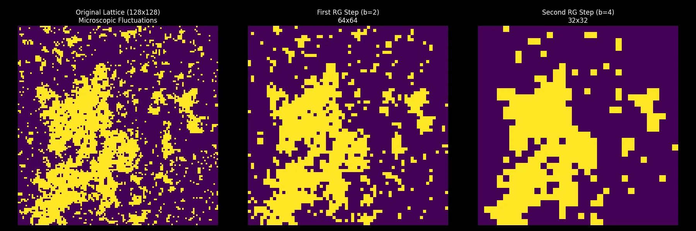
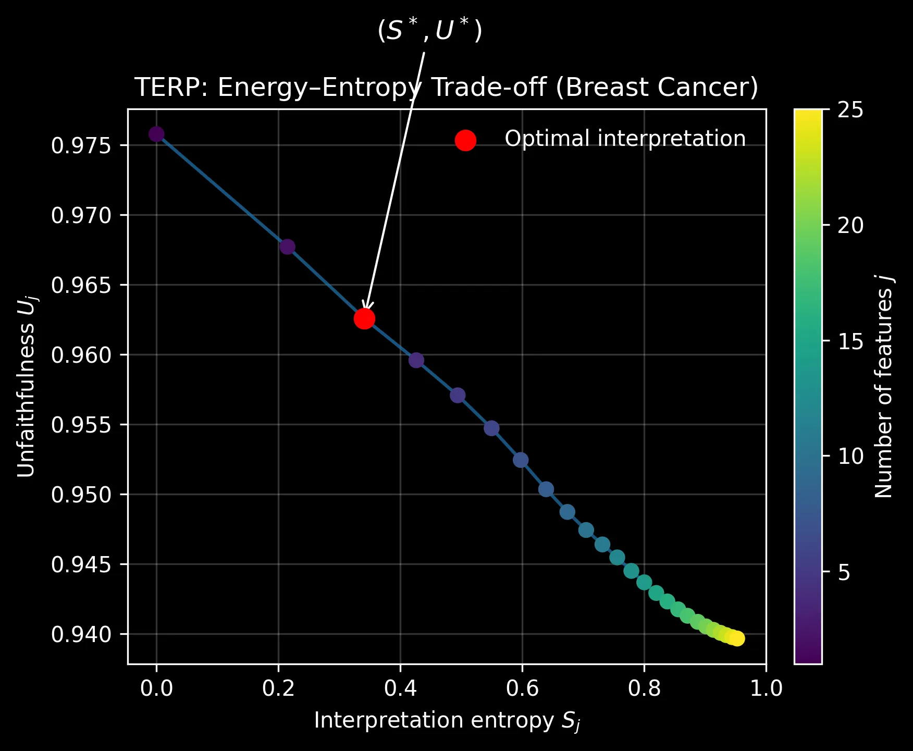
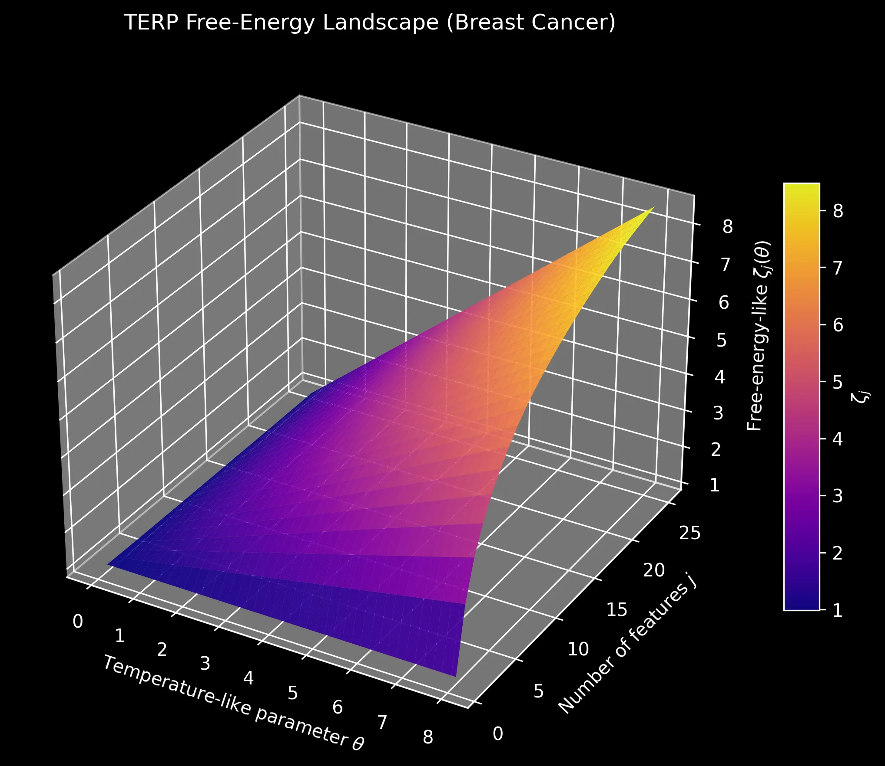
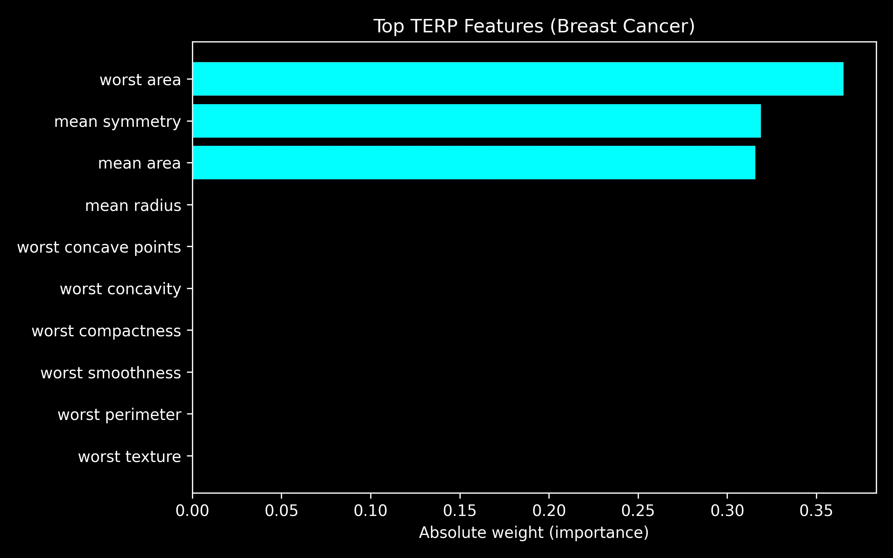
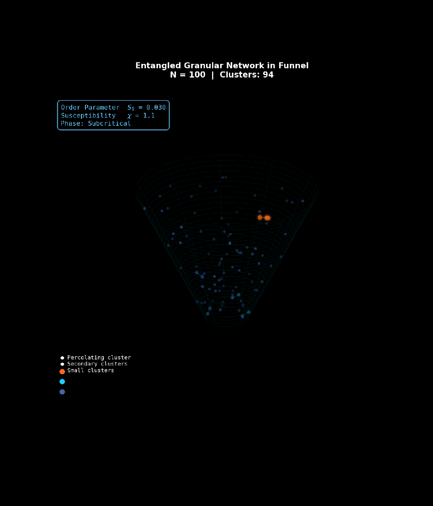
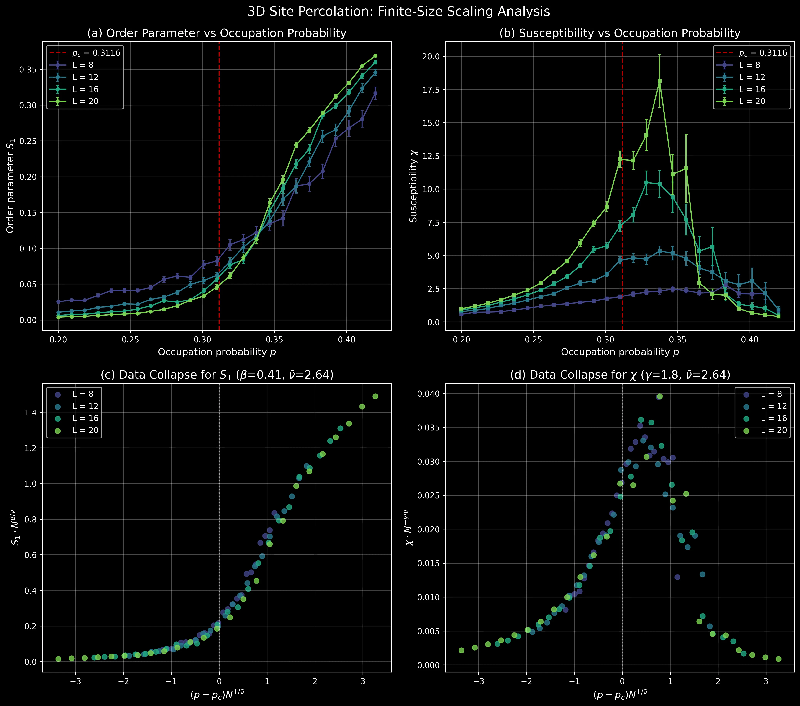

  

这是**重整化群（Renormalization Group, RG）**理论的自学笔记，涵盖临界现象、相变、标度律与普适类等内容。笔记以文章形式整理，并配有 [Python 代码](https://github.com/Liu-Zhihang/Renormalization-Group/tree/main/code) 以加深理解。

## 课程概述

重整化群的诞生源于对发散积分和临界现象的困惑，却在半个世纪内发展成为理解自然的一般性语言。从基本粒子的相互作用到燕群盘旋的天空，从神经网络的层层权重到地球气候的起伏变化，RG思想贯穿了对多尺度复杂系统的研究。宏观规律并非微观定律的简单叠加，而是经由尺度转换的涌现产物。通过RG，我们得以洞见为何截然不同的系统会共享相同的行为准则，如何从纷繁细节中抽取出支配全局的因素。

这些多尺度系统的共同挑战在于：当相关长度趋于发散时，传统的"尺度分离"假设彻底失效——局域涨落不再相互抵消，而是通过长程关联层层放大，直接耦合到宏观可观测量。面对 $10^{23}$ 量级自由度的强关联，**重整化群**采取"分而治之"的策略：逐层约化短程自由度，追踪系统参数随观察尺度的"流动"，最终收敛到支配宏观行为的固定点。

正是这种流动解释了**普适性**的起源——为何微观机制迥异的系统会共享相同的临界指数。Kenneth Wilson 因发展这一理论于 1982 年获得诺贝尔物理学奖。本系列教程从临界现象的物理图像出发，建立统计力学基础，引入标度律与临界指数的定量语言，最终深入场论重整化群与现代前沿应用。

## 已完成笔记

### 第1部分：动机、统计物理与临界现象

- [1. 什么是重整化群](cn/1.什么是重整化群.md)
- [2. 为什么需要重整化群](cn/2.为什么需要重整化群.md)
- [3. 统计力学回顾：配分函数、自由能与涨落](cn/3.统计力学回顾：配分函数、自由能与涨落.md)
- [4. 相变与临界指数：标度律与普适类（上）](cn/4.相变与临界指数：标度律与普适类（上）.md)
- [5. 相变与临界指数：标度律与普适类（下）](cn/5.相变与临界指数：标度律与普适类（下）.md)

## 代码输出演示

**[第2讲：为什么需要重整化群](cn/2.为什么需要重整化群.md)**

| 实空间重整化群流 |
|:---:|
|  |

*Kadanoff 块自旋粗粒化：128×128 → 64×64 → 32×32，微观涨落逐步消失，宏观秩序涌现*

**[第3讲：统计力学回顾——配分函数、自由能与涨落](cn/3.统计力学回顾：配分函数、自由能与涨落.md)**

| 能量-熵权衡 | 自由能景观 | 特征重要性 |
|:---:|:---:|:---:|
|  |  |  |

*TERP 可解释 AI：用热力学自由能思想寻找最优解释*

**[第5讲：相变与临界指数——标度律与普适类（下）](cn/5.相变与临界指数：标度律与普适类（下）.md)**

| 3D 渗流相变动画 | 有限尺寸标度分析 |
|:---:|:---:|
|  |  |

*左：3D Site Percolation 团簇演化动画；右：序参量和磁化率的有限尺寸标度分析*

## 许可证

本项目采用 [CC BY-NC-ND 4.0](https://creativecommons.org/licenses/by-nc-nd/4.0/) 许可。
